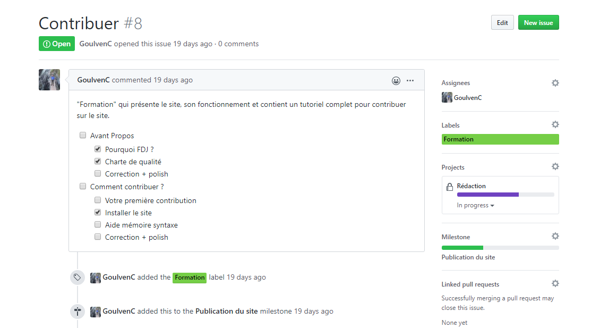
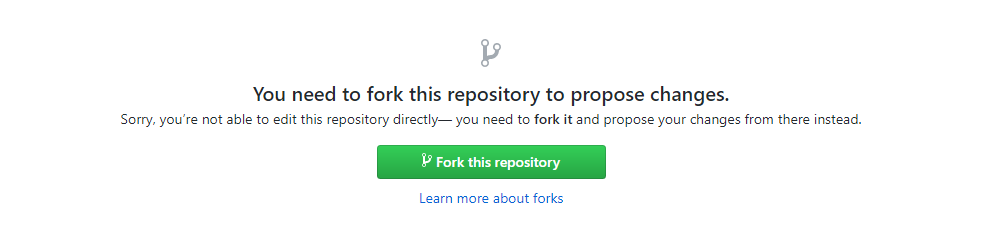
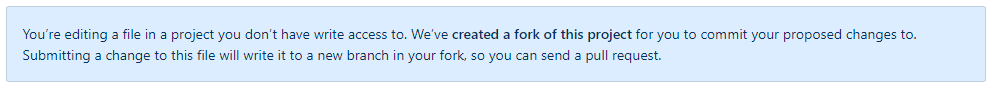
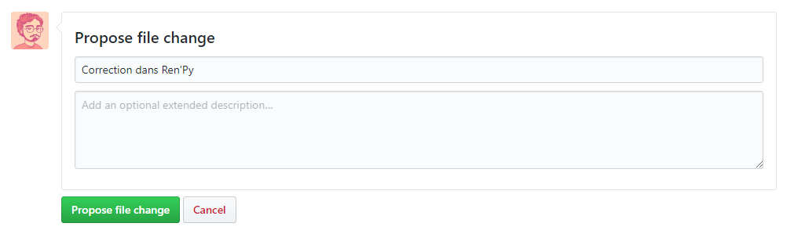

Si le projet de FaireDesJeux.fr vous emballe et que souhaitez contribuer, que ce soit en écrivant une simple correction ou une toute nouvelle formation, vous êtes au bon endroit !

Dans cette partie, je vais vous montrer comment vous préparer pour travailler efficacement sur le site. Après avoir lu cette page, vous saurez comment modifier rapidement un article et consulter les issues de GitHub.

### Créer un compte Github

GitHub est un site qui permet de partager du code et de le modifier à plusieurs. C'est là-bas que l'on rend accessible le code source du site, et donc le contenu des pages.

Un compte vous permettra de contribuer : toutes vos modifications seront créditées avec votre nom et image de profil. Vous pouvez [créer un compte ici](https://github.com/join). Pensez à valider votre adresse email à la fin de l'inscription !

### Petite visite du repo

Le code source du site se trouve à cette adresse :

https://github.com/gamedevalliance/fairedesjeux.fr

C'est un dépôt, ou *repository* en anglais. Entre nous, on appelle simplement ça le repo. Il contient tout le code qui permet de créer le site. Si vous êtes là pour écrire du contenu, vous pouvez visiter le dossier `content` et vous verrez que tout y est rangé clairement : chaque formation possède son dossier et chaque chapitre a son propre sous-dossier. Vous pouvez ouvrir des pages si vous êtes curieux, mais je vous montrerai comment les modifier dans la partie suivante.

Afin de tous nous coordonner et voir en un clin d'oeil les tâches à réaliser, il existe un système d'issues :

*https://github.com/gamedevalliance/fairedesjeux.fr/issues*

Une issue permet de consulter une tâche à réaliser et d'écrire des commentaires, comme dans un mini-forum. Vous pouvez voir en un clin d'oeil le domaine concerné par l'issue, les personnes assignées à la tâche... Lorsque la tâche est terminée, on ferme l'issue, et elle est cachée de la liste principale.

Si vous souhaitez émettre une suggestion, annoncer que vous travaillez sur une nouvelle formation, ou encore rapporter un bug du site... Vous pouvez créer une nouvelle issue, ou bien en parler sur Discord (nous avons un salon dédié aux projets GitHub).

Les issues sont également organisées dans des projets :

https://github.com/gamedevalliance/fairedesjeux.fr/projects

Ainsi, si c'est la rédaction qui vous intéresse avant tout, vous pouvez entrer dans le projet pour avoir une vue d'ensemble de toute l'activité.

### Modifier rapidement une page

Imaginons que vous ayez repéré une faute dans une page de la formation Ren'Py, et que vous souhaitez la corriger. Cliquez sur "Modifier cette page" en haut à droite du site. Vous serez renvoyé à l'adresse de la page en question sur GitHub.

Le repo original du site s'appelle `gamedevalliance/fairedesjeux.fr`. Dès qu'il est modifié, le site est automatiquement actualisé pour afficher les nouveautés. C'est pourquoi il est protégé : seule l'équipe de modération peut écrire à l'intérieur.

Ainsi, pour travailler sur le site, vous devez copier le repo sur votre profil : on appelle ça un fork. La première fois que vous souhaitez modifier une page, GitHub vous propose de créer un fork en un clic.

*Une explication détaillée des forks est également disponible.*

La page suivante vous permet d'éditer le fichier, et vous confirme que vous vous situez dans une nouvelle branche de votre propre fork.

Ecrivez votre modification, puis donnez un titre descriptif à votre commit (votre changement).

*Un commit est un changement. Avec git, on peut consulter l'historique entier des commits et revenir dans le temps si nécessaire.*

L'écran suivant vous permettra de visualiser votre pull request et de la confirmer. Une pull request est une demande pour fusionner les nouveautés de votre fork avec le repo originel. Dès que vous envoyez une pull request, elle est publique et tout le monde pourra la consulter sur GitHub, même si elle n'est pas encore validée. Assurez-vous donc de bien lire la page avant de confirmer.

Désormais, lorsque vous cliquerez sur "Modifier cette page", l'éditeur de texte s'affichera directement. Une nouvelle branche sera créée dans votre fork, pour que vous puissiez éditer le fichier et envoyer une pull request de cette branche. Une branche permet de travailler sur un aspect précis de votre repo sans affecter le reste.

### A propos des forks

Si vous avez déjà modifié une page, un fork a été créé sur votre profil. Sinon, vous pouvez en créer un manuellement. Sur la [page du repo](https://github.com/gamedevalliance/fairedesjeux.fr) `gamedevalliance/fairedesjeux.fr`, cliquez sur "Fork" en haut à droite.

Votre fork s'appelle `votre-pseudo/fairedesjeux.fr`. Vous pouvez le retrouver facilement depuis la page d'accueil de GitHub, ou depuis votre profil. Dans ce fork, vous avez tous les droits en écriture : vous pouvez modifier des pages sur votre navigateur, et même le télécharger pour travailler dans votre éditeur favori. Nous verrons cela dans la section suivante !
