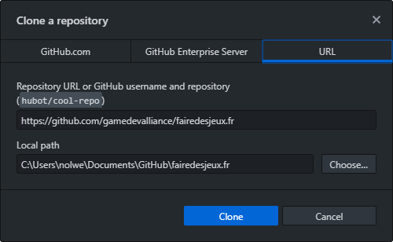
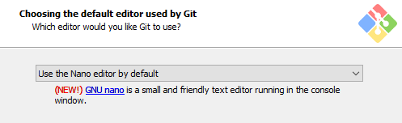
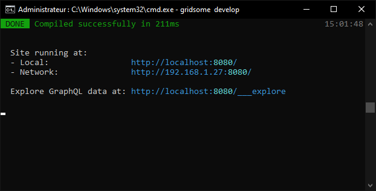

Nous avons vu comment créer un fork et écrire des petites modifications depuis votre navigateur. Si vous souhaitez proposer des contributions plus importantes, comme par exemple ajouter de nouvelles pages et formations, cela ne serait pas très pratique, car vous ne pouvez pas voir le résultat de ce que vous écrivez.

Pour cela, vous pouvez télécharger le site sur votre ordinateur et lancer un serveur local. Ainsi, vous pourrez écrire plus confortablement dans votre éditeur préféré, et visualiser le résultat en direct dans votre navigateur !

### Sur Windows

#### Télécharger le site

En premier lieu, vous devez télécharger le site depuis votre fork sur GitHub.

:::remi
Si vous connaissez déjà git, vous pouvez simplement cloner votre fork.
:::

Si vous débutez, installez [Github Desktop](https://desktop.github.com/) qui vous facilitera la tâche. La première fois, le logiciel propose un petit tutoriel très rapide que je vous conseille de suivre. Vous pouvez ensuite télécharger votre fork de deux manières :

- Dans Github Desktop, cliquez sur "File" puis "Clone repository" et choisissez votre fork dans la liste.
- Sur la page de votre fork sur GitHub, cliquez sur le bouton vert puis "Open in Desktop".


*Le site est cloné par défaut dans vos Documents.*

#### Installer Node.js

Nous allons maintenant installer tout ce qui va servir à afficher le site dans un serveur local. Téléchargez Node.js sur le [site officiel](https://nodejs.org/en/). Choisir entre la version LTS et Current ne devrait pas faire de différence, mais nous utiliserons ici la version Current. Lors de l'installation, laissez les paramètres par défaut à l'exception de cette case qu'il est important de cocher :


Si vous avez oublié de cocher cette case, pas d'inquiétude : il vous suffit de relancer l'installation pour la "réparer" puis de cocher l'option.

Une nouvelle fenêtre s'ouvrira ensuite pour installer automatiquement tous les modules nécessaires :


*Appuyez sur une touche pour valider et lancer l'installation.*

Cela peut prendre un moment. Faites-vous un petit café pour patienter !


*L'installation est terminée quand vous êtes invité·e à appuyer sur Entrée.*

#### Installer git

Téléchargez git depuis le [site officiel](https://git-scm.com/downloads). L'interface d'installation est un peu intimidante mais vous pouvez laisser les paramètres par défaut, à part l'éditeur Nano que je vous conseille pour une installation légère.



:::remi
Même si vous aviez installé GitHub Desktop, vous devez installer le *vrai* git séparément pour qu'il puisse être utilisé par d'autres programmes. Ce n'est pas perdu, puisque vous en aurez sûrement besoin dans la création de jeux !
:::

#### Télécharger les dépendances du site

Ouvrez l'invite de commandes (tapez "cmd" dans la recherche Windows) et naviguez jusqu'au dossier du site avec la commande `cd`. Dans mon cas, le chemin est le suivant :

```batch
cd Documents\Github\fairedesjeux.fr
```

Si vous n'êtes pas sûr·e de votre chemin, tapez la commande `dir` pour afficher la liste des dossiers, puis `cd NomDuDossier`, et ainsi de suite. Pour remonter d'un dossier, écrivez `cd ..` .

Une fois dans le dossier `fairedesjeux.fr`, installez les paquets nécessaires en écrivant :

```batch
npm install
```

> npm ne fonctionnera peut-être pas correctement si vous ouvrez cmd depuis Github Desktop. C'est pourquoi nous l'avons ouvert séparément, mais lancer Github Desktop en tant qu'administrateur aurait fonctionné aussi.


*Là aussi, cela peut prendre un moment. C'est l'occasion de boire votre café.*

Quelques avertissements peuvent s'afficher en orange au cours de l'installation, mais ne vous inquiétez pas : ils ne devraient vous poser aucun problème. Par contre, si vous avez des erreurs en rouge, n'hésitez pas à demander de l'aide sur Discord.

Installez ensuite Gridsome :

```batch
npm install --global @gridsome/cli
```

Et vous avez terminé ! Désormais, la seule commande que vous aurez besoin d'utiliser est celle qui lance le serveur local :

```batch
gridsome develop
```


*Tant que cette fenêtre est active, vous pouvez accéder au site.*

Tapez maintenant `localhost:8080` dans la barre d'adresse de votre navigateur. Magie, vous êtes sur le site !

Dorénavant, pour lancer le site, il vous suffira d'ouvrir un terminal dans le dossier `fairedesjeux.fr` (vous pouvez le faire depuis Github Desktop : "Repository > Open in Command Prompt") et d'écrire `gridsome develop`.

### Sur macOS

Téléchargez Node.js sur le [site officiel](https://nodejs.org/en/). Choisir entre la version LTS et Current ne devrait pas faire de différence, mais nous utiliserons ici la version Current. Suivez le processus d'installation.

Installez ensuite git en choisissant la méthode de votre choix depuis le [site officiel](https://git-scm.com/download/mac). Les solutions les plus simples sont le "*Binary installer*" et la commande Homebrew.

Nous allons maintenant télécharger le site. Si vous connaissez git, vous pouvez tout simplement cloner votre fork. Mais si vous débutez, installez [Github Desktop](https://desktop.github.com/) qui vous facilitera la tâche. La première fois, le logiciel propose un petit tutoriel très rapide que je vous conseille de suivre. Vous pouvez maintenant télécharger votre fork de deux manières :

- Dans Github Desktop, cliquez sur "File" puis "Clone repository" et choisissez votre fork dans la liste.
- Sur la page de votre fork sur GitHub, cliquez sur le bouton vert puis "Open in Desktop".

Ouvrez le terminal dans le dossier `fairedesjeux.fr` nouvellement créé. Vous pouvez le faire depuis Github Desktop : *Repository* > *Open in Command Prompt*. Autrement, dans les *Préférences système* de votre Mac, allez dans *Clavier* > *Raccourcis* > *Services* et activez l'option *Nouveau terminal dans le dossier*. Maintenant, vous pouvez ouvrir un terminal dans un dossier avec un clic droit dans Finder.

Une fois dans le dossier `fairedesjeux.fr` avec le terminal, tapez cette commande pour installer les dépendances :

```bash
npm install
```

Des avertissements peuvent s'afficher en orange mais ne posent pas de problème. Si vous obtenez des erreurs en rouge, n'hésitez pas à demander de l'aide sur Discord.

Lorsque c'est terminé, installez Gridsome :

```bash
npm install --global @gridsome/cli
```

Vous avez tout installé ! Vous pouvez maintenant lancer le serveur local :

```bash
gridsome develop
```

Le site devient alors disponible à l'adresse `localhost:8080` sur votre navigateur, et se recharge en direct lorsque vous faites des changements.

Désormais, lorsque vous souhaiterez lancer le site, il vous suffira d'ouvrir un terminal dans le dossier `fairedesjeux.fr` et d'écrire `gridsome develop`.

### Sur Linux

Dans le terminal, entrez cette commande pour installer Node.js et npm :

```bash
sudo apt install nodejs
```

Cette commande fonctionne sur les distributions basées sur la dernière version d'Ubuntu. Vous pouvez consulter la [page officielle d'installation](https://nodejs.org/en/download/package-manager/) pour des informations sur une autre distribution.

Ouvrez ensuite le terminal dans le dossier où vous souhaitez télécharger le site, puis écrivez ceci pour cloner votre fork :

```bash
git clone https://github.com/votre-pseudo/fairedesjeux.fr
```

Entrez dans le dossier avec `cd fairedesjeux.fr` puis installez les dépendances :

```bash
sudo npm install
```

Des avertissements peuvent s'afficher en orange mais ne posent pas de problème. Si vous obtenez des erreurs en rouge, n'hésitez pas à demander de l'aide sur Discord.

Quand c'est terminé, installez Gridsome :

```bash
sudo npm install --global @gridsome/cli
```

Et voilà ! Désormais, lorsque vous souhaiterez lancer le site, il vous suffira d'ouvrir un terminal dans le dossier `fairedesjeux.fr` et d'écrire :

```bash
gridsome develop
```

Le site devient alors disponible à l'adresse `localhost:8080` sur votre navigateur, et se recharge en direct lorsque vous faites des changements.
