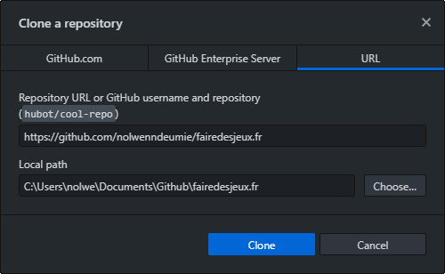

Nous avons vu comment créer un fork et écrire des petites modifications depuis votre navigateur. Si vous souhaitez proposer des contributions plus importantes, comme par exemple ajouter des nouvelles pages et formations, cela ne serait pas très pratique, car vous ne pouvez pas voir le résultat de ce que vous écrivez.

Pour cela, vous pouvez télécharger le site sur votre ordinateur et lancer un serveur local. Ainsi, vous pourrez écrire plus confortablement dans votre éditeur préféré, et visualiser le résultat en direct dans votre navigateur !

### Sur Windows

En premier lieu, vous devez télécharger le site.

:::remi
Si vous connaissez git, vous pouvez tout simplement cloner votre fork.
:::

Si vous débutez, installez [Github Desktop](https://desktop.github.com/) qui vous facilitera la tâche. La première fois, le logiciel propose un petit tutoriel très rapide que je vous conseille de suivre. Vous pouvez maintenant télécharger votre fork de deux manières :

- Dans Github Desktop, cliquez sur "File" puis "Clone repository" et choisissez votre fork dans la liste.
- Sur la page de votre fork sur GitHub, cliquez sur le bouton vert puis "Open in Desktop".


*Le site est cloné par défaut dans vos Documents.*

Nous allons maintenant installer tout ce qui va servir à afficher le site dans un serveur local. Téléchargez Node.js sur le [site officiel](https://nodejs.org/en/). Choisir entre la version LTS et Current ne devrait pas faire de différence, mais nous utiliserons ici la version Current. Lors de l'installation, laissez les paramètres par défaut à l'exception de cette case qu'il est important de cocher :


Si vous avez oublié de cocher cette case, pas d'inquiétude : il vous suffit de relancer l'installation pour la "réparer" puis de cocher l'option.

Une nouvelle fenêtre s'ouvrira ensuite pour installer automatiquement tous les modules nécessaires :


*Appuyez sur une touche pour valider et lancer l'installation.*

Cela peut prendre un moment. Faites-vous un petit café pour patienter !


*L'installation est terminée quand vous êtes invité·e à appuyer sur Entrée.*

Ouvrez l'invite de commandes (tapez "cmd" dans la recherche Windows), naviguez jusqu'au dossier du site avec `cd` puis installez les paquets nécessaires avec `npm install`.

```
cd Documents\Github\fairedesjeux.fr
npm install
```

:::Note
npm ne fonctionnera pas si vous ouvrez l'invite de commandes depuis Github Desktop. Il est conseillé d'ouvrir cmd séparément, mais lancer Github Desktop en tant qu'administrateur fonctionne aussi.
:::


*Là aussi, cela peut prendre un moment. C'est l'occasion de boire votre café.*

Quelques avertissements peuvent s'afficher en orange au cours de l'installation, mais ne vous inquiétez pas : ils ne devraient vous poser aucun problème.

Installez ensuite Gridsome :

```
npm install --global @gridsome/cli
```

Et vous avez terminé ! Désormais, la seule commande que vous aurez besoin d'utiliser est celle qui lance le serveur local :

```
gridsome develop
```


*Tant que cette fenêtre est active, vous pouvez accéder au site.*

Tapez maintenant `localhost:8080` dans la barre d'adresse de votre navigateur. Magie, vous êtes sur le site !

### Sur Linux

Dans le terminal, entrez cette commande pour installer Node et npm :

```
sudo apt install nodejs
```

Cette commande fonctionne sur les distributions basées sur la dernière version d'Ubuntu. Vous pouvez consulter la [page officielle d'installation](https://nodejs.org/en/download/package-manager/) pour des informations sur une autre distribution.

Ouvrez ensuite le terminal dans le dossier où vous souhaitez télécharger le site, puis écrivez ceci pour cloner votre fork :

```
git clone https://github.com/votre-pseudo/fairedesjeux.fr
```

Entrez dans le dossier avec `cd fairedesjeux.fr` puis installez les dépendances :

```
sudo npm install
```

Quand c'est terminé, installez Gridsome :

```
sudo npm install --global @gridsome/cli
```

Et voilà ! Désormais, lorsque vous souhaiterez lancer le site, il vous suffira d'ouvrir un terminal dans le dossier `fairedesjeux.fr` et d'écrire :

```
gridsome develop
```

Le site devient alors disponible à l'adresse `localhost:8080` sur votre navigateur, et se recharge en direct lorsque vous faites des changements.
