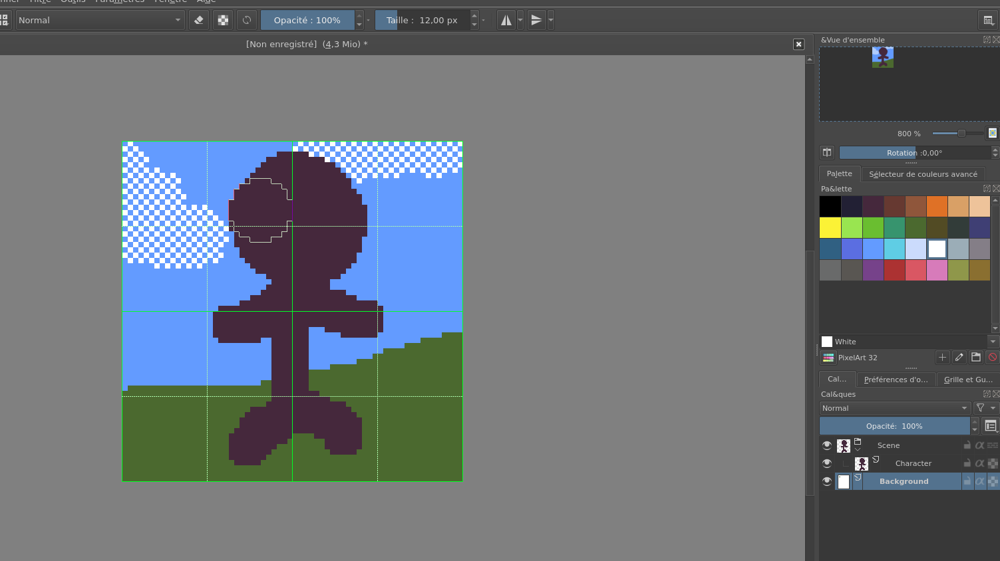

Maintenant que vous avez configuré Krita et sans doute commencez à faire joujou avec les outils principaux (tels que le pinceau et la pipette), il est temps de découvrir les outils que je vous ai fait ajouter à votre panneau de droite.

### Vue d'ensemble

Pratique quand vous réalisez des scènes ou des personnages en pixel art, car il vous permet de prendre du recul et de voir à quoi ressemble votre oeuvre à taille réelle.

### Palette et sélecteur de couleurs

La fonction et l'utilisation du sélecteur de couleurs se devinent facilement. Mais vous pouvez vous facilitez la vie durant vos pixel arts en utilisant une palette, qui permet de stocker les couleurs que vous utilisez et de les selectionner en un clic. En bas à gauche de ce panneau, vous pouvez clicker pour sélectioner une palette parmis celles déjà installées dans Krita (par exemple "PixelArt 16" qui imite les contraintes des jeux retro 4 bits), en créer une nouvelle ou en importer une déjà existante (généralement aux formats `.kpl`, `.act` ou `.gpl`).

Une fois votre palette selectionnée, vous trouverez également en bas à droite des boutons pour ajouter, supprimer ou modifier une couleur.

### Calques

Les calques sont un outil important sur tout les logiciels d'infographies, il s'agit des différentes couches transparentes qui, superposées, constituent votre image finale. Par exemple, vous pouvez dessiner votre personnage sur un calque et votre décors sur un second calque en arrière. Ainsi, vous êtes sûr de ne pas abimer votre personnage en modifiant votre décors, ou vous pouvez bouger librement un élément sans laisser un vide derrière lui.

En bas à gauche du panneau, vous trouverez plussieurs boutons. Le premier permet de créer un nouveau calque, les types de calques les plus communs étant ceux de dessins (matriciels, utilisant des pixels), les vectoriels et ceux "de groupe" (qui fonctionnent comme des dossiers pour organiser vos calques). Vous trouverez également des boutons pour dupliquer un calque, modifier sa profondeur ou le supprimer.

### Préférence de l'outil

Ce panneau permet d'acceder rapidement aux différents paramètres de l'outil que vous avez actuellement selectionné. Par exemple, si vous utilisez actuellement l'outil sélection rectangulaire, vous pourrez y modifier le mode (matriciel ou vectoriel), l'action (Remplacer, ajouter, soustraire, etc) ou pré-régler la taille ou le ratio de votre sélection.

### Grille et guides

Nous allons passer rapidement sur les guides, qui permettent d'afficher des lignes sur votre écran, qui ne sont pas très utile en pixel art, pour nous concentrer sur l'outil de grille. Celui-ci va vous faire gagner un temps précieux si par exemple vous souhaitez réaliser un Tileset avec plussieurs assets d'une même taille côte à côte.

Commencez par cocher le bouton "Afficher la grille", puis reglez l'espacement en fonction de la résolution que vous souhaitez sur votre tileset, ainsi que le style et la couleur de la grille. Vous également utilisez des subdivisions pour par exemple diviser chaque case de votre tileset (pratique pour voir le millieu de chaque case par exemple), dans ce cas vous pouvez par exemple pour un tileset 16\*16, regler un espacement en 8\*8 puis mettre deux subdivisions.
