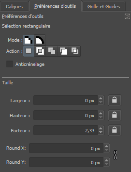

Maintenant que vous avez configuré Krita, nous pouvons découvrir les outils que je vous ai fait ajouter à votre panneau de droite.

### Vue d'ensemble

Cette vue est pratique quand vous réalisez des scènes ou des personnages en pixel art, car elle vous permet de prendre du recul et de voir à quoi ressemble votre oeuvre à petite taille.

### Palette et sélecteur de couleurs

Je n'ai pas besoin de vous expliquer l'utilité du sélecteur de couleurs ! Mais vous pouvez vous faciliter la vie en utilisant une palette, qui permet de stocker des couleurs pour les réutiliser en un clic, et vous aide à garder un ton cohérent dans toute l'image. En bas à gauche du panneau, un bouton affiche la liste des palettes pré-installées dans Krita, par exemple "PixelArt 16" qui imite les contraintes des jeux retro 4 bits. Vous pouvez créer la vôtre ou en importer depuis des sites comme [Lospec](https://lospec.com/palette-list), au format `.pal`, `.gpl` et autres.

Une fois votre palette selectionnée, vous trouverez également en bas à droite des boutons pour ajouter, supprimer ou modifier une couleur.

### Calques

L'outil incontournable de tout logiciel d'infographie ! Les calques sont des couches transparentes qui, superposées, constituent votre image finale. Vous pouvez dessiner votre personnage sur un calque et votre décor sur un autre. Ainsi, le personnage peut être déplacé librement sans abîmer le décor, et vice versa.

En bas à gauche du panneau, vous pouvez créer un nouveau calque. Les plus communs sont les calques de dessin (matriciels, utilisant des pixels), les calques vectoriels et les calques de groupe, qui fonctionnent comme des dossiers.

### Préférences de l'outil

Ce panneau permet de modifier les paramètres de l'outil que vous utilisez actuellement. Nous y reviendrons souvent dans la prochaine section !

### Grille et guides

Les guides ne vous seront que très rarement utiles en pixel art, contrairement à la grille ! Elle vous fera gagner un temps précieux lors de la création d'un tileset ou d'une planche de personnages, avec plusieurs assets d'une même taille côte à côte.

Réglez l'espacement d'après la taille des éléments de votre tileset, ainsi que le style et la couleur de la grille. Autre astuce pratique : utilisez des subdivisions pour bien voir le milieu de chaque case par exemple. Pour cela, divisez la taille de l'espacement par 2 et choisissez 2 subdivisions.

*Tileset de [Buch](https://opengameart.org/content/a-platformer-in-the-forest)*
