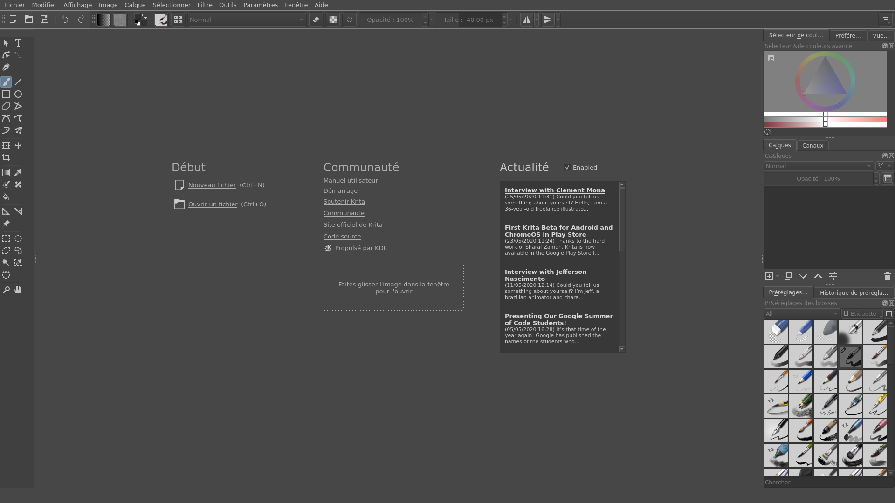
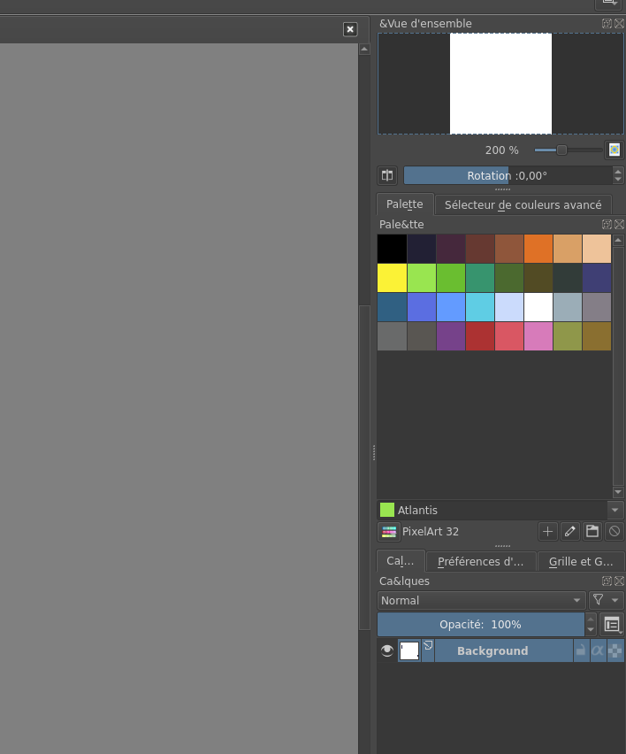
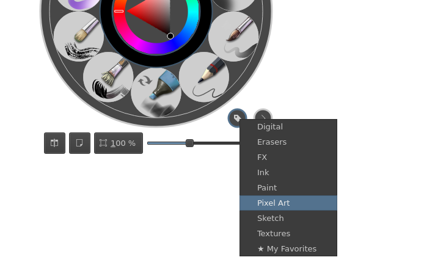

Si vous lancez Krita pour la première fois, voilà l'interface que vous devriez avoir sous les yeux. Vous pouvez dès à présent cliquez sur **Nouveau fichier** (raccourcis: `ctrl` + `n`) et commencer à essayer les différents outils à gauche, tel que le pinceau (`b`) , la pipette (`p`) ou la selection rectangulaire (`ctrl` + `r`). Vous pouvez également changer la couleur, la taille ou l'opacité de votre pinceau avec le menu horizontal en haut de la fenêtre. Facile non ?

:::astride
Les documents s'enregistrent au format `.kra`, pour exporter le résultat final dans un autre format, il vous faut cliquer sur **Fichier** > **Exporter**
:::

### Utiliser les "espaces de travail"

Normalement, vous devez déjà être un peu intrigué par les menus sur la droite de votre écran. Les différents éléments que vous voyez sont des **"tableaux"**, vous pouvez les drag and drop pour les déplacer dans votre espace de travail, cliquer sur la petite croix pour en supprimer un, et aller dans l'onglet **Paramêtre** > **Tableaux** puis cliquer sur le tableau désiré pour l'ajouter à votre espace de travail.

Pour travailler dans les meilleures conditions, il vous faut un espace de travail adapté à ce que vous faites. Pour cela rendez vous dans l'onglet **Fenêtre** > **Espace de travail** où vous pouvez déjà choisir parmis plussieurs espaces de travail par défauts. Comme vous pouvez le constater, il n'en existe pas encore pour le Pixel Art, vous allez devoir le réaliser vous même !

Normalement, avec mes explications vous devriez être capable d'agencez les différents panneaux par vous même, en recopiant mon espace de travail selon l'image ci-dessous. Un conseil : partez de l'espace de travail **"Big_Paint"**, ça vous simplifiera le travail.

**En haut :** "Vue d'ensemble".

**Au centre :** "Palette", "Sélecteur de couleurs avancé".

**En bas :** "Calques", "Préférence d'outil", "Grille et Guides".

:::astride
Vous ne comprenez pas l'utilité de tout ces outils ? Pas de panique, on les découvrira ensemble dans la suite de la formation
:::

Une fois votre agencement terminé, rendez vous dans **Fenêtre** > **Espace de travail** puis cliquez sur **Nouvel espace de travail...** et donnez lui le nom "Pixel Art". Vous pouvez a présent passer d'un des espaces de travail préfait au votre facilement.

### Des pinceaux adaptés

Peut-être avait vous jeté un oeil aux différents brushs disponibles, il y en a des dizaines et c'est compliqué de s'y retrouver... Mais si vous selectionnez votre pinceau et que vous faites un clic droit sur votre document, Krita vous ouvre une roue avec une petite selection de pinceau.

Comme vous pouvez vous en rendre compte, la plupart de ces pinceaux ne sont pas fait pour le pixel art, soit parce qu'ils ont de l'anti-aliasing soit parce qu'ils nécéssitent une grosse résolution. Cliquez donc sur le premier icône en bas à droite (voir image ci-dessus) pour modifier la selection et cliquez sur **Pixel Art**. Vous voilà maintenant avec trois pinceaux : un pixel-par-pixel, un dithering simple et un pinceau rond sans anti-aliasing.

:::remi
Krita dispose d'un moteur de pinceau puissant, si vous êtes un peu bricoleur vous pouvez essayer de créer vos propres pinceaux ou outils de dithering personnalisés !
:::

Vous voilà normalement fin près à vous lancer, votre interface est toute propre ! Place maintenant à la pratique et la découverte des différents outils...
