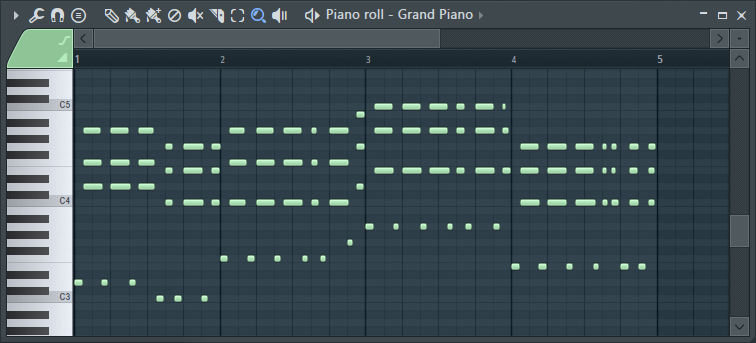

Dans ce cours, nous utiliserons un clavier de piano pour les illustrations. C'est sans doute le moyen le plus simple de représenter les notes visuellement, et c'est d'ailleurs ce qui est utilisé dans les logiciels de composition ! Vous ne serez donc pas dépaysé.

*Ecrire des mélodies au piano est très intuitif. (FL Studio)*

Vous connaissez peut-être déjà les 7 noms de note : do, ré, mi, fa, sol, la, si !

<video src="/videos/musique/7-notes.mp4" loop controls></video>

Le logiciel filmé pour ces illustrations est Synthesia. Vous pouvez l'utiliser pour vous entraîner en lisant ce cours : on comprend mieux en pratiquant !

### Les intervalles

En musique, on parle d'intervalle quand on souhaite représenter la distance entre deux notes. C'est une notion très importante que l'on utilisera sans cesse : cela nous permettra de parler des constructions d'accords, des harmonistations, et de composition en général.

Les principaux intervalles sont la seconde, la tierce, la quarte, la quinte, la sixte, la septième et l'octave.

Pour bien comprendre, choisissez deux notes sur le clavier. Numérotez la première par le chiffre 1, et augmentez la valeur à chaque fois que vous avancez d'un nom de note. Si l'autre note a pour numéro 2, c'est une seconde, si c'est 3, c'est une tierce...

<video src="/videos/musique/intervalles.mp4" loop controls></video>

...Et à 8, c'est une octave ! Si on dépasse l'octave, on peut parler de tierce octaviée par exemple.

#### Les demi-tons

Les demi-tons sont les intervalles les plus petits qui existent entre deux notes. On utilise les touches noires du piano pour les jouer. Si le demi-ton est situé entre do et ré, on peut dire que c'est un do♯ (do dièse) ou un ré♭ (ré bémol).

<video src="/videos/musique/demi-tons.mp4" loop controls></video>

Vous aurez sans doute remarqué qu'il n'y a pas de touche noire partout. C'est parce qu'il n'y a qu'un demi-ton entre mi et fa, et entre si et do. Au total, une octave est constituée de 12 demi-tons.

#### Les tons

Les tons sont des intervalles de deux demi-tons. Par exemple, il y a un ton entre do et ré, étant donné qu'il y a les demi-tons do–do♯ et do♯–ré. Mais on peut aussi dire qu'il y a un ton entre mi et fa♯, puisqu'un seul demi-ton sépare mi et fa.

### La tonalité

De nos jours, on utilise communément deux tonalités : la tonalité majeure et la tonalité mineure. C'est ce qui donne la couleur de la musique à l'écoute. Une tonalité majeure peut paraître plus lumineuse et joyeuse :

<video src="/videos/musique/do-majeur.mp4" controls></video>

Tandis qu'une tonalité mineure peut être perçue comme plus sombre et triste :

<video src="/videos/musique/do-mineur-harmonique.mp4" controls></video>

:::remi
Cette comparaison joie contre tristesse est une simplification pour vous aider à comprendre, mais ne vous y attachez pas trop, car les sentiments évoqués peuvent varier selon les personnes.
:::

:::astride
C'est vrai. Par exemple, certains trouvent la tonalité mineure plutôt mystérieuse et étrange.
:::

Vous aurez peut-être remarqué que les deux tonalités se différencient par les tons et demi-tons utilisés. Le réservoir de notes d'une tonalité, c'est ce qu'on appelle une **gamme**. Ces deux tonalités ont chacune une gamme de 7 notes. Bien sûr, vous pouvez vous permettre d'utiliser d'autres notes de temps en temps pour ajouter des couleurs particulières.

Les deux exemples ci-dessus partaient de la note do : on dit alors que do est la note **fondamentale** de la tonalité. En composant, vous remarquerez que l'oreille s'attend à revenir à la note fondamentale régulièrement. Souvent, votre mélodie se terminera sur cette note par exemple.

#### Tonalité majeure

La tonalité majeure est composée ainsi :

ton, ton, demi-ton, ton, ton, ton, demi-ton.

On peut créer cette tonalité à partir de n'importe quelle note fondamentale en respectant ces intervalles. Du coup, il faudra s'adapter en utilisant des dièses et des bémols.

tonalité | 
---|---|---|---|---|---|---|---
**do majeur** | do | ré  | mi   | fa  | sol | la  | si
**ré majeur** | ré | mi  | fa♯  | sol | la  | si  | do♯
**mi majeur** | mi | fa♯ | sol♯ | la  | si  | do♯ | ré♯
**fa majeur** | fa | sol | la   | si♭ | do  | ré  | mi

Et ainsi de suite !

<video src="/videos/musique/les-7-majeures.mp4" loop controls></video>

:::remi
Dans les gammes, on écrit parfois des bémols plutôt que des dièses afin de conserver l'ordre habituel des 7 notes principales.
:::

:::astride
On aurait pu écrire que des dièses, mais en pratiquant sur un clavier, vous verrez que conserver cet ordre des notes rend l'enchaînement plus facile à lire !
:::

#### Tonalité mineure

Il existe trois types de tonalités mineures, chacune ayant sa propre couleur musicale que l'on peut utiliser selon nos envies.

- **Mineure harmonique :** ton, demi-ton, ton, ton, demi-ton, *un ton et demi*, demi-ton
- **Mineure ascendante :** ton, demi-ton, ton, ton, ton, ton, demi-ton
- **Mineure descendante :** ton, demi-ton, ton, ton, demi-ton, ton, ton

<video src="/videos/musique/les-3-mineures.mp4" loop controls></video>

Il est courant d'utiliser l'ascendante lorsque la mélodie monte et la descendante quand elle descend. La gamme mineure harmonique peut quant à elle servir à toutes les situations !

#### Les modes

Il est bon de savoir qu'il n'y a pas que ces tonalités dans la musique. Dans la musique occidentale, il existe d'autres possibilités que l'on appelle des modes, et d'autres cultures à travers le monde fonctionnent encore différemment.

:::astride
En fait, les tonalités majeure et mineure faisaient autrefois partie des modes musicaux ! Mais comme on les utilisait beaucoup plus souvent, on les a regroupées sous le terme de tonalité.
:::

Prenons un exemple : le **mode de ré** est composé de toutes les touches blanches en allant de ré à do. Ainsi, si l'on tient compte des demi-tons naturels entre mi–fa et si–do, on obtient cette disposition :

ton, demi-ton, ton, ton, ton, demi-ton, ton.

<video src="/videos/musique/mode-de-re.mp4" controls></video>

On peut alors reporter cette disposition avec n'importe quelle note fondamentale. De la même façon, vous pourriez utiliser le mode de mi, et ainsi de suite.

Un autre exemple est la **gamme par tons**. C'est un mode uniquement composé de tons, ce qui veut dire qu'il ne contient que 6 notes :

do–ré, ré–mi, mi–fa♯, fa♯–sol♯, sol♯–la♯, la♯–do.

<video src="/videos/musique/gamme-par-tons.mp4" controls></video>

### Lire une partition

La **portée**, ce sont les cinq lignes sur lesquelles on écrit les notes.

La **clé** est le symbole en début de portée qui indique comment positionner les notes sur la portée. Les plus connues sont la clé de sol et la clé de fa, mais il existe également la clé d'ut.

*Vidéo de decrescendo*

La clé de sol indique que le sol est sur la deuxième ligne de la portée, et la clé de fa indique que le fa est sur la quatrième ligne.

:::remi
Cela peut sembler étrange au premier abord, mais c'est très pratique. En fait, la clé de fa se situe juste en-dessous de la clé de sol, ce qui donne une continuité entre les notes aigues et graves.
:::

:::marvin
Sinon, on serait obligés de dessiner nous-mêmes plein de traits sous de la clé de sol. J'ai compris !
:::

### Le rythme

Le rythme indique la durée des notes et l'espace entre elles. Il suit un **tempo**, ou BPM pour battements par minute. On peut suivre le tempo plus facilement avec un métronome : s'il bipe toutes les secondes, le tempo est à 60.

:::astride
Le rythme est aussi important que la mélodie en musique. On peut tout à fait faire de la musique avec une seule note mais un rythme qui varie !
:::

*Percussion sympa*
