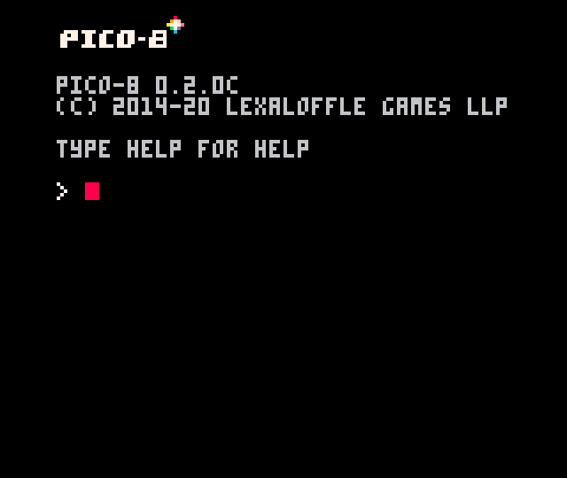
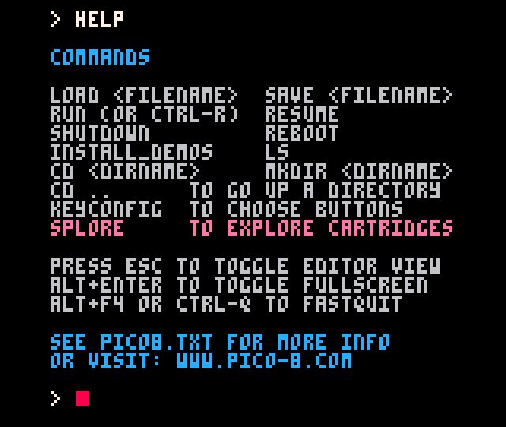
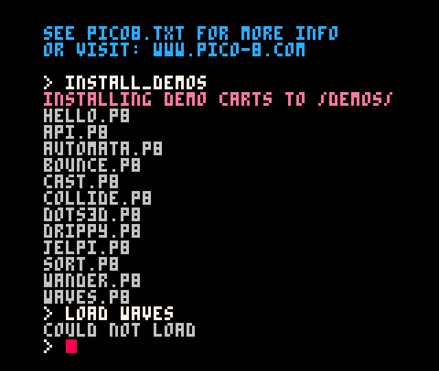
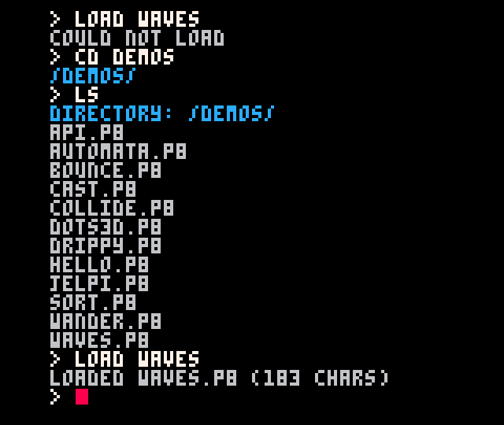
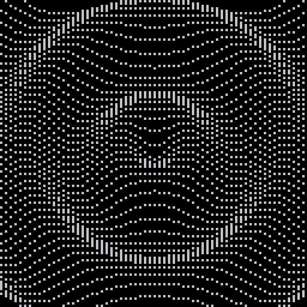
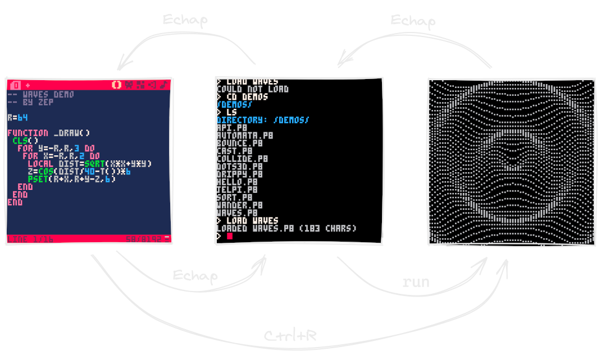

Avant d'entrer dans le vif du sujet, laissez-moi vous guider à travers l'interface de la console. Lorsque vous démarrez PICO-8, se tient face à vous un écran noir où vous pouvez entrer des commandes.

> PICO-8 se démarre en plein écran. Si vous préférez, vous pouvez le passer en mode fenêtré avec Alt+Entrée.

La commande `help` affiche toutes les commandes de base dont vous pourriez avoir besoin.

Ces commandes permettent de charger des fichiers, naviguer dans les dossiers... Mais remarquez aussi la mystérieuse commande `install_demos`. Utilisez-la et PICO-8 va installer des cartouches d'exemple dans le dossier `demos` ! Cependant, si vous tentez d'en ouvrir une avec la commande `load`, vous verrez que cela ne fonctionne pas...

C'est parce que nous ne sommes pas dans le bon dossier ! Ecrivez `cd demos` pour entrer dans le dossier, puis `ls` pour voir son contenu. Vous pouvez maintenant charger le jeu de votre choix en écrivant `load` suivi du nom (pas besoin décrire l'extension `.p8`).

Lancez une démo chargée en écrivant `run` ou avec Ctrl+R.

*La démo "Waves"*

Vous pouvez aussi voir comment le jeu a été programmé ! Faites Echap pour revenir à l'écran de commande, puis une deuxième fois Echap pour atteindre l'écran de développement. Ce sont les trois écrans principaux de PICO-8 :

Toutes ces petites démos sont sympathiques, mais vous avez peut-être envie d'essayer des jeux ayant un peu plus de panache. Faites `cd ..` pour remonter d'un dossier et `install_games` pour installer une sélection de jeux comprenant Celeste Classic, la version PICO-8 à l'origine du jeu à succès.

La commande `splore` démarre un navigateur plus confortable pour essayer les jeux installés ainsi que ceux étant publiés sur le site de PICO-8.

[[Video src="/videos/pico-8/splore-demos.mp4" autoplay muted loop controls]]

Cerise sur le gâteau : en appuyant sur Echap pendant un jeu, vous pouvez examiner comment ont été faits le code, les graphismes et la musique.

Je vous conseille également de chercher votre bonheur dans les supers jeux PICO-8 jouables dans le navigateur [sur itch.io](https://itch.io/games/tag-pico-8) !