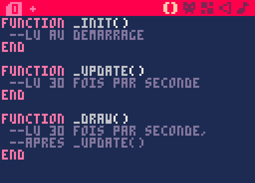
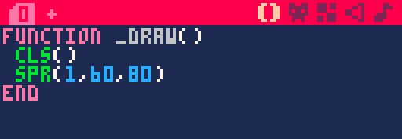
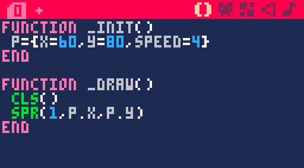
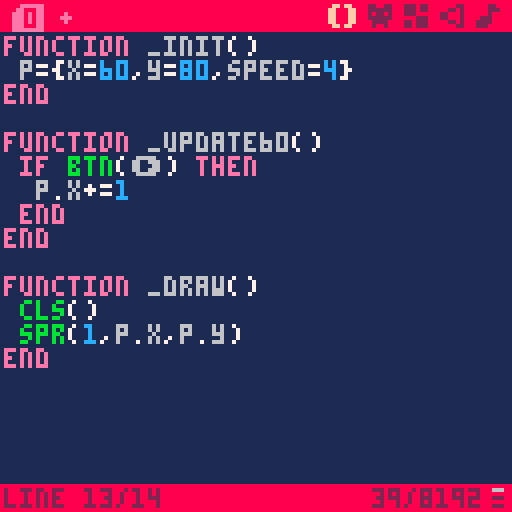
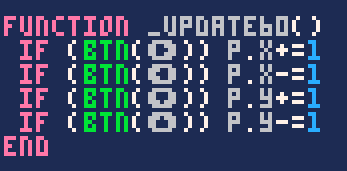

Il existe trois fonctions pré-définies dans PICO-8 qui vous seront très utiles :

- `_init()` contient tout ce qui doit être exécuté une seule fois au démarrage du jeu. On y définit tout ce qui nous aide à préparer le jeu : le nombre de PV du joueur, sa position de départ...
- `_update()` contient toute la logique du jeu et s'exécute 30 fois par seconde.
- `_draw()` est exécuté 30 fois par seconde aussi, juste après update, et on y met tout ce qui concerne l'affichage des graphismes.



:::hypemarvin
Pourquoi je dois séparer update et draw alors que les deux se jouent à la suite ?
:::

:::astride
Quand tout se passe bien, c'est vrai qu'on ne verrait pas la différence en écrivant tout dans la même fonction. Par contre, c'est utile si le jeu se met à ralentir !
:::

Lorsque le jeu devient trop gourmand pour la petite machine virtuelle et que PICO-8 n'arrive pas à dessiner les frames à temps, `_draw()` sera appelé à 15 FPS, et `update()` sera appelé deux fois par frame pour compenser. Ainsi le gameplay continue de fonctionner à la vitesse normale même quand l'affichage est ralenti !

:::profremi
Si vous préférez que votre jeu tourne à 60 FPS, remplacez `_update()` par `_update60()`. Cela veut dire que PICO-8 doit calculer deux fois plus de frames par seconde, mais cela ne pose pas de problème pour les jeux les plus simples.
:::

### Déplacer un personnage

Pour rappel, notre but est de faire bouger le vaisseau en utilisant les flèches. Dans notre cas, nous allons utiliser `_init()` pour définir la position de départ du vaisseau, puis `_update()` regardera si une touche est appuyée pour changer la valeur X ou Y, et enfin `_draw()` affichera le sprite au bon endroit.

Commencez par mettre le code que vous aviez déjà écrit dans la fonction `_draw()` :



Nous devons maintenant définir des variables pour la position du joueur. Pour être bien organisé, nous allons insérer toutes ces variables dans un tableau "player".


*Les tableaux sont un moyen de stocker plusieurs informations différentes en une seule variable.*

En Lua, un tableau peut se créer ainsi :

```lua
player = {x = 60, y = 80, speed = 4}
```

Et ensuite, on peut accéder aux valeurs en écrivant ceci :

```lua
player.x      => 60
player.y      => 80
player.speed  => 4
```

Vous pouvez l'écrire comme vous préférez, mais personnellement je vais nommer le tableau `p` plutôt que player, car on va l'utiliser souvent et il n'y a pas beaucoup de place sur l'écran de PICO-8.


*N'oubliez pas de changer les arguments de spr() pour qu'ils pointent vers vos variables !*

Parfait ! Nous allons pouvoir ajouter un peu d'interactivité maintenant. Ajoutez une fonction `_update()` ou `_update60()` (je vous conseille la version à 60 FPS, la fluidité est très appréciable) et écrivez-y cette condition :


*Pour écrire la flèche, tapez Maj+R (pour Right).*

Vous pouvez tester le jeu, et ça marche ! Cela dit, trois lignes pour un bête appui de touche, ça prend quand même beaucoup de place. PICO-8 propose une écriture alternative en une ligne :

```lua
--condition classique
if question then
  commandes
end
--condition en une ligne
if (question) commandes
```

Pratique pour les conditions simples comme celle-ci !


Essayez d'écrire les conditions correspondant aux 4 directions. Pour écrire les signes des flèches, tapez Maj+L, R, U ou D (pour *Left*, *Right*, *Up* et *Down*).



:::winkastride
Les boutons peuvent aussi être désignés par des chiffres et vous pouvez avoir jusqu'à 8 joueurs différents en branchant des manettes ! Tout est dans la [documentation de `btn`](https://www.lexaloffle.com/dl/docs/pico-8_manual.html#BTN).
:::

Ça fait plaisir de voir son petit vaisseau bouger à l'écran, n'est-ce pas ? Ajoutons une touche finale : actuellement, votre fonction déplace le joueur de 1 pixel par frame. Vous vous souvenez que nous avions défini une propriété `speed` pour le joueur ? Essayez de l'utiliser dans votre code de déplacement.


:::hypemarvin
Pourquoi s'embêter à créer une variable `speed` alors que je peux directement écrire le chiffre que je veux dans `_update()` ?
:::

D'une part, c'est un peu plus propre : la prochaine fois que vous voudrez changer la vitesse, il suffira de modifier cette variable dans `_init()` plutôt que de la changer à 4 endroits différents. Mais cela vous permettra aussi de la manipuler en jeu ! Par exemple, pour créer un power-up qui double votre vitesse, il suffirait d'écrire `p.speed *= 2`.
