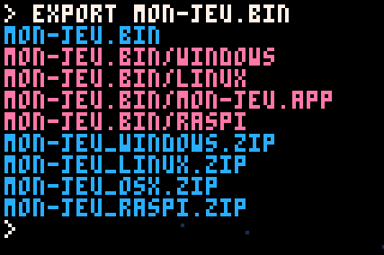
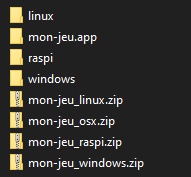
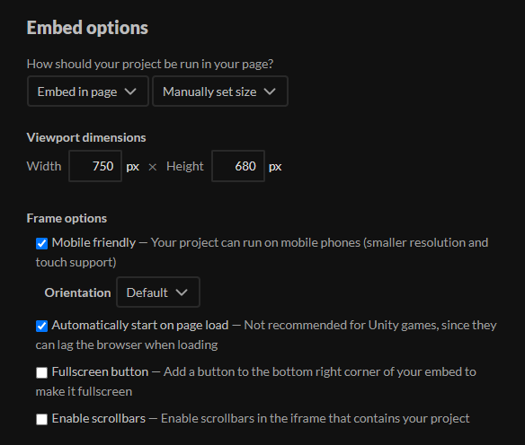
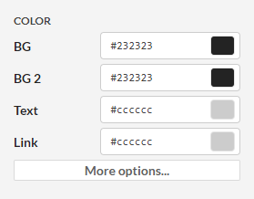

Cette page est la dernière section sur les bases de PICO-8. Dans les chapitres suivants, nous allons réaliser des jeux concrets ! A tout moment, lorsque vous souhaiterez partager votre avancement à vos ami·e·s, vous pourrez revenir à cette page qui détaille comment exporter un jeu et le publier sur Internet.

### Créer une cartouche

Pour être partagé, votre jeu doit avoir un titre et une image de couverture ! Au tout début de votre code, écrivez deux lignes qui apparaîtront sur l'image de cartouche.

```lua
--jeu dans l'espace !!
--par marvin
```

Ensuite, appuyez sur F7 pendant le jeu pour capturer une image de couverture.

Pour partager votre jeu à d'autres utilisateurs et utilisatrices de PICO-8, vous pourriez tout simplement envoyer le fichier `.p8`, ou bien créer une image de cartouche avec `save mon-jeu.p8.png`. Vous trouverez des images de la sorte sur le site de Lexaloffle par exemple, et vous pouvez les ouvrir dans PICO-8 comme un fichier normal.

:::marvin
Et si mes amis n'ont pas PICO-8 ?
:::

:::astride
Tu dois rendre ton jeu *standalone* ! Cela veut dire qu'il n'aura besoin de rien d'autre pour se lancer.
:::

Appuyez sur Echap et écrivez la commande :

```
export mon-jeu.bin
```



`bin` est une abréviation de *binaries*, ou exécutables en français. Cette commande produit donc une version différente de votre jeu par système d'exploitation : Windows, Linux, Mac et même Raspberry Pi ! Pour avoir l'allure d'un·e vrai·e pro, vous pouvez aussi personnaliser l'icône du fichier exécutable. Dessinez-la sur votre spritesheet, et notez son numéro dans le paramètre `-i`.

```
export -i 21 mon-jeu.bin
```

Si besoin, précisez la taille de l'icône avec `-s` (`2` pour du 16×16px) et la couleur de transparence avec `-c` (noir par défaut, `16` pour aucune transparence).

#### Partager vers Mac et Linux

Sur Windows, un fichier exécutable est indiqué par l'extension `.exe`, mais le fonctionnement est différent sur Mac et Linux. Or, le système de fichiers de Windows ne permet pas de stocker les métadonnées requises pour rendre un fichier exécutable sur ces autres systèmes. Cela veut dire que si vous utilisez Windows pour envoyer le fichier, les joueurs et joueuses sur Mac et Linux devraient faire une manipulation par eux-mêmes après le téléchargement.



Pour éviter cela, PICO-8 génère aussi des fichiers zip qui peuvent conserver les bonnes propriétés tant qu'ils ne sont pas extraits sur Windows. Il vaut donc mieux que vous partagiez ces zip tels quels pour que tout fonctionne directement sur les autres systèmes. Si vous avez besoin d'ajouter un fichier dans les zip, précisez-le plutôt à PICO-8 au moment de l'exportation :

```
export -e manuel.pdf mon-jeu.bin
```

#### Assembler plusieurs cartouches

Vous pouvez exporter plusieurs fichiers `.p8` en un seul jeu :

```
export mon-jeu.bin cart1.p8 cart2.p8
```

Pratique pour créer de gros jeux dépassant les limites de PICO-8, ou pour créer une compilation de plusieurs jeux ! Vous pouvez assembler jusqu'à 16 cartouches, et les charger à tout moment avec `load("cartouche.p8")`. Dernière astuce : pour charger uniquement la spritesheet d'une cartouche, écrivez `reload(0, 0, 0x2000, "cartouche.p8")`.

### Jouer sur navigateur

Les jeux PICO-8 sont généralement assez courts et on aime les lancer rapidement, comme des jeux d'arcade. C'est pourquoi à mon avis, ils ont toute leur place sur navigateur. Créer une version web de votre jeu est simple comme bonjour :

```
export -f mon-jeu.html
```

Le paramètre `-f` n'est pas obligatoire, mais je vous le conseille : il indique que les fichiers seront générés dans un sous-dossier pour s'y retrouver plus facilement.

Le fichier HTML s'ouvre avec le navigateur et contient le lecteur de PICO-8. Essayez-le ! Le fichier JS, quant à lui, contient toutes les données de votre jeu. Si à l'avenir vous éditez le fichier HTML, pour ajouter du texte en-dessous ou pour changer les couleurs par exemple, vous pourrez mettre à jour le jeu en générant uniquement un fichier JS :

```
export mon-jeu.js
```

#### Héberger le jeu sur Internet

Pour rendre votre jeu accessible à une certaine adresse, plusieurs options s'offrent à vous : si vous possédez un serveur, vous pouvez simplement y envoyer les deux fichiers. Sinon, vous pouvez envoyer votre cartouche sur le site de Lexaloffle, la communauté officielle de PICO-8. C'est là que les développeurs et développeuses s'échangent des démos techniques et des tutoriels ; j'y trouve d'ailleurs la plupart de mes astuces. On peut aussi y publier des vrais jeux, mais pour cela j'ai une préférence pour itch.io, qui est davantage visité par un public de joueurs et qui a de meilleures fonctions de recherche.

#### Paramétrer sur itch.io

Créez un nouveau projet sur itch.io. Si vous avez besoin de conseils supplémentaires, n'hésitez pas à consulter notre cours sur itch.io, car je vais uniquement me concentrer sur les détails propres à PICO-8.

Compressez le dossier du jeu web (sur Windows : clic droit, envoyer vers dossier compressé). Uploadez le zip sur itch.io et cochez "This file will be played in the browser". Cela permettra à votre fichier HTML de s'afficher dans un *embed*, c'est-à-dire un cadre au sein de la page itch.io. Plus bas, vous pouvez régler les options de ce cadre, et pour un jeu PICO-8, je vous conseille ces réglages :



Une fois sur la page du jeu, cliquez sur Edit theme pour choisir des couleurs qui accompagnent bien l'embed.



Sachez qu'en plus de la version web, vous pouvez aussi proposer des versions Windows, Mac et Linux qui seront disponibles au téléchargement en bas de la page.

#### Jouer sur smartphone

Un grand avantage de la version web des jeux PICO-8, c'est l'interface pour mobile qui se déclenche automatiquement si vous êtes sur ce type d'appareil ! Cela dit, sur les téléphones de mon entourage, cela n'est pas idéal : le jeu est généralement fluide mais le son fait des crissements très désagréables. A surveiller, cela évoluera peut-être un jour !
