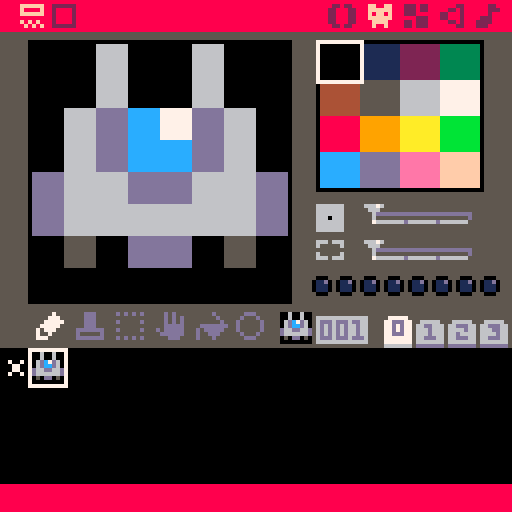

Bien, maintenant que vous avez fait le tour du propriétaire, le moment est idéal pour créer votre première cartouche. Redémarrez PICO-8 avec la commande `reboot` pour oublier le dernier jeu chargé et revenir au dossier racine simplement.

Vous pouvez utiliser la commande `save shooter` pour créer une nouvelle cartouche. Dorénavant, il vous suffira d'écrire `save` ou d'appuyer sur Ctrl+S pour enregistrer votre jeu.

Allez jusqu'au menu de dessin et faites un vaisseau. Ne copiez pas forcément le mien : c'est plus sympa si vous faites un truc à vous !



Retournez ensuite dans l'éditeur de code et écrivez :

```lua
cls()
spr(1,60,60)
```

Lancez le jeu avec Ctrl+R, et voilà votre vaisseau qui s'affiche ! Laissez-moi vous expliquer ce que vous avez fait :

- `cls()` remplit l'écran de noir. Comme PICO-8 dessine par-dessus ce qui existe déjà, on utilise cette fonction en début de frame pour ne pas voir la frame précédente. Vous pouvez remplir l'écran avec une des 16 couleurs que vous voyez dans le menu de dessin. Essayez par exemple `cls(14)` pour avoir un fond rose.
- `spr()` affiche un sprite. Les trois paramètres sont dans l'ordre : le numéro du sprite, sa position X et sa position Y. Essayez de faire varier la position et voyez ce qui se passe !


*Les positions X et Y sur l'écran de PICO-8.*

Comme un sprite fait 8×8 pixels et que la position représente le coin haut-gauche, écrire `spr(1,60,60)` l'affiche pile au milieu de l'écran.

`spr()` possède également d'autres fonctionnalités bien pratiques qui sont détaillées dans le manuel. Au cours de cette formation, si vous ne comprenez pas bien une commande ou souhaitez en savoir plus, n'hésitez pas à consulter le manuel, disponible dans le dossier du logiciel ou sur [cette page](https://www.lexaloffle.com/pico-8.php?page=manual). Votre curiosité sera récompensée et vous apprendrez beaucoup de choses !

Dans la prochaine étape, on va déplacer votre super vaisseau avec les flèches du clavier. Si vous avez bien suivi, ça veut dire qu'on fera varier sa position X ou Y quand on appuie sur une touche !