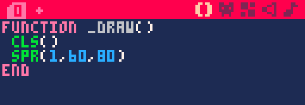
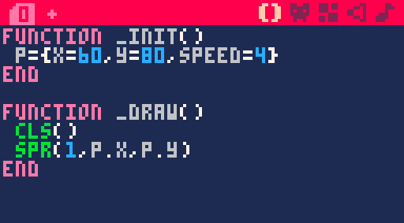
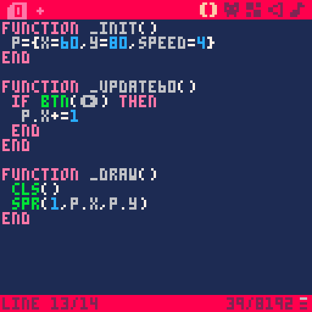
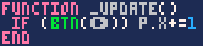
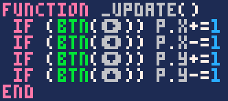
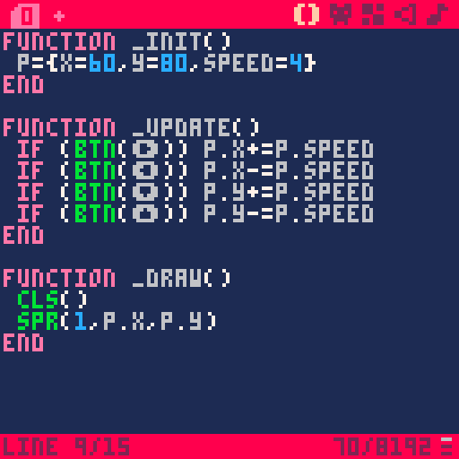

Il existe trois fonctions pré-définies dans PICO-8 qui vous seront très utiles :

- `_init()` contient tout ce qui doit être exécuté une seule fois au démarrage du jeu. On y définit tout ce qui nous aide à préparer le jeu : le nombre de PV du joueur, sa position de départ...
- `_update()` contient toute la logique du jeu et s'exécute 30 fois par seconde.
- `_draw()` est exécuté 30 fois par seconde aussi, juste après update, et on y met tout ce qui concerne l'affichage des graphismes.


Vous vous demandez peut-être : « Mais pourquoi séparer update et draw alors que les deux sont lus à la suite ? »

Quand tout se passe normalement, ça ne fait pas de différence de tout écrire dans la même fonction, en effet. Par contre, c'est utile si le jeu devient trop gourmand pour la petite machine virtuelle et se met à ralentir ! Si PICO-8 n'arrive pas à dessiner les frames à temps, `_draw()` sera appelé à 15 FPS, et `update()` sera appelé deux fois par frame pour compenser. Ainsi le gameplay continue de fonctionner à la vitesse normale même quand l'affichage est ralenti !

> Si vous préférez que votre jeu tourne à 60 FPS, remplacez `_update()` par `_update60()`. Chaque frame aura donc moitié moins de puissance processeur pour être calculée, mais cela suffit largement pour les jeux les plus simples.

### Déplacer le vaisseau

Pour rappel, notre but est de faire bouger le vaisseau en utilisant les flèches. Dans notre cas, nous allons utiliser `_init()` pour définir la position de départ du vaisseau, puis `_update()` regardera si une touche est appuyée pour changer la valeur X ou Y, et enfin `_draw()` affichera le sprite au bon endroit.

Commencez par mettre le code que vous aviez déjà écrit dans la fonction `_draw()` :



Nous devons maintenant définir des variables pour la position du joueur. Pour être bien organisé, nous allons insérer toutes ces variables dans un tableau "player".


*Les tableaux sont un moyen de stocker plusieurs informations différentes en une seule variable.*

En Lua, un tableau peut se créer ainsi :

```lua
player = {x = 60, y = 80, speed = 4}
```

Et ensuite, on peut accéder aux valeurs en écrivant ceci :

```lua
player.x      => 60
player.y      => 80
player.speed  => 4
```

Vous pouvez l'écrire comme vous préférez, mais personnellement je vais nommer le tableau `p` plutôt que player, car on va l'utiliser souvent et il n'y a pas beaucoup de place sur l'écran de PICO-8.


*N'oubliez pas de changer les arguments de spr() pour qu'ils pointent vers vos variables !*

Parfait ! Nous allons pouvoir ajouter un peu d'interactivité maintenant. Ajoutez une fonction `_update()` ou `_update60()` (je vous conseille la version à 60 FPS, la fluidité est très appréciable) et écrivez-y cette condition :


*Pour écrire la flèche, tapez Maj+R (pour Right).*

Vous pouvez tester le jeu, et ça marche ! Cela dit, trois lignes pour un bête appui de touche, ça prend quand même beaucoup de place. PICO-8 propose une écriture alternative en une ligne :

```lua
--condition classique
if question then
  commandes
end
--condition en une ligne
if (question) commandes
```

Pratique pour les conditions simples comme celle-ci !



Essayez d'écrire les conditions correspondant aux 4 directions. Pour écrire les signes des flèches, tapez Maj+L, R, U ou D (pour *Left*, *Right*, *Up* et *Down*).



Ça fait plaisir de voir son petit vaisseau bouger à l'écran, n'est-ce pas ? Ajoutons une touche finale : actuellement, votre fonction déplace le joueur de 1 pixel par frame. Vous vous souvenez que nous avions défini une propriété `speed` pour le joueur ? Essayez de l'utiliser dans votre code de déplacement.



:::marvin
Pourquoi s'embêter à créer une variable `speed` alors que je peux directement écrire le chiffre que je veux dans `_update()` ?
:::

D'une part, c'est un peu plus propre : la prochaine fois que vous voudrez changer la vitesse, il suffira de modifier cette variable dans `_init()` plutôt que de la changer à 4 endroits différents. Mais cela vous permettra aussi de la manipuler en jeu ! Par exemple, pour créer un power-up qui double votre vitesse, il suffirait d'écrire `p.speed *= 2`.
