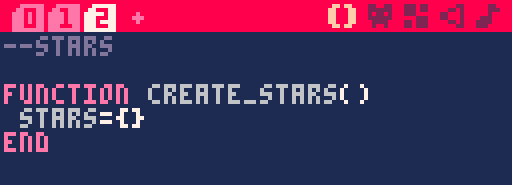
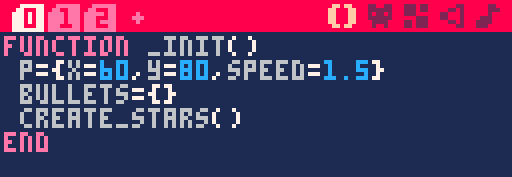
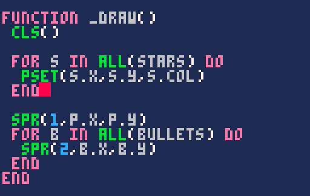

Continuons de nous entraîner avec les boucles for en affichant des étoiles qui défilent.

[[Video src="/videos/pico-8/etoiles-defilantes.mp4" autoplay muted loop controls]]

Chaque étoile aura une position X et Y, une couleur et une vitesse. Comme vous le voyez, en faisant varier la couleur et la vitesse des étoiles, on peut créer un effet de profondeur sympathique !

Dans un nouvel onglet nommé stars, créez une fonction `create_stars()`. Définissez un tableau `stars` qu'on va remplir juste après de toutes nos étoiles.



Disons que je veux créer 20 étoiles toutes à des endroits aléatoires de l'écran. Je pourrais copier 20 fois le code de création de l'étoile... ou utiliser un boucle for !


Pour rappel, `i` est une variable locale qui commence à 1, et monte de 1 à chaque fois que la boucle se joue, jusqu'à 20. En fait, si on voulait, `i` pourrait même monter de 5 en 5. Il faudrait écrire `i=1,20,5`, mais ça n'aurait pas d'intérêt ici.

A 20 reprises, on crée une étoile avec un X et Y aléatoire dans l'écran (qui fait 128px de côté), on lui donne une couleur et une vitesse, puis on l'ajoute au tableau `stars`.

> Dans PICO-8, `rnd(n)` renvoie un nombre décimal où 0 ≤ résultat < n. Si besoin, vous pouvez obtenir un nombre entier en arrondissant au nombre inférieur `flr()` ou au nombre supérieur `ceil()`.

Ok, voilà pour la création de nos étoiles au début du jeu. Vous pouvez appeler cette fonction dans init.



Même s'il n'y a pas encore de mouvement, j'ai bien envie de voir à quoi mes étoiles ressemblent ! Nous n'allons pas dessiner de sprite pour afficher un point, puisqu'il existe pour cela la fonction "pixel set" : `pset(x, y, couleur)`.



Comme je vous l'avais dit, PICO-8 dessine chaque nouvel élément par-dessus ce qui existe déjà. Il faut donc dessiner les étoiles en premier, pour que le vaisseau soit affiché par-dessus.

Vous pouvez déjà ajuster la couleur et le nombres d'étoiles... Mais vous verrez, ça aura beaucoup plus de cachet en mouvement.

Créons une fonction `update_stars()` pour faire défiler les étoiles au cours du jeu. Pour chaque étoile dans le tableau `stars`, on va diminuer son Y... Eh oui, c'est l'heure d'écrire une nouvelle boucle for :


Pensez à appeler `update_stars()` dans `_update60()`. Si vous essayez le jeu, vous allez vous apercevoir d'un petit problème... Les étoiles s'en vont et ne reviennent jamais. Donc quand une étoile atteindra le bas de l'écran, nous allons la replacer en haut, et lui redonner un X aléatoire (sinon, le même motif défilerait en boucle).


On commence à être pas mal ! Voici quelques idées si vous voulez changer le style des étoiles à votre façon :

- Vous pouvez rendre leur vitesse aléatoire avec `speed = rnd(4)`. Par contre, certaines étoiles auront une vitesse très proche de 0. Pour obtenir une vitesse entre 2 et 4, écrivez `2 + rnd(2)`.

- Vous pouvez également rendre la couleur aléatoire ! Si vous donnez un tableau à `rnd()`, elle vous renverra un élément aléatoire du tableau. Préparez une liste de couleurs, par exemple `{9, 14, 15}`, et vous pouvez écrire `col = rnd({9, 14, 15})`.

- Une astuce que j'aime bien, c'est de créer un groupe d'étoiles lentes à l'arrière plan, et un groupe d'étoiles rapides au premier plan. Vous pouvez le faire ainsi :

```lua
for i=1,20 do
    local new_star = {
        x = rnd(128), y = rnd(128),
        col = 1,
        speed = 1 + rnd(0.5)
    }
    add(stars, new_star)
end
for i=1,8 do
    local new_star = {
        x = rnd(128), y = rnd(128),
        col = 6,
        speed = 3 + rnd(1)
    }
    add(stars, new_star)
end
```
