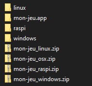

Votre jeu doit avoir un titre et une image de couverture ! Au tout début de votre code, écrivez deux lignes qui apparaîtront sur l'image de cartouche.

```lua
--jeu dans l'espace !!
--par marvin
```

Ensuite, appuyez sur F7 pendant le jeu pour capturer une image de couverture.

Pour partager votre jeu à d'autres utilisateurs et utilisatrices de PICO-8, vous pourriez tout simplement envoyer le fichier `.p8`, ou bien créer une image de cartouche avec `save mon-jeu.p8.png`. Vous trouverez des images de la sorte sur le site de Lexaloffle par exemple, et vous pouvez les ouvrir dans PICO-8 comme un fichier normal.

:::marvin
Et si mes amis n'ont pas PICO-8 ?
:::

:::astride
Tu dois rendre ton jeu *standalone* ! Cela veut dire qu'il n'aura besoin de rien d'autre pour se lancer.
:::

Appuyez sur Echap et écrivez la commande :

```
export mon-jeu.bin
```


`bin` est une abréviation de *binaries*, ou exécutables en français. Cette commande produit donc une version différente de votre jeu par système d'exploitation : Windows, Linux, Mac et même Raspberry Pi ! Pour avoir l'allure d'un·e vrai·e pro, vous pouvez aussi personnaliser l'icône du fichier exécutable. Dessinez-la sur votre spritesheet, et notez son numéro dans le paramètre `-i`.

```
export -i 21 mon-jeu.bin
```

Si besoin, précisez la taille de l'icône avec `-s` (`2` pour du 16×16px) et la couleur de transparence avec `-c` (noir par défaut, `16` pour aucune transparence).

### Partager vers Mac et Linux

Sur Windows, un fichier exécutable est indiqué par l'extension `.exe`, mais le fonctionnement est différent sur Mac et Linux. Or, le système de fichiers de Windows ne permet pas de stocker les métadonnées requises pour rendre un fichier exécutable sur ces autres systèmes. Cela veut dire que si vous utilisez Windows pour envoyer le fichier, les joueurs et joueuses sur Mac et Linux devraient faire une manipulation par eux-mêmes après le téléchargement.



Pour éviter cela, PICO-8 génère aussi des fichiers zip qui peuvent conserver les bonnes propriétés tant qu'ils ne sont pas extraits sur Windows. Il vaut donc mieux que vous partagiez ces zip tels quels pour que tout fonctionne directement sur les autres systèmes. Si vous avez besoin d'ajouter un fichier dans les zip, précisez-le plutôt à PICO-8 au moment de l'exportation :

```
export -e manuel.pdf mon-jeu.bin
```

### Assembler plusieurs cartouches

Vous pouvez exporter plusieurs fichiers `.p8` en un seul jeu :

```
export mon-jeu.bin cart1.p8 cart2.p8
```

Pratique pour créer de gros jeux dépassant les limites de PICO-8, ou pour créer une compilation de plusieurs jeux ! Vous pouvez assembler jusqu'à 16 cartouches, et les charger à tout moment avec `load("cartouche.p8")`. Dernière astuce : pour charger uniquement la spritesheet d'une cartouche, écrivez `reload(0, 0, 0x2000, "cartouche.p8")`.
