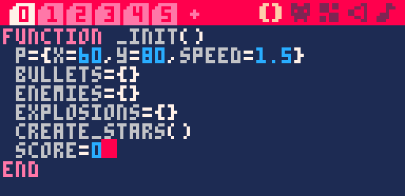
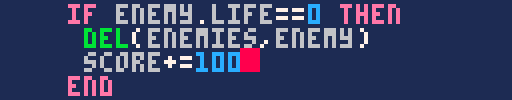
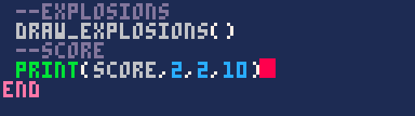
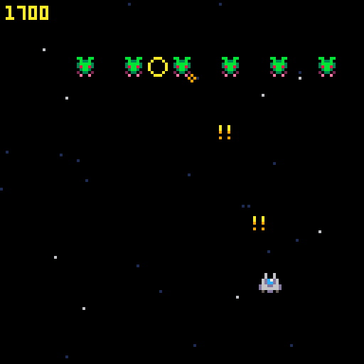
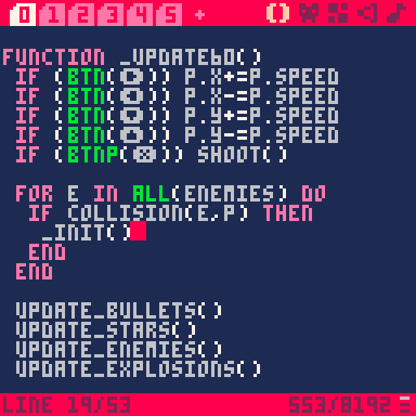
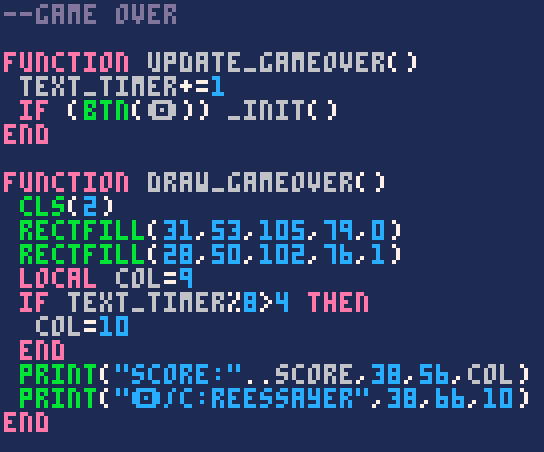
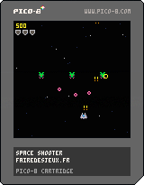

Vous êtes arrivé·e à la dernière étape de la réalisation de votre premier jeu sur PICO-8. Félicitations ! Nous allons coder ce qui nous manque pour obtenir un vrai jeu que vous pouvez partager, c'est-à-dire un score qui s'affiche quand on meurt et la possibilité de recommencer une partie.

### Afficher un score

Au début du jeu, on doit déclarer la variable `score` et la mettre à 0 :



Ensuite, quand on tue un ennemi, montez le score de 100 points par exemple. C'est toujours plus gratifiant quand il y a plein de zéros !



Enfin, et c'est là la nouveauté, nous allons afficher du texte dans un coin de l'écran avec la commande `print()`.

```lua
print("texte", x, y, couleur)
```

Les guillemets permettent d'indiquer que c'est un texte, ou un *string* en programmation. Sans les guillemets, PICO-8 tentera de l'interpréter comme une instruction. Ainsi, vous pouvez afficher le contenu d'une variable, ou encore appeler une fonction qui renverra un texte.

```lua
print(score_text(), 0, 0, 7)

function score_text()
    if score > 1000 then
        return "mega score !!!"
    else
        return "perfectible"
    end
end
```

Comme pour la plupart des fonctions de PICO-8 acceptant une couleur, si on ne la précise pas, la dernière couleur utilisée est choisie. Ainsi, en écrivant ceci :

```lua
print("score:", 2, 2, 7)
print(score, 2, 8)
```

...les deux textes seront affichés avec la couleur 7, le blanc. En connaissant toutes ces astuces, vous pouvez afficher le score comme il vous plaît à la fin de draw. Voici un exemple tout simple :





Plus qu'à gérer la collision entre notre vaisseau et les ennemis afin d'avoir une condition de défaite !


*Au tout début de ce cours, nous n'avions pas encore pris l'habitude de ranger les choses dans des fonctions, donc ce qui concerne notre vaisseau est directement dans update. N'hésitez pas à réorganiser ça !*

Pour le moment, on n'a pas d'écran de game over. En appelant `_init()`, on remet toutes les variables à leur état initial, donc c'est un peu comme si on redémarrait le jeu. Plus tard, on appellera plutôt notre scène de game over, mais... comment créer différentes scènes ?

### Gérer plusieurs états

Actuellement, dans update et draw se joue tout ce qui concerne la scène du jeu : le décor, le vaisseau, les ennemis... On ne veut pas de tout cela quand on est dans le menu de game over. De la même façon, le texte de game over ne doit pas s'afficher alors qu'on est en train de jouer ! On a donc besoin de deux états bien distincts. Voici une façon simple de gérer plusieurs états dans son jeu :

```lua
function _init()
    state = 0 -- on commence à l'état 0 : l'état d'une partie en cours
end

function _update()
    if (state == 0) update_game()
    if (state == 1) update_gameover()
end

function _draw()
    if (state == 0) draw_game()
    if (state == 1) draw_gameover()
end

function update_game()
    -- ici, écrire tout ce qui concerne une partie en cours.
    -- quand on meurt, changer d'état avec :
    state = 1
end

function update_gameover()
    -- ici, écrire ce qui concerne le menu de game over.
    -- quand on relance la partie, changer d'état avec :
    state = 0
end

function draw_game()
    -- afficher le jeu
end

function draw_gameover()
    -- afficher le menu de game over
end
```

En suivant cette logique, vous pourriez réaliser davantage d'états, pour un écran-titre ou un menu de magasin par exemple. Suivez ces quelques étapes pour préparer votre jeu à gérer des états :

1. Créez la variable `state` avec une valeur de base dans `_init()`.

2. Renommez les `_update60()` et `_draw()` actuelles en `update_game()` et `draw_game()`.

3. Créez les nouvelles `_update60()` et `_draw()` :

    ```lua
    function _update()
        if (state == 0) update_game()
        if (state == 1) update_gameover()
    end

    function _draw()
        if (state == 0) draw_game()
        if (state == 1) draw_gameover()
    end
    ```

4. Créez les fonctions `update_gameover()` et `draw_gameover()` dans un nouvel onglet "*Game over*" et laissez-les vides pour le moment.

5. Au moment où le joueur ou la joueuse meurt, au lieu de redémarrer le jeu, changez la valeur de `state` pour passer en game over.

Maintenant, le jeu devrait se figer lorsqu'on meurt. On dirait pas comme ça, mais c'est bon signe ! Actuellement, `draw_gameover()` ne dessine rien, donc c'est la preuve que l'on est dedans.

### Dessiner l'écran de game over

Commencez par choisir une couleur de fond avec `cls()` puis laissez libre cours à votre imagination. Affichez un petit message avec le score puis faites en sorte que l'on puisse quitter l'écran en appuyant sur la touche O (écrivez le symbole avec Maj+O).


*Mon écran contient une fenêtre et son ombre dessinées avec des rectfill ainsi qu'un texte dont la couleur clignote en utilisant l'astuce du modulo. Les deux points `..` permettent de [concaténer](https://www.lua.org/pil/3.4.html) les deux textes.*

Vous pouvez essayer d'écrire `state = 0` pour relancer une partie, mais cela posera un problème car les variables du jeu n'ont pas été réinitialisées. Dans notre cas, autant relancer `_init()` qui remet tout à zéro, incluant la variable `state`.

### Perspectives d'amélioration

A travers ce chapitre, j'ai pu vous montrer plein de concepts de base de PICO-8 ! Il nous reste encore plein de choses à voir, comme l'affichage d'une map, le déplacement case par case... Mais je garde ça pour le prochain chapitre. Maintenant, c'est à vous de choisir : vous pouvez directement passer à la suite pour réaliser un jeu d'aventure, ou bien continuer à vous entraîner sur ce petit shooter. Voici quelques idées intéressantes qui vous feront vous triturer un peu les méninges :

- Donnez des points de vie au vaisseau et un temps d'invincibilité après s'être fait toucher. Affichez des sprites de cœur ou dessinez une jauge avec [rectfill](https://www.lexaloffle.com/dl/docs/pico-8_manual.html#RECT).

- Améliorez la fonction de collision pour que chaque élément possède un X et un Y, mais aussi une largeur et une hauteur, comme dans la version originale de [MBoffin](https://mboffin.itch.io/pico8-overlap). Utile si vos sprites de projectile sont petits !

- Faites que les ennemis tirent leurs propres projectiles. Vous pouvez commencer simplement avec des tirs qui descendent en Y. Ensuite, complexifiez le système pour que chaque balle puisse suivre un angle, pour suivre notre vaisseau par exemple. Vous aurez besoin de cosinus et de sinus !

<iframe width="538" height="539"
  src="/jeux-pico-8/space-shooter/index.html">
</iframe>

Prenez le temps de chercher par vous-même, et si vous bloquez, téléchargez cette cartouche et ouvrez-la dans une deuxième fenêtre de PICO-8. Elle contient tout ce que nous avons fait dans le tuto ainsi que ces trois points bonus.


*Enregistrez l'image dans le dossier de vos cartouches.<br/>Pour trouver le dossier, tapez `folder` au lancement de PICO-8.*

Vous pouvez également demander de l'aide dans la section d'entraide de notre serveur Discord !
