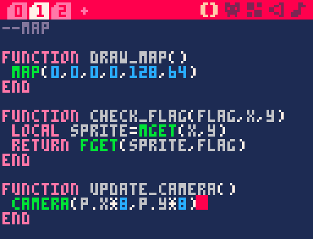
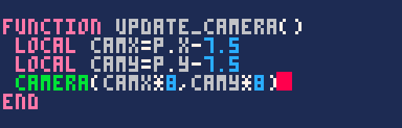
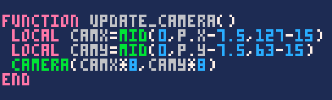
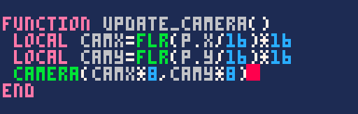

<iframe width="538" height="539"
  src="/jeux-pico-8/demo-camera-modes/index.html">
</iframe>

La première méthode garde le personnage au centre de l'écran, à la manière des vieux jeux Ultima, tandis que la deuxième présente des zones fixes, à la manière du premier Zelda sur NES. Personnellement, je trouve que la deuxième méthode a beaucoup de charme !

Quelque soit la méthode que vous choisissez, je vous conseille de lire cette section dans l'ordre car j'expliquerai les choses progressivement. Dans l'onglet "*Map*", créez une fonction `update_camera()` et appelez-la à la fin d'update.

### Première méthode

Avec la fonction `camera(x, y)`, vous pouvez changer la position du coin haut-gauche de la caméra. En pratique, quand vous déplacez la caméra, cela veut dire que vous décalez tout ce qui est ensuite dessiné dans draw. Faites un petit test en écrivant les mêmes coordonnées que le sprite du personnage :

La caméra suit bien le personnage ; il ne reste plus qu'à la reculer pour qu'il soit au centre. Comme l'écran fait 16 tiles de large, `p.x - 8` serait trop loin à gauche tandis que `p.x - 7` serait trop à droite. L'idéal, c'est entre les deux !

Il ne manque plus qu'à restreindre la caméra lorsqu'on est proche des bords de la carte en utilisant `mid`, comme on l'a fait précédemment pour le personnage.

### Deuxième méthode

Pour imiter le comportement du premier Zelda, il faut imaginer que notre carte est découpée en plusieurs écrans de 16×16 cases. Nous devons déterminer dans lequel de ces écrans se trouve le personnage, puis déplacer la caméra dans le coin-haut gauche du bon écran.

<iframe width="538" height="539"
  src="/jeux-pico-8/demo-camera-calcul/index.html">
</iframe>

Dans cette démo, vous pouvez déplacer le personnage avec les flèches et examiner comment la caméra est ajustée. L'astuce consiste à diviser la position du personnage par 16 et l'arrondir avec `flr` pour obtenir le numéro de l'écran dans lequel il se trouve. Il suffit alors de multiplier ce nombre par 16 pour obtenir la case où doit se trouver la caméra.

C'est du beau travail. Bien sûr, plus tard, il vous sera possible d'animer votre personnage et la caméra d'une façon plus fluide, et je vous partagerai pour cela quelques techniques dans le prochain chapitre. Une fois que vous avez choisi la méthode qui vous plaît le plus, vous pouvez passer à l'étape suivante !
