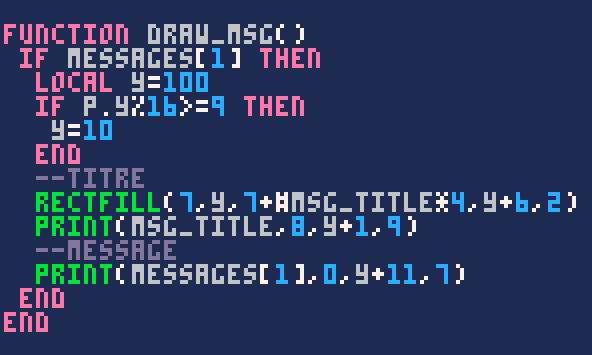

[[Video src="/videos/pico-8/boite-de-dialogue.mp4" autoplay muted loop controls]]

Comme vous pouvez le voir, le système affiche le nom de la personne qui parle ainsi qu'un ou plusieurs messages d'affilée. Cerise sur le gâteau, la boîte de dialogue s'affiche en haut ou en bas en fonction de la position de l'héroïne pour ne pas la recouvrir !

Créer un système de dialogues peut sembler compliqué au début, mais ne vous inquiétez pas, c'est en fait plutôt simple. J'en profiterai donc pour vous apprendre quelques astuces sur le chemin !

### Préparation

Commencez par dessiner un panneau ou un personnage à qui parler et donnez-lui le flag 0 pour qu'on ne puisse pas marcher dessus – ce serait impoli.


Dans un nouvel onglet, créez ces trois fonctions que vous appellerez à la fin d'init, update et draw :


La fonction `init_msg()` ne servira qu'à déclarer le tableau vide `messages`, donc elle est déjà terminée ! Réfléchissons à la suite.

Pour afficher un nouveau message, nous utiliserons la commande `create_msg("nom", "message 1", "message 2")` et ainsi de suite selon le nombre de messages que l'on souhaite. Ce sera très pratique et flexible, mais comment créer une fonction dont le nombre d'arguments peut varier de la sorte ? Avec trois petits points. Eh oui :


Le premier argument est le nom du locuteur et doit toujours être précisé. La suite s'adapte toute seule en fonction des arguments que vous écrivez ! Si on écrit deux messages comme dans mon exemple, alors la variable `messages` vaudra `{"message 1", "message 2"}`. Pour tester cela rapidement, créez un message temporaire dans `init_msg()` afin qu'il s'affiche dès le début du jeu.


#### Parenthèse sur les tableaux

Le tableau `messages` est une liste contenant une ou plusieurs valeurs à la suite. Jusqu'ici, dans nos tableaux, nous avons toujours nommé nous-mêmes les index des valeurs. Par exemple, dans le tableau `p` :

```lua
p = {
    x = 6,
    y = 3,
}
```

Le string `"x"` est l'index (on dit aussi *clé*) tandis que le nombre `6` est la valeur. Pour accéder à la valeur, vous écrivez `p.x` qui est en fait un raccourci syntaxique de la véritable écriture : `p["x"]`. Cela peut sembler étrange mais essayez et vous verrez que cela fonctionne. C'est parce qu'à la base, pour accéder à la valeur d'un tableau, on écrit `tableau[index]`.

Comment faire, donc, quand notre tableau est juste une liste de valeurs sans qu'on ait nommé des clés ? Eh bien par défaut, l'index est simplement 1, 2, 3, et ainsi de suite. Avec le tableau suivant :

```lua
messages = {"bonjour", "le vent frais"}
```

On accède aux valeurs ainsi :

```lua
messages[1]     => "bonjour"
messages[2]     => "le vent frais"
```

:::profremi
Dans la plupart des langages de programmation, l'index commence par défaut à zéro plutôt qu'à 1. Gardez cela à l'esprit lorsque vous passerez à un autre langage.
:::

Et voilà, vous savez tout ! On peut passer au vif du sujet.

### Afficher les messages dans l'ordre

Naturellement, nous souhaitons afficher les messages du premier au dernier. Dans `draw_msg()`, affichez le premier message sans oublier d'écrire une condition pour vérifier qu'il existe bel et bien, étant donné que le tableau `messages` sera parfois vide.


Le message devrait s'afficher au mileu de votre écran. C'est un début ! La fonction `update_msg()` sera chargée de passer au message suivant quand on appuie sur le bouton X.

Un aspect pratique des tableaux, c'est que lorsqu'on supprime un des éléments, les autres se décalent pour ne pas laisser de trou dans les index. Cela veut dire que si on supprime le message 1, tous les messages suivants seront décalés : le message 2 deviendra message 1 et ainsi de suite. Nous avons juste à supprimer l'index 1 lors de l'appui de touche dans `update_msg()` et cela fonctionnera sans rien toucher dans draw.


Vous connaissiez déjà `del(tableau, element)` qui supprime un élément donné du tableau ; voici maintenant [`deli(tableau, index)`](https://www.lexaloffle.com/pico-8.php?page=manual#main_div:~:text=deli%20t%20%5Bi%5D) qui vous l'aurez compris, supprime un index donné. En appuyant sur X en jeu, vous devriez maintenant voir le message suivant, ou bien rien du tout s'il n'en restait plus.

Plus qu'un détail à régler pour que le système soit fonctionnel : le personnage ne devrait pas pouvoir bouger lorsqu'un dialogue est en cours. Pour cela, c'est tout simple : il suffit de vérifier si le tableau `messages` est bien vide avant d'autoriser le mouvement. Pour rappel, on peut récupérer le nombre d'éléments dans un tableau avec `#`.


### Une jolie boîte de dialogue

Le système est fonctionnel, plus qu'à lui donner une belle apparence !

#### Adapter la position

Si vous utilisez la caméra par sections, il vous faut garder à l'esprit le fait que le personnage se trouvera souvent en bas de l'écran, donc derrière la boîte de dialogue. Si vous utilisez la caméra qui centre le personnage, ceci ne vous concerne pas, mais sinon, vous pouvez facilement déterminer si le personnage est en haut ou en bas de l'écran avec ce bon vieux modulo !


Si vous divisez la position Y du personnage par 16, le reste sera un nombre allant de 0 à 15 indiquant votre position Y par rapport à l'écran. Ainsi, si `p.y % 16 >= 9` est vraie, alors je suis plutôt bas dans l'écran, donc je peux placer le texte en haut. Bien sûr, vous pouvez changer le `9` par ce que vous voulez.

#### Le titre

J'aimerais que le cadre du nom s'adapte à la largeur du texte. Souvenez-vous que si vous utilisez `#` sur un string, vous obtenez le nombre de caractères. Vous pouvez partir du principe qu'un caractère fait 4 pixels de large (3 + 1 pixel d'espacement) et ainsi obtenir la largeur de fenêtre désirée.



#### Le message

Pour ce qui est de la fenêtre principale, demandez-vous combien de lignes prendront généralement vos messages pour en déterminer la hauteur. Dans mon cas, j'ai prévu deux lignes. Vous pouvez ajouter des retours à la ligne au sein d'un texte avec `\n` :

```lua
create_msg("panneau", "bienvenue dans mon jeu\nd'aventure.")
```

Après un peu de peaufinage, j'ai obtenu un résultat qui me plaît avec ce code :


### Afficher un message en cours de jeu

Placez votre panneau ou votre personnage sur la carte si ce n'est pas déjà fait. Notez les coordonnées qui s'affichent lorsque vous le survolez avec la souris. Dans la fonction d'interaction, vous pouvez renseigner ces coordonnées et écrire un message adéquat !


Bien sûr, si vous écrivez beaucoup de messages, vous aurez peut-être envie de les stocker dans une fonction séparée ou dans un grand tableau commun. Je vous laisserai juger de la méthode qui vous correspond le mieux !

### Utiliser ce système autrement

Au cours de cette étape, nous avons placé les dialogues sur des cases impassables. Si vous placez un dialogue sur une case de sol ordinaire, le texte s'affichera lorsque le personnage passe dessus, mais se réaffichera en boucle alors qu'on le ferme puisque "*New X Y*" se trouve par défaut au même endroit que le personnage. Pour faire en sorte que votre mise en scène ne se joue qu'une fois, vous pouvez imaginer plusieurs méthodes, comme par exemple activer un booléen et vérifier son état avant de jouer le texte.

Vous pouvez également faire en sorte qu'une zone plus large puisse déclencher un message. Voici un exemple :

```lua
if x >= 10 and x <= 16 and y == 40 and not visited_dungeon then
    create_msg("maitre du donjon", "bienvenue dans mon antre...")
    visited_dungeon = true
end
```

Le message s'affichera la première fois que vous marcherez dans la zone déterminée, mais plus jamais ensuite !
