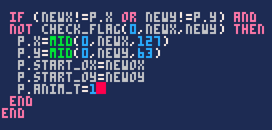
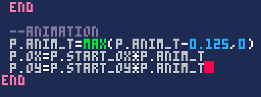

Nous commençons à avoir une bonne base pour créer un jeu d'exploration ! Dans cette dernière étape, je vous propose d'animer le personnage et la caméra pour obtenir un *look* plus propre. Voyez par vous-même :

<iframe width="538" height="539"
  src="/jeux-pico-8/demo-animations-avancees/index.html">
</iframe>

### Animer le personnage

Commençons par nous occuper du personnage. Si votre jeu utilise actuellement le mode 1 de caméra, vous risquez d'avoir un peu mal à la tête en testant le jeu au cours de cette étape, mais nous allons le corriger juste après.

#### Créer une position offset

Essayez de vous déplacer dans cette démo qui décompose ce que nous allons faire :

<iframe width="538" height="539"
  src="/jeux-pico-8/demo-offset/index.html">
</iframe>

La véritable position du personnage sur la grille, `p.x` et `p.y`, que l'on utilise pour détecter les collisions et interagir, ne changera pas. Elle est affichée en noir dans cette démo. Par contre, nous allons définir une position décalée de 8 pixels à chaque déplacement et qui reviendra progressivement à la véritable position. On l'appellera *offset* ; c'est le sprite blanc de la démo.

Remarquez que l'on autorise le joueur ou la joueuse à déplacer `p.x` et `p.y` seulement lorsque l'animation de l'offset est terminée. Ainsi, le sprite blanc se déplace de façon parfaitement fluide : on n'y voit que du feu !

Ajoutons les propriétés du personnage dont nous aurons besoin par la suite :


Pour vous donner une idée, les variables `ox` et `oy` représenteront la position actuelle de l'offset. `start_ox` et `start_oy` seront la position de départ de l'offset, au début d'un déplacement. `anim_t` vaudra 1 au début de l'animation, et ira jusqu'à 0 pour qu'elle se termine.

Commencez par placer l'offset de sorte à compenser chaque déplacement que l'on fait.

```lua
function player_movement()
    newx = p.x
    newy = p.y
    if btnp(⬅️) then
        newx -= 1
        newox = 8
        newoy = 0
    elseif btnp(➡️) then
        newx += 1
        newox = -8
        newoy = 0
    elseif btnp(⬆️) then
        newy -= 1
        newox = 0
        newoy = 8
    elseif btnp(⬇️) then
        newy += 1
        newox = 0
        newoy = -8
    end
```

Placez les conditions dans un `elseif` afin de dire au jeu de s'arrêter au premier bouton appuyé et ainsi d'interdire les déplacements en diagonale. Vous trouverez peut-être que l'on se répète beaucoup en écrivant tous ces `newox` et `newoy` mais rassurez-vous : c'est temporaire.

Plus bas, dans la condition qui vérifie la collison avant de déplacer `p.x` et `p.y`, nous pouvons aussi confirmer la position de départ de l'offset, et dire que l'animation commence en mettant `p.anim_t` à 1.


Cela dit, cette condition est actuellement vraie en permanence tant qu'il n'y a pas d'obstacle à "New X Y", même si nous sommes immobiles et que "New X Y" se trouve sous nos pieds. Nous devons faire en sorte que la condition se joue uniquement lorsque le joueur ou la joueuse tente de se déplacer, c'est à dire que "New X Y" n'est pas sous nos pieds.



Au passage, je vous conseille d'enlever le `else` qui joue le son. Avec l'animation améliorée, on n'a plus besoin de ce feedback supplémentaire, et maintenant que nous n'utilisons plus btnp, le son se jouerait en boucle.

Juste en-dessous, donc à la fin de la fonction `player_movement()`, ajoutez ce code qui anime l'offset.



La première ligne diminue `p.anim_t` au fil du temps jusqu'à atteindre 0. Plus nous diminuons `p.anim_t`, plus `p.ox` et `p.oy` deviennent petits, ce qui nous rapproche de la position réelle du personnage, et ce jusqu'à obtenir un offset de 0.

Lorsque nous affichons le personnage, nous devons maintenant prendre en compte l'offset :


Maintenant, l'animation de déplacement est fluide mais saute lorsqu'on maintient une flèche appuyée. C'est parce que jusqu'ici, nous déplacions le personnage à chaque fois que btnp était vrai. Maintenant, nous vérifierons plutôt les boutons quand `p.anim_t` est égal à 0, autrement dit quand l'animation est terminée.

```lua
function player_movement()
    newx = p.x
    newy = p.y
    if p.anim_t == 0 then
        newox = 0
        newoy = 0
        if btn(⬅️) then
            newx -= 1
            newox = 8
        elseif btn(➡️) then
            newx += 1
            newox = -8
        elseif btn(⬆️) then
            newy -= 1
            newoy = 8
        elseif btn(⬇️) then
            newy += 1
            newoy = -8
        end
    end
```

Au passage, cela nous permet de n'écrire qu'une fois `newox = 0` et `newoy = 0` !

Pensez aussi à changer les btnp en btn, pour que le jeu puisse réagir dès que l'animation est terminée.

#### Retourner le sprite

Pour changer la direction dans laquelle regarde le personnage quand il va vers la gauche, inutile de dessiner deux sprites différents : nous pouvons le retourner avec du code !

Comme le précise la [documentation](https://www.lexaloffle.com/pico-8.php?page=manual#main_div:~:text=spr%20n%20x%20y%20%5Bw%20h%5D%20%5Bflip_x%5D%20%5Bflip_y%5D), spr prend des paramètres optionnels, indiqués ici d'une `*`.

```lua
spr(numero, x, y, largeur*, hauteur*, miroir_x*, miroir_y*)
```

`largeur` et `hauteur` indiquent le nombre de sprites à dessiner côte à côte et valent chacun 1 par défaut.

Les deux derniers paramètres valent `false` par défaut et permettent d'inverser le sprite. Ce qui nous intéresse, c'est de passer `miroir_x` à `true` lorsqu'on se déplace vers la gauche, mais pour atteindre cet argument, nous devrons aussi renseigner ceux qui le précède :

```lua
spr(16, p.x*8, p.y*8, 1, 1, true)
```

Ceci n'est qu'un exemple pour vous montrer le principe. Bien sûr, nous ne pouvons pas le laisser à `true` tout le temps.

Nous allons ajouter une propriété "flip" au personnage.


Dans `draw_player()`, nous n'avons plus qu'à changer l'argument "miroir X" en fonction de l'état de `p.flip`.


Nous n'avons pas eu besoin de déclarer la variable `flip` dans le tableau `p` au début du jeu, puisque si la variable n'existe pas encore, l'argument vaudra tout simplement `false`.

#### Cycle de marche

La touche finale concernant notre personnage sera d'agiter ses gambettes lorsqu'il avance. Pour créer un cycle de marche simple, deux sprites suffisent largement. Pour ma part, ce sont les sprites 16 et 17.


Vous pouvez ensuite, à la fin de `player_movement()`, ajouter cette petite condition pour afficher le deuxième sprite pendant la première moitié de l'animation :


Pour un résultat plus comique, je vous suggère de remplacer la condition par `p.anim_t % 0.25 != 0`. Et pour aller plus loin au sujet des cycles de marche, je vous conseille d'étudier cette [démo](https://mboffin.itch.io/pico8-simple-animation) de MBoffin !

#### L'astuce des opérateurs logiques

Lorsque vous voyez la forme ci-dessus, avec une condition qui donne une certaine valeur si elle est vraie, et une autre si elle est fausse, sachez que vous pouvez l'écrire en une ligne avec des [opérateurs logiques](https://www.lua.org/pil/3.3.html).

```lua
variable = condition and 1 or 2
```

Si la condition est vraie, la variable vaudra 1, sinon elle vaudra 2. Donc plus concrètement :

```lua
p.sprite = p.anim_t >= 0.5 and 17 or 16
```

Ceci produit le même effet que la condition d'origine ! L'intérêt des opérateurs logiques est que vous pouvez les utiliser n'importe où, par exemple directement en tant qu'argument :

```lua
spr(p.anim_t >= 0.5 and 17 or 16, ...)
```

Vous n'avez pas à le faire si vous préférez la forme précédente. Mais c'est très bon à savoir !

### Animer la caméra

Souvenez-vous : je vous avais proposé deux modes différents pour la caméra. Nous allons voir comment adapter ces deux méthodes pour rendre la caméra aussi agréable que dans la démo de cette section. Vous n'allez peut-être pas écrire les deux modes dans votre jeu, mais je vous invite à au moins lire les deux passages pour une bonne compréhension.

#### Mode 1 : centrer le personnage

Pour rappel, on avait écrit ceci pour créer une caméra qui centre le personnage. La commande `mid()` empêchait la caméra de dépasser des bords de la map quand le personnage s'en approchait.

```lua
function update_camera()
    local camx = mid(0, p.x - 7.5, 31 - 15)
    local camy = mid(0, p.y - 7.5, 31 - 15)
    camera(camx * 8,camy * 8)
end
```

Le nombre `31` représentait la largeur ou la hauteur de votre map. Avant même de prendre en compte l'offset, je vous propose de remanier un peu ce code :

```lua
function update_camera()
    local map_width = 31
    local map_height = 31
    local camx = mid(0, (p.x - 7.5) * 8, (map_width - 15) * 8)
    local camy = mid(0, (p.y - 7.5) * 8, (map_height - 15) * 8)
    camera(camx, camy)
end
```

Le code est plus lisible car on comprend mieux ce que signifient mes `31`. De plus, ce n'est plus dans `camera()` qu'on multiplie par 8, mais directement quand on donne une valeur à `camx` et `camy`. On peut maintenant ajouter l'offset dans le calcul de `camx` et `camy` et ça fonctionnera comme sur des roulettes :

```lua
function update_camera()
    local map_width = 31
    local map_height = 31
    local camx = mid(0, (p.x - 7.5) * 8 + p.ox, (map_width - 15) * 8)
    local camy = mid(0, (p.y - 7.5) * 8 + p.oy, (map_height - 15) * 8)
    camera(camx, camy)
end
```

N'hésitez pas à revenir à la ligne souvent pour vous y retrouver dans le petit écran de PICO-8.

#### Mode 2 : transition entre les sections

Contrairement au mode 1, ce mode-ci fonctionne toujours parfaitement même après avoir programmé l'offset dans notre jeu. Mais nous pouvons lui ajouter un effet de transition très sympathique, avec une trajectoire *ease out*, c'est-à-dire que le mouvement freine alors qu'on se rapproche de la destination. Pour rappel, nous avions écrit le mode 2 de la caméra comme ceci :

```lua
function update_camera()
    local camx = flr(p.x / 16) * 16
    local camy = flr(p.y / 16) * 16
    camera(camx * 8, camy * 8)
end
```

Là encore, il va falloir remanier le code et mieux séparer les choses pour la suite :

```lua
function update_camera()
    --section sur la map
    local sectionx = flr(p.x / 16) * 16
    local sectiony = flr(p.y / 16) * 16
    --position de la camera
    local camx = sectionx * 8
    local camy = sectiony * 8
    camera(camx, camy)
end
```

Ce code a toujours le même effet, mais on y voit plus clair. Maintenant, au lieu de directement donner cette position à la caméra, on va plutôt dire que c'est la destination souhaitée, puis déplacer progressivement la caméra vers cette destination.

Pour rapprocher la caméra en douceur, à chaque frame, nous allons vérifier quelle est la distance entre la caméra et sa destination, puis réduire cette distance par un pourcentage – en multipliant la distance par 0.25 par exemple.

Grâce à cette multiplication, lorsque la caméra est éloignée de sa destination, elle va se rapprocher très vite, et plus elle sera proche, plus le déplacement sera lent.

```lua
function init_camera()
    camx, camy = 0, 0
end

function update_camera()
    --section sur la map
    local sectionx = flr(p.x / 16) * 16
    local sectiony = flr(p.y / 16) * 16
    --destination de la camera
    local destx = sectionx * 8
    local desty = sectiony * 8
    --difference avec pos. actuelle
    local diffx = destx - camx
    local diffy = desty - camy
    --reduction de la distance
    diffx *= 0.25
    diffy *= 0.25
    --application de la reduction
    camx += diffx
    camy += diffy
    camera(camx, camy)
end
```

Remarquez que pour connaître la différence entre la caméra et sa destination, on fait un calcul avec `camx` et `camy` alors qu'elles n'ont pas encore de valeur au début du jeu ; on doit donc les déclarer dans une nouvelle fonction `init_camera()`.

En tout cas, ça marche parfaitement ! N'hésitez pas à changer le facteur pour un déplacement plus ou moins rapide. Au passage, en écrivant ceci, je me suis rendu compte que chaque ligne devait être écrite deux fois pour X et Y alors qu'elles font la même chose... Je me suis donc demandé ce que ça donnerait de synthétiser le tout en une fonction pour écrire chaque ligne une seule fois.

```lua
function init_camera()
    camx, camy = 0, 0
end

function update_camera()
    camx = camera_process(camx, p.x)
    camy = camera_process(camy, p.y)
    camera(camx, camy)
end

function camera_process(cam, subject)
    local section = flr(subject / 16) * 16
    local dest = section * 8
    local diff = dest - cam
    diff *= 0.25
    cam += diff
    return cam
end
```

A votre place, je ne l'utiliserais pas forcément, parce que je trouve que cela rend le code assez illisible. Mais c'est toujours rigolo de réfléchir à ce genre de chose.

### Conclusion

Ce chapitre est terminé ! En combinant ce que nous avons appris avec le shooter (tirs, apparition d'ennemis...) et avec le jeu d'aventure (map, dialogues...), vous devriez pouvoir créer toutes sortes de jeux ! Quand l'inspiration vient à manquer, n'oubliez pas que vous pouvez l'éveiller en faisant un petit tour sur le splore. A l'avenir, un dernier chapitre vous montrera des astuces plus avancées, comme la programmation de déplacements pixel par pixel avec des collisions et des forces influant les mouvements.
