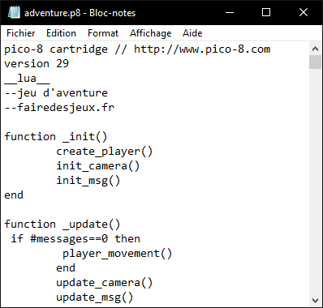
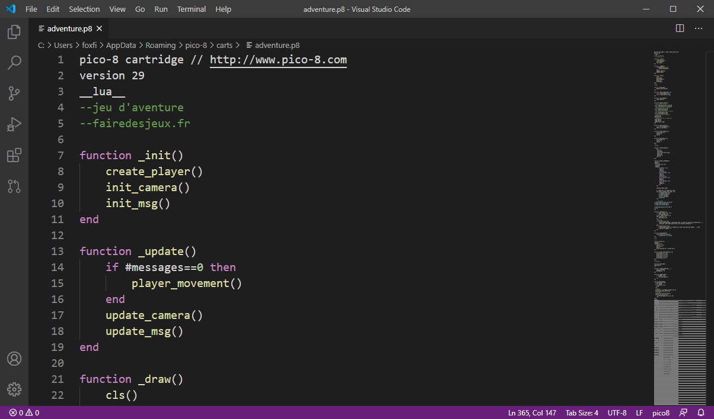
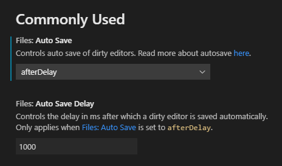
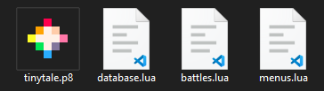
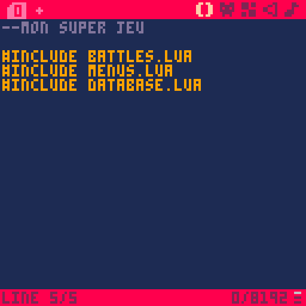
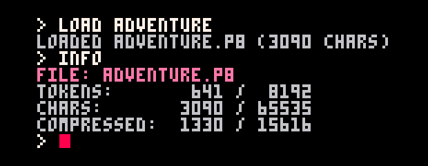

Saviez-vous que le fichier de votre cartouche ne contient en réalité que du texte ? Vous pouvez l'ouvrir avec le bloc-notes par exemple, et vous y verrez non seulement votre code, mais aussi vos sprites, votre map et vos sons.

### Installer un éditeur

Bien sûr, il n'est pas très pratique de modifier son jeu avec le bloc-notes, donc nous allons utiliser un véritable éditeur de code prévu à cet effet. Si vous n'avez jamais utilisé ce genre de logiciel, vous pouvez télécharger [Visual Studio Code](https://code.visualstudio.com/), qui est un éditeur gratuit très populaire et qui fonctionne sur tous les systèmes d'exploitation.

Ouvrez ensuite votre fichier `.p8` avec VS Code. Par défaut, la coloration syntaxique n'est pas activée, car l'éditeur ne reconnaît pas ce type de fichier. Vous pouvez installer [cette extension](https://marketplace.visualstudio.com/items?itemName=Grumpydev.pico8vscodeeditor) pour obtenir la coloration et quelques autres fonctionnalités.

Une autre option très pratique que je vous conseille est d'activer la sauvegarde automatique. Dans les paramètres de VS Code (Ctrl+,), changez le paramètre "Auto Save" en "afterDelay". Vous pouvez laisser le délai à 1000, qui indique que votre fichier sera sauvegardé après une seconde d'inactivité.

VS Code reconnaît les changements externes en temps réel. Cela signifie que si vous modifiez votre cartouche dans PICO-8 puis sauvegardez, les changements apparaîtront instantanément dans VS Code. Par contre, l'inverse n'est pas vrai. Malheureusement, PICO-8 ne détecte pas les changements externes en temps réel : le fichier est rechargé uniquement lorsque vous lancez le jeu avec Ctrl+R, à condition qu'aucun changement non sauvegardé ne soit présent dans l'éditeur de PICO-8.

Pour résumer, lorsque vous écrivez du code dans VS Code ou un autre éditeur, faites Ctrl+R dans PICO-8 pour que celui-ci récupère tous les changements.

Un éditeur externe vous permet d'ouvrir un dossier entier et donc de manipuler plusieurs fichiers en même temps. Cela peut vous aider à vous organiser ! Mais comment les intégrer à PICO-8 ensuite ?

### La commande Include

Dans le même dossier que votre cartouche, vous pouvez créer un ou plusieurs fichiers en `.lua` (Lua étant le langage de script utilisé par PICO-8) dans lequel vous écrirez vos fonctions.

*Contenu du dossier*

Pour injecter le contenu d'un fichier dans votre cartouche, utilisez la commande `#include` :

Pour PICO-8, c'est comme si vous avez copié-collé le contenu du fichier à la place de la ligne `#include`. Vous pouvez utiliser cette commande de plusieurs façons :

- `#include script.lua` copie le contenu d'un fichier.
- `#include cartouche.p8` copie le code d'une autre cartouche.
- `#include cartouche.p8:1` copie un onglet précis d'une cartouche.

La commande `#include` est traitée une seule fois au lancement du jeu, ce qui veut dire que vous ne pouvez pas injecter du code en cours de jeu. De plus, les limites de caractères et de tokens s'appliquent toujours. Vous pouvez vérifier où vous en êtes par rapport aux limites avec la commande `info`, qui prend en compte les fichiers externes.

Ce qui est particulièrement pratique en séparant votre jeu en plusieurs fichiers, c'est que vous pouvez écrire du code dans votre éditeur favori et modifier vos sprites dans PICO-8 sans craindre qu'un conflit ait lieu lors de la sauvegarde. Cela vous facilitera particulièrement la vie si vous travaillez à plusieurs !

Lorsque vous exportez votre jeu ou l'enregistrez au format PNG, tout le contenu des `#include` est sauvegardé à l'intérieur de la cartouche, afin que les fichiers externes ne soient pas nécessaires pour jouer.
