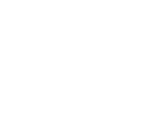
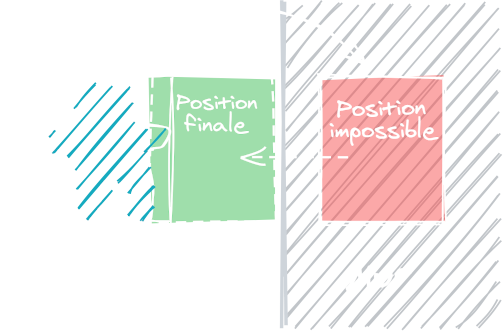

Dans le chapitre sur le shooter, nous avons vu comment nous déplacer pixel par pixel, mais sans collision sur la carte. Dans le chapitre du jeu d'aventure, nous avons vu comment avoir des collisions sur la carte avec un déplacement case par case. Mais comment mêler le meilleur des deux mondes, autrement dit déplacer son personnage pixel par pixel tout en respectant les collisions sur la grille de la carte ? C'est ce que nous allons voir dans cette étape !

### La méthode simple

Dans cette démo, mon personnage est moins large qu'une case ; vous pouvez donc vous déplacer de gauche à droite dans le petit couloir !

<iframe width="538" height="539"
  src="/jeux-pico-8/demo-deplacement-pixel-simple/index.html">
</iframe>

Vous pouvez lire le contenu complet de cette cartouche [à cette adresse](https://github.com/aureliendossantos/pico-8-sample-games/blob/master/basic-pixel-movement-on-map.p8). Notez que pour plus de clarté, le code a été écrit dans un éditeur externe et les lignes sont trop longues pour être agréables à lire dans la fenêtre de PICO-8. Cela n'empêche pas le jeu de fonctionner parfaitement !

Pour commencer, préparez un nouveau projet en réalisant quelques sprites, dont un obstacle avec le flag 0, puis dessinez-les sur la carte. Notre game loop sera toute simple :

```lua
function _init()
	create_player()
end

function _update()
	player_movement()
end

function _draw()
	cls()
	map()
	spr(p.sprite, p.x, p.y)
end
```

Le personnage aura de nouvelles propriétés. La largeur de mon sprite est de 7 pixels et et sa hauteur est de 8, mais vous pouvez changer ces valeurs librement en fonction de la taille de votre sprite : vous n'êtes plus contraint·e par la grille de la carte !

```lua
function create_player()
	p = {
		x = 24, y = 24, -- position au pixel près
		dx = 0, dy = 0, -- vitesse actuelle du perso
		sprite = 6,
		speed = 1,
		w = 7, h = 8 -- largeur et hauteur
	}
end
```

Notez que pour trouver le point à droite et en bas du sprite, il faudra faire `p.x+p.w-1` et `p.y+p.h-1`, sinon, on sera un pixel trop loin. Souvenez-vous en !

C'est dans la fonction `player_movement()` que se déroulera toute la magie du système. On commence par changer la vitesse du personnage d'après les touches appuyées :

```lua
function player_movement()
	if (btn(⬅️)) p.dx -= p.speed
	if (btn(➡️)) p.dx += p.speed
	if (btn(⬆️)) p.dy -= p.speed
	if (btn(⬇️)) p.dy += p.speed
```

Ensuite, on vérifie si on peut bouger à l'endroit souhaité en donnant à une fonction `can_move()` un carré qui représente la hitbox du personnage. `can_move()` prendra donc quatre arguments : un point x, y ainsi que la largeur et la hauteur du carré.

```lua
	if can_move(p.x+p.dx, p.y, p.w, p.h) then
		p.x += p.dx
	end

	if can_move(p.x, p.y+p.dy, p.w, p.h) then
		p.y += p.dy
	end

	p.dx, p.dy = 0, 0 -- Ceci est une affectation multiple en une ligne !
end
```

On vérifie la direction x et y séparément afin de ne pas être stoppé net si une seule des directions est bloquée. Cela nous permet de longer les murs quand on se déplace en diagonale ! A la fin, on remet la vitesse à 0.

Revenons à `can_move()`. Cette fonction prend le rectangle qu'on lui donne en argument (x, y, largeur, hauteur) et vérifie, pour chaque coin du rectangle, si un tile avec le flag 0 s'y trouve.

```lua
function can_move(x, y, w, h)
	if (check_obstacle(x, y)) return false         -- coin haut-gauche
	if (check_obstacle(x+w-1, y)) return false     -- coin haut-droite
	if (check_obstacle(x, y+h-1)) return false     -- coin bas-gauche
	if (check_obstacle(x+w-1, y+h-1)) return false -- coin bas-droite
	return true
end
```

Dès que le programme atteint un `return`, on sort de la fonction et le reste n'est pas joué. Si on est arrivé jusqu'en bas, c'est qu'aucun coin n'était sur un obstacle, donc on peut `return true` !

La fonction `check_obstacle(x, y)` prend un pixel sur la map, trouve la case correspondante sur la carte et renvoie `true` si son sprite a le flag 0.

```lua
function check_obstacle(x, y)
	local map_x = flr(x/8)
	local map_y = flr(y/8)
	local sprite = mget(map_x, map_y)
	return fget(sprite, 0)
end
```

En écrivant tout ceci, vous devriez avoir reproduit l'exemple ci-dessus !

Cette méthode suffira pour certains jeux, mais se révèle trop imprécise dans d'autres cas. Essayez par exemple de mettre `p.speed` à `3`, et vous verrez que vous ne pourrez plus vous coller aux murs. Si un ou deux pixels vous séparent du mur, vous ne pourrez pas avancer de 3 pixels donc vous serez bloqué·e. Idéalement, le personnage devrait être ralenti pour se déplacer de ces un ou deux pixels !

### Méthode avec accélération et friction

Voyons comment programmer une méthode de déplacement plus précise avec des effets de physique. Cela rendra vos contrôles plus satisfaisants, mais cela peut aussi être une base pour un système plus vaste ! Vous pourriez par exemple appliquer une force sur le personnage ou les ennemis pour les repousser, et ils se stopperont correctement contre les murs.

<iframe width="538" height="539"
  src="/jeux-pico-8/demo-deplacement-pixel-avance/index.html">
</iframe>

Vous pouvez lire le code complet de la démo [à cette adresse](https://github.com/aureliendossantos/pico-8-sample-games/blob/master/advanced-pixel-movement-on-map.p8).

On utilisera la même game loop que précédemment :

```lua
function _init()
	create_player()
end

function _update()
	player_movement()
end

function _draw()
	cls()
	map()
	spr(p.sprite, p.x, p.y)
end
```

Et nous donnerons de nouvelles propriétés au personnage :

```lua
function create_player()
	p = {
		sprite = 5,
		x = 24, y = 24,
		w = 7, h = 8,
		dx = 0, dy = 0,
		max_speed = 3,
		acceleration = 1,
		friction = 0.85
		-- friction = 1 : pas de ralentissement
		-- friction = 0 : arrêt instantané
	}
end
```

L'accélération est la vitesse ajoutée à chaque frame quand on appuie sur une flèche. Elle s'accumule donc au fil des frames mais ne pourra jamais dépasser la valeur `max_speed`. La friction est la vitesse retirée à chaque frame quand on n'appuie plus sur les flèches.

Dans `player_movement()`, ajoutons l'accélération à la vitesse actuelle en fonction des touches appuyées :

```lua
function player_movement()
	if (btn(⬅️)) p.dx -= p.acceleration
	if (btn(➡️)) p.dx += p.acceleration
	if (btn(⬆️)) p.dy -= p.acceleration
	if (btn(⬇️)) p.dy += p.acceleration
```

Cela ressemble à ce que nous avions fait lors de l'étape précédente, mais le problème avec cette méthode, c'est que lorsqu'on bouge en diagonale, on va plus vite. Plus précisément, si au cours d'une frame on se déplace à la fois d'un pixel sur l'axe X et d'un pixel sur l'axe Y, on a parcouru une distance 1,4 fois plus grande que si on se déplaçait sur un seul axe. D'où je sors ce chiffre ? Vous pouvez le retrouver avec un petit coup de théorème de Pythagore !



Ici, a et b sont les distances parcourues en X et en Y, tandis que c est la distance parcourue en diagonale. D'après le théorème, c² = a² + b² = √2 ≈ 1,41. Cela signifie que pour corriger la vitesse, il faudrait la multiplier par environ 0,71, mais ce n'est pas obligatoire ! Dans certains jeux, il sera plus fun et naturel de multiplier par un juste milieu tel que 0,8 ou de ne pas altérer la vitesse du tout. A vous de voir ! Personnellement, j'aime bien le résultat que donne 0,75. J'effectue le calcul lorsque le personnage se déplace à une vitesse significative dans les deux axes.

```lua
	if abs(p.dx) > p.max_speed/2 and abs(p.dy) > p.max_speed/2 then
		p.dx *= 0.75
		p.dy *= 0.75
	end
```

:::astride
La fonction `abs`, qui signifie valeur absolue, permet d'obtenir la valeur positive d'un nombre. Si un nombre *x* vaut parfois 1 et parfois -1, le résultat de `abs(x)` sera toujours 1. C'est pratique pour connaître la vitesse du personnage quelque soit sa direction !
:::

Avec ce système, l'accélération s'accumule à chaque frame, donc nous devons limiter le tout à la vitesse maximum :

```lua
	p.dx = mid(-p.max_speed, p.dx, p.max_speed)
	p.dy = mid(-p.max_speed, p.dy, p.max_speed)
```

Avant même de se déplacer, nous allons bloquer le mouvement dans la ou les directions où l'on est collé·e à un mur. Cela nous permettra de longer les murs quand on se déplace en diagonale, mais nous écrirons cette fonction plus tard ! C'est juste pour vous dire que c'est à ce stade que nous l'appellerons.

```lua
	check_walls(p)
```

Ensuite vient le déplacement. Comme précédemment, la fonction `can_move()` renverra `true` s'il n'y a pas d'obstacle à la destination souhaitée.

```lua
	if can_move(p, p.dx, p.dy) then
		p.x += p.dx
		p.y += p.dy
```

Par contre, cette fois, s'il y a un obstacle, on va en rapprocher le personnage aussi près que possible ! Nous allons stocker la distance que le personnage était censé parcourir, puis progressivement raccourcir cette distance jusqu'à trouver une position sans aucun obstacle.



```lua
	if can_move(p, p.dx, p.dy) then
		p.x += p.dx
		p.y += p.dy
	else
		-- On sauvegarde la distance que le perso devait parcourir
		local target_x = p.dx
		local target_y = p.dy

		-- Tant qu'on ne peut pas se déplacer jusqu'à 'target x y'…
		while not can_move(p, target_x, target_y) do

			-- Si 'target x' a été réduite au point d'être presque 0…
			if abs(target_x) <= 0.1 then
				target_x = 0 -- on la met simplement à 0.
			else
				-- Sinon, sa nouvelle valeur est 90% de l'ancienne
				target_x *= 0.9
			end

			-- Pareil pour y
			if abs(target_y) <= 0.1 then
				target_y = 0
			else
				target_y *= 0.9
			end
		end
		-- On se déplace jusqu'à la distance obtenue
		p.x += target_x
		p.y += target_y
	end
```

Parfait ! Maintenant que le personnage a été déplacé, vous pouvez appliquer la friction. Il sera ainsi ralenti si on n'appuie plus sur une flèche, mais cela ne se verra pas si on continue d'appuyer puisque l'accélération est plus forte.

```lua
	if (abs(p.dx) > 0) p.dx *= p.friction
	if (abs(p.dy) > 0) p.dy *= p.friction
```

Si le personnage ralentit depuis un moment est que sa vitesse a presque atteint 0, on peut la mettre simplement à 0.

```lua
	if (abs(p.dx) < 0.02) p.dx = 0
	if (abs(p.dy) < 0.02) p.dy = 0
end
```

Passons aux fonctions que nous avons appelées. Comme à l'étape précédente, `can_move` regarde si les coins d'un carré sont sur une case de la map avec le flag 0. Ici, la fonction prend comme arguments un objet avec des propriétés x, y, largeur, hauteur, ainsi qu'une vitesse pour former le carré à l'endroit où l'on souhaite se rendre.

```lua
function can_move(a, dx, dy)

	-- Quelques variables pour plus de clarté
	local x_left = a.x + dx
	local x_right = a.x + dx + a.w-1
	local y_top = a.y + dy
	local y_bottom = a.y + dy + a.h-1

	if (check_obstacle(x_left, y_top)) return false     -- coin haut-gauche
	if (check_obstacle(x_left, y_bottom)) return false  -- coin haut-droite
	if (check_obstacle(x_right, y_top)) return false    -- coin bas-gauche
	if (check_obstacle(x_right, y_bottom)) return false -- coin bas-droite

	return true
end
```

A part le fait de devoir constituer le carré en prenant en compte `dx` et `dy`, c'est le même principe qu'avant. Au passage, la fonction `check_obstacle` est exactement la même que précédemment :

```lua
function check_obstacle(x, y)
	local map_x = flr(x/8)
	local map_y = flr(y/8)
	local sprite = mget(map_x, map_y)
	return fget(sprite, 0)
end
```

Enfin, la fonction `check_walls` est une nouveauté. Elle vérifie si un objet aux propriétés `x`, `y`, `w`, `h`, `dx`, `dy` est collée à un mur, et bloque la direction X ou Y correspondante si c'est le cas.

```lua
function check_walls(a)

	-- Si on va vers la gauche
	if a.dx < 0 then
		local wall_top_left = check_obstacle(a.x-1, a.y)
		local wall_bottom_left = check_obstacle(a.x-1, a.y+a.h-1)
		-- S'il y a un mur dans cette direction,
		-- on réduit la vitesse x à 0
		if wall_top_left or wall_bottom_left then
			a.dx = 0
		end

	-- vers la droite
	elseif a.dx > 0 then
		local wall_top_right = check_obstacle(a.x+a.w, a.y)
		local wall_bottom_right = check_obstacle(a.x+a.w, a.y+a.h-1)
		if wall_top_right or wall_bottom_right then
			a.dx = 0
		end
	end

	-- vers le haut
	if a.dy < 0 then
		local wall_top_left = check_obstacle(a.x, a.y-1)
		local wall_top_right = check_obstacle(a.x+a.w-1, a.y-1)
		if wall_top_left or wall_top_right then
			a.dy = 0
		end

	-- vers le bas
	elseif a.dy > 0 then
		local wall_bottom_left = check_obstacle(a.x, a.y+a.h)
		local wall_bottom_right = check_obstacle(a.x+a.w-1, a.y+a.h)
		if wall_bottom_right or wall_bottom_left then
			a.dy = 0
		end
	end
end
```

Pour bien comprendre l'intérêt de cette fonction, vous pouvez tout simplement ne pas l'appeler, et vous verrez que vous ne pourrez pas longer les murs correctement.

### Réutiliser le code pour les ennemis

<iframe width="538" height="539"
  src="/jeux-pico-8/demo-deplacement-et-attaque/index.html">
</iframe>

Vous pouvez lire le code complet de la démo [à cette adresse](https://github.com/aureliendossantos/pico-8-sample-games/blob/master/advanced-pixel-movement-with-attack.p8).

```lua
function create_enemy()
	e = {
		sprite = 7,
		x = 80, y = 24,
		w = 6, h = 8,
		dx = 0, dy = 0,
		max_speed = 1,
		acceleration = 0.5,
		friction = 0.85
	}
end
```

```lua
function player_movement()
	if (btn(⬅️)) p.dx -= p.acceleration
	if (btn(➡️)) p.dx += p.acceleration
	if (btn(⬆️)) p.dy -= p.acceleration
	if (btn(⬇️)) p.dy += p.acceleration

	entity_movement(p)
end
```

Alors que contient la fonction `entity_movement()` ? Tout simplement ce que contenait la fonction `player_movement()` auparavant, excepté la gestion des touches du clavier bien sûr.

Voici un comportement simple pour l'exemple : l'ennemi se rapproche du personnage jusqu'à une certaine distance.

```lua
function enemy_movement()
	local distance = abs(e.x-p.x) + abs(e.y-p.y)
	if distance > 30 then
		if (p.x+2 < e.x) e.dx -= e.acceleration
		if (p.x-2 > e.x) e.dx += e.acceleration
		if (p.y+2 < e.y) e.dy -= e.acceleration
		if (p.y-2 > e.y) e.dy += e.acceleration
	end

	entity_movement(e)
end
```

```lua
spr(e.sprite, e.x, e.y)
```

#### Donner un coup d'épée dans toutes les directions

On ajoute la propriété `p.angle` qui indiquera la direction dans laquelle le personnage regarde. Ce sera utile pour la direction de l'épée mais aussi pour afficher des sprites différents pour chaque direction si vous le souhaitez.

```lua
function create_player()
	p = {
		sprite = 6,
		x = 24, y = 24,
		w = 7, h = 8,
		dx = 0, dy = 0,
		max_speed = 3,
		acceleration = 1,
		friction = 0.5,
		angle = 6
	}
	sword_timer = 0
	sword_x1, sword_x2, sword_y1, sword_y2 = 1, 1, 1, 1
end
```

Le timer sera utilisé pour la durée du hit de l'épée, et ensuite c'est la hitbox de sword

Les chiffres que j'ai choisis correspondent à ceux du pavé numérique, où le personnage serait au milieu du pavé, à 5.

```lua
function update_player_angle()
	if btn(➡️) and btn(⬆️) then
		p.angle = 9
	elseif btn(⬅️) and btn(⬆️) then
		p.angle = 7
	elseif btn(⬅️) and btn(⬇️) then
		p.angle = 1
	elseif btn(➡️) and btn(⬇️) then
		p.angle = 3
	elseif btn(➡️) then
		p.angle = 6
	elseif btn(⬆️) then
		p.angle = 8
	elseif btn(⬅️) then
		p.angle = 4
	elseif btn(⬇️) then
		p.angle = 2
	end
end
```

```lua
function update_sword()
	--point d'origine : centre du perso
	local ox, oy = p.x+3, p.y+3

	update_player_angle()

	if p.angle == 9 then
		sword_x1, sword_y1, sword_x2, sword_y2 = ox, oy-10, ox+10, oy
	elseif p.angle == 7 then
		sword_x1, sword_y1, sword_x2, sword_y2 = ox-10, oy-10, ox, oy
	elseif p.angle == 1 then
		sword_x1, sword_y1, sword_x2, sword_y2 = ox-10, oy, ox, oy+10
	elseif p.angle == 3 then
		sword_x1, sword_y1, sword_x2, sword_y2 = ox, oy, ox+10, oy+10
	elseif p.angle == 6 then
		sword_x1, sword_y1, sword_x2, sword_y2 = ox, oy-5, ox+13, oy+5
	elseif p.angle == 8 then
		sword_x1, sword_y1, sword_x2, sword_y2 = ox-5, oy-13, ox+5, oy
	elseif p.angle == 4 then
		sword_x1, sword_y1, sword_x2, sword_y2 = ox-13, oy-5, ox, oy+5
	elseif p.angle == 2 then
		sword_x1, sword_y1, sword_x2, sword_y2 = ox-5, oy, ox+5, oy+13
	end

	-- On réduit le timer de hit jusqu'à 0 s'il est lancé
	sword_timer = max(0, sword_timer-1)

	if (sword_timer == 0) sword_hitting = false

	if btnp(❎) and not sword_hitting then
		sword_hitting = true
		sword_timer = 4
	end
end
```

Dans draw, vous pouvez afficher la hitbox de l'épée sous le personnage pour la régler plus facilement :

```lua
rectfill(sword_x1, sword_y1, sword_x2, sword_y2, sword_hitting and 9 or 8)
```

La couleur sera de 9 si vous êtes en train de donner un coup, 8 sinon.

#### Repousser l'ennemi

```lua
function enemy_movement()
	local distance = abs(e.x-p.x) + abs(e.y-p.y)
	if distance > 30 then
		if (p.x+2 < e.x) e.dx -= e.acceleration
		if (p.x-2 > e.x) e.dx += e.acceleration
		if (p.y+2 < e.y) e.dy -= e.acceleration
		if (p.y-2 > e.y) e.dy += e.acceleration
	end

	e.hit = false
	if sword_hitting then
		-- Méthode de collision vue dans le tuto shooter
		if not (e.x > sword_x2
		or e.y > sword_y2
		or e.x+e.w-1 < sword_x1
		or e.y+e.h-1 < sword_y1) then
			-- Ennemi touché par l'épée
			e.hit = true
			-- Repousser l'ennemi
			if (p.x+3 < e.x) e.dx += 3
			if (p.x-3 > e.x) e.dx -= 3
			if (p.y+3 < e.y) e.dy += 3
			if (p.y-3 > e.y) e.dy -= 3
		end
	end

	entity_movement(e)
end
```

On repousse l'ennemi en lui appliquant une force en X et/ou en Y en fonction de sa position par rapport au joueur ou à la joueuse. Si l'ennemi est à peu près en face du personnage, il sera repoussé en ligne droite afin qu'on puisse plus facilement l'enchaîner en continuant d'avancer vers lui.

```lua
	local max = e.hit and 3 or e.max_speed
	e.dx = mid(-max, e.dx, max)
	e.dy = mid(-max, e.dy, max)
```

Dans draw, vous pouvez transformer toutes les couleurs de la palette en blanc afin de faire clignoter l'ennemi facilement lorsqu'il est touché.

```lua
if (e.hit) pal({7,7,7,7,7,7,7,7,7,7,7,7,7,7,7,7})
spr(e.sprite, e.x, e.y)
pal()
```
