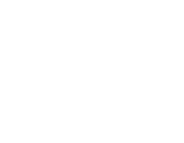
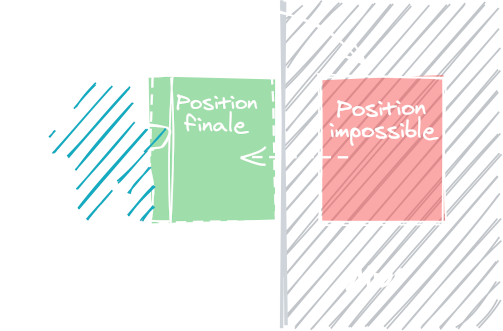

Cette étape et la suite directe de celle sur les déplacements au pixel près. Ici, je vais vous donner quelques pistes pour aller plus loin et ajouter des effets de physique. Cela peut rendre vos contrôles plus amusants, mais aussi être une base pour un système plus vaste ! Vous pourriez par exemple appliquer une force sur le personnage ou les ennemis pour les repousser, et ils se stopperont correctement contre les murs.

<iframe width="538" height="539"
  src="/jeux-pico-8/demo-deplacement-pixel-avance/index.html">
</iframe>

Vous pouvez lire le code complet de la démo [à cette adresse](https://github.com/aureliendossantos/pico-8-sample-games/blob/master/advanced-pixel-movement-on-map.p8).

On utilisera la même game loop que précédemment :

```lua
function _init()
	create_player()
end

function _update()
	player_movement()
end

function _draw()
	cls()
	map()
	spr(p.sprite, p.x, p.y)
end
```

Et nous donnerons de nouvelles propriétés au personnage :

```lua
function create_player()
	p = {
		sprite = 5,
		x = 24, y = 24,
		w = 7, h = 8,
		dx = 0, dy = 0,
		max_speed = 3,
		acceleration = 1,
		friction = 0.85
		-- friction = 1 : pas de ralentissement
		-- friction = 0 : arrêt instantané
	}
end
```

L'accélération est la vitesse ajoutée à chaque frame quand on appuie sur une flèche. Elle s'accumule donc au fil des frames mais ne pourra jamais dépasser la valeur `max_speed`. La friction est la vitesse retirée à chaque frame quand on n'appuie plus sur les flèches.

Dans `player_movement()`, ajoutons l'accélération à la vitesse actuelle en fonction des touches appuyées :

```lua
function player_movement()
	if (btn(⬅️)) p.dx -= p.acceleration
	if (btn(➡️)) p.dx += p.acceleration
	if (btn(⬆️)) p.dy -= p.acceleration
	if (btn(⬇️)) p.dy += p.acceleration
```

Cela ressemble à ce que nous avions fait lors de l'étape précédente, mais le problème avec cette méthode, c'est que lorsqu'on bouge en diagonale, on va plus vite. Plus précisément, si au cours d'une frame on se déplace à la fois d'un pixel sur l'axe X et d'un pixel sur l'axe Y, on a parcouru une distance 1,4 fois plus grande que si on se déplaçait sur un seul axe. D'où je sors ce chiffre ? Vous pouvez le retrouver avec un petit coup de théorème de Pythagore !



Ici, a et b sont les distances parcourues en X et en Y, tandis que c est la distance parcourue en diagonale. D'après le théorème, c² = a² + b² = √2 ≈ 1,41. Cela signifie que pour corriger la vitesse, il faudrait la multiplier par environ 0,71, mais ce n'est pas obligatoire ! Dans certains jeux, il sera plus fun et naturel de multiplier par un juste milieu tel que 0,8 ou de ne pas altérer la vitesse du tout. A vous de voir ! Personnellement, j'aime bien le résultat que donne 0,75. J'effectue le calcul lorsque le personnage se déplace à une vitesse significative dans les deux axes.

```lua
	if abs(p.dx) > p.max_speed/2 and abs(p.dy) > p.max_speed/2 then
		p.dx *= 0.75
		p.dy *= 0.75
	end
```

:::astride
La fonction `abs`, qui signifie valeur absolue, permet d'obtenir la valeur positive d'un nombre. Si un nombre *x* vaut parfois 1 et parfois -1, le résultat de `abs(x)` sera toujours 1. C'est pratique pour connaître la vitesse du personnage quelque soit sa direction !
:::

Avec ce système, l'accélération s'accumule à chaque frame, donc nous devons limiter le tout à la vitesse maximum :

```lua
	p.dx = mid(-p.max_speed, p.dx, p.max_speed)
	p.dy = mid(-p.max_speed, p.dy, p.max_speed)
```

Avant même de se déplacer, nous allons bloquer le mouvement dans la ou les directions où l'on est collé·e à un mur. Cela nous permettra de longer les murs quand on se déplace en diagonale, mais nous écrirons cette fonction plus tard ! C'est juste pour vous dire que c'est à ce stade que nous l'appellerons.

```lua
	check_walls(p)
```

Ensuite vient le déplacement. Comme précédemment, la fonction `can_move()` renverra `true` s'il n'y a pas d'obstacle à la destination souhaitée.

```lua
	if can_move(p, p.dx, p.dy) then
		p.x += p.dx
		p.y += p.dy
```

Par contre, cette fois, s'il y a un obstacle, on va en rapprocher le personnage aussi près que possible ! Nous allons stocker la distance que le personnage était censé parcourir, puis progressivement raccourcir cette distance jusqu'à trouver une position sans aucun obstacle.



```lua
	if can_move(p, p.dx, p.dy) then
		p.x += p.dx
		p.y += p.dy
	else
		-- On sauvegarde la distance que le perso devait parcourir
		local target_x = p.dx
		local target_y = p.dy

		-- Tant qu'on ne peut pas se déplacer jusqu'à 'target x y'…
		while not can_move(p, target_x, target_y) do

			-- Si 'target x' a été réduite au point d'être presque 0…
			if abs(target_x) <= 0.1 then
				target_x = 0 -- on la met simplement à 0.
			else
				-- Sinon, sa nouvelle valeur est 90% de l'ancienne
				target_x *= 0.9
			end

			-- Pareil pour y
			if abs(target_y) <= 0.1 then
				target_y = 0
			else
				target_y *= 0.9
			end
		end
		-- On se déplace jusqu'à la distance obtenue
		p.x += target_x
		p.y += target_y
	end
```

Parfait ! Maintenant que le personnage a été déplacé, vous pouvez appliquer la friction. Il sera ainsi ralenti si on n'appuie plus sur une flèche, mais cela ne se verra pas si on continue d'appuyer puisque l'accélération est plus forte.

```lua
	if (abs(p.dx) > 0) p.dx *= p.friction
	if (abs(p.dy) > 0) p.dy *= p.friction
```

Si le personnage ralentit depuis un moment est que sa vitesse a presque atteint 0, on peut la mettre simplement à 0.

```lua
	if (abs(p.dx) < 0.02) p.dx = 0
	if (abs(p.dy) < 0.02) p.dy = 0
end
```

Passons aux fonctions que nous avons appelées. Comme à l'étape précédente, `can_move` regarde si les coins d'un carré sont sur une case de la map avec le flag 0. Ici, la fonction prend comme arguments un objet avec des propriétés x, y, largeur, hauteur, ainsi qu'une vitesse pour former le carré à l'endroit où l'on souhaite se rendre.

```lua
function can_move(a, dx, dy)

	-- Quelques variables pour plus de clarté
	local x_left = a.x + dx
	local x_right = a.x + dx + a.w-1
	local y_top = a.y + dy
	local y_bottom = a.y + dy + a.h-1

	if (check_obstacle(x_left, y_top)) return false     -- coin haut-gauche
	if (check_obstacle(x_left, y_bottom)) return false  -- coin haut-droite
	if (check_obstacle(x_right, y_top)) return false    -- coin bas-gauche
	if (check_obstacle(x_right, y_bottom)) return false -- coin bas-droite

	return true
end
```

A part le fait de devoir constituer le carré en prenant en compte `dx` et `dy`, c'est le même principe qu'avant. Au passage, la fonction `check_obstacle` est exactement la même que précédemment :

```lua
function check_obstacle(x, y)
	local map_x = flr(x/8)
	local map_y = flr(y/8)
	local sprite = mget(map_x, map_y)
	return fget(sprite, 0)
end
```

Enfin, la fonction `check_walls` est une nouveauté. Elle vérifie si un objet aux propriétés `x`, `y`, `w`, `h`, `dx`, `dy` est collée à un mur, et bloque la direction X ou Y correspondante si c'est le cas.

```lua
function check_walls(a)

	-- Si on va vers la gauche
	if a.dx < 0 then
		local wall_top_left = check_obstacle(a.x-1, a.y)
		local wall_bottom_left = check_obstacle(a.x-1, a.y+a.h-1)
		-- S'il y a un mur dans cette direction,
		-- on réduit la vitesse x à 0
		if wall_top_left or wall_bottom_left then
			a.dx = 0
		end

	-- vers la droite
	elseif a.dx > 0 then
		local wall_top_right = check_obstacle(a.x+a.w, a.y)
		local wall_bottom_right = check_obstacle(a.x+a.w, a.y+a.h-1)
		if wall_top_right or wall_bottom_right then
			a.dx = 0
		end
	end

	-- vers le haut
	if a.dy < 0 then
		local wall_top_left = check_obstacle(a.x, a.y-1)
		local wall_top_right = check_obstacle(a.x+a.w-1, a.y-1)
		if wall_top_left or wall_top_right then
			a.dy = 0
		end

	-- vers le bas
	elseif a.dy > 0 then
		local wall_bottom_left = check_obstacle(a.x, a.y+a.h)
		local wall_bottom_right = check_obstacle(a.x+a.w-1, a.y+a.h)
		if wall_bottom_right or wall_bottom_left then
			a.dy = 0
		end
	end
end
```

Pour bien comprendre l'intérêt de cette fonction, vous pouvez tout simplement ne pas l'appeler, et vous verrez que vous ne pourrez pas longer les murs correctement.

*Suite du chapitre disponible très bientôt !*
