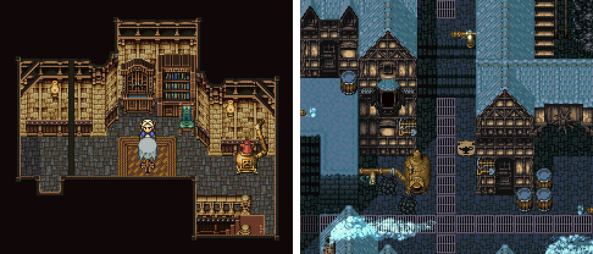

J'aimerais souligner autre chose au sujet de cette map : la grille est bien trop évidente !

Beaucoup de jeux laissent voir cette grille qui crie en permanence aux joueurs et joueuses : « Tu n'es pas dans le vrai monde, tu es au milieu de tiles d'un jeu vidéo ! » Même s'il est vrai que la grille est présente, nous souhaitons donner l'illusion qu'elle n'existe pas... Effacer visuellement la grille est en fait un des plus grands accomplissements que vous pouvez réaliser en tant que *pixel artist*.

*Alber Odyssey*

*Final Fantasy VI*

Ces jeux parviennent très bien à casser la grille. Essayez de vous la représenter mentalement, de voir où les tiles commencent et se terminent... Pas facile, n'est ce pas ? Bien sûr, certaines délimitations sont évidentes, comme le toit marron de la première image, le tapis de la seconde ou les grilles de la dernière... mais tout de même !

Revenons à notre carré d'herbe. Parfois, un tile qui semble parfait peut très mal rendre une fois répété sur la grille.

Sur la première image à gauche, voyez-vous ce que je voulais dire ? Pour vous aider à repérer ce qui ne va pas, j'ai encerclé la zone qui semble être la pire. Une grosse tâche sombre se répète et révèle la grille, donnant un aspect artificiel. En modifiant quelques pixels, j'ai obtenu l'image du centre, qui est meilleure mais apporte un nouveau problème : une sorte de ligne horizontale qui se répète. Ce n'est pas une vraie ligne, mais plutôt l'alignement de suffisamment de pixels d'une même couleur pour que notre œil imagine automatiquement une ligne... C'est perturbant pour le regard !

Cela nous amène au dernier exemple. En ajoutant à la ligne des pixels plus sombres et en homogénéisant la répartition des teintes, j'ai réussi à obtenir une texture d'herbe beaucoup plus convaincante. A moins d'être chanceux ou d'avoir beaucoup de temps à perdre, vous ne parviendrez jamais à réellement effacer la grille. Tout l'art réside dans la capacité à trouver un juste milieu entre l'aspect aléatoire de l'herbe et l’absence de pattern révélateur. Dans la troisième image, il reste de subtiles lignes claires révélant la grille, que l'on pourrait tenter de corriger avec des pixels plus foncés, mais la réalité est que le résultat est déjà très bien, et beaucoup plus agréable à regarder !

Plusieurs choses peuvent donc faire qu'un tile ne fonctionne pas visuellement... Pour savoir si un tile est bon, il faut vérifier ce à quoi il ressemblera sur une map. Il existe des outils sur beaucoup de logiciels reproduisant une texture sur une large surface, sinon vous pouvez tout simplement créer une map basique dans votre jeu pour y tester vos nouveaux tiles.

Il n'existe malheureusement pas de meilleure technique que celle de tester votre tile et de l'améliorer jusqu'à ce que le résultat vous convienne !
