Si vous aimez les RPG, vous avez sûrement déjà joué aux icônes du genre. Ce qu'on va faire dans ce chapitre, c'est les décomposer pour voir ce qui les rend aussi iconiques.

Parlons de Secret of Mana 3, qui est probablement le jeu le plus beau que j'ai jamais vu :

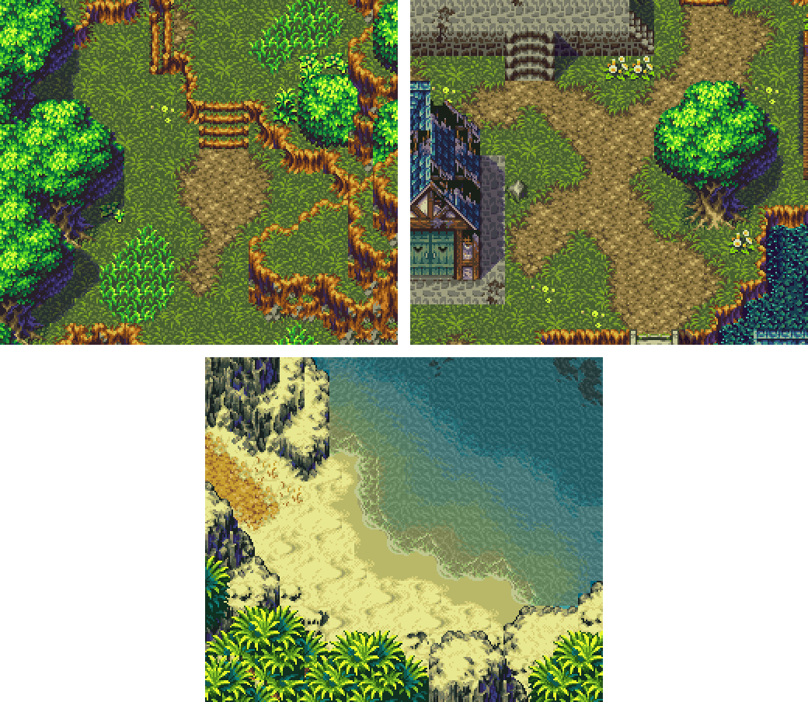

Impressionnant, hein... Mais décomposons-le et voyons ce qui le rend *si* impressionnant.

Regardez le premier screen. Ignorez les arbres, les piles de terre et tout le reste, et concentrez-vous uniquement sur le sol. Pourquoi est-il différent des sols que j'ai faits plus tôt, comme celui du châlet dans la partie sur les dégradés ? La différence, c'est l'intérêt.

Si vous regardez le sol de plus près, vous remarquerez qu'ils ne se sont pas contentés de prendre un tile d'herbe et de remplir toute la map avec, mettre des arbres autour, et dire "Ok, c'est terminé. On a notre forêt." Rien que sur la première image, il y a peut-être bien quatre types de fleurs différents, et plusieurs motifs pour l'herbe, la terre et les herbes hautes !

Bien sûr, tout est extrêmement bien dessiné, mais ça ne veut pas dire que personne d'autre ne peut le faire. Prenons un morceau du screen et agrandissons-le. 

> Petite note au passage... Ce dont je parlais tout à l'heure, éliminer la grille. Eh bien Secret of Mana 3 l'a absolument fait. J'ai été obligé de découper mon screen au hasard parce que je n'avais aucune idée d'où commencent et finissent les tiles. Ça, mes amis, c'est une réussite.

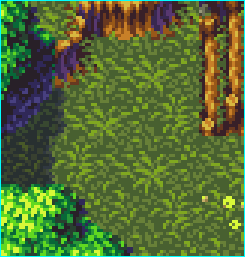

Maintenant, concentrons-nous sur l'herbe. Comptez le nombre de couleurs utilisées. Trois. Eh oui, seulement trois, comme l'herbe que l'on a faite plus tôt dans ce cours. "Mais on dirait pas qu'il y a que trois couleurs ! Quand on regarde de loin, on dirait qu'il y a plein de teintes !" C'est vrai, mais souvenez-vous que ce n'est fait qu'avec trois teintes.

Regardez une des larges touffes d'herbe, avec les grands brins. Vous pouvez voir que les brins sont dessinés en grande partie avec le vert le plus clair. Ils ont aussi utilisé le vert intermédiaire pour souligner cette teinte claire, mais il y en a peu.

Maintenant, attardez-vous sur une zone qui semble plus plate, en bas au centre par exemple. Cette fois, ils n'ont utilisé que le vert foncé et le vert intermédiaire. Il n'y a que quelques points ici et là de teinte claire, pour donner l'illusion de brins d'herbe qui pointent, attrapant la lumière. Le reste est composé de pixels éparpillés. La plupart n'ont même pas la forme d'un brin d'herbe ! Vous pouvez voir des amas de vert intermédiaire qui ont la forme de carrés, de gribouillis, de tetrominos... Mais quand vous êtes en train de jouer, ça ressemble à de l'herbe. 

Ce que nous avons appris ici, c'est que pour que quelque chose ait l'air plus clair, vous n'avez pas besoin d'une teinte supplémentaire. Vous devez juste décider d'à quel point vous utilisez chaque couleur.

Prenons une autre zone, du deuxième screen cette fois :

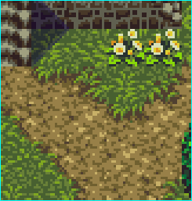

Intéressons-nous à la terre cette fois : on peut distinguer quatre teintes. La quatrième, la plus foncée, est utilisée rarement. Ce sont juste des pixels parsemés ici et là pour ajouter un peu de profondeur, comme un terrain irrégulier ou des amas de terre, ou pour souligner l'herbe, qui devrait projeter une ombre de toute façon.

C'est juste placé à quelques endroits... mais ça fait plus que vous ne pourriez l'imaginer. Pour vous montrer un exemple drastique de tout ce que fait cette teinte à l'image, j'ai éclairci d'un cran la teinte la plus foncée :

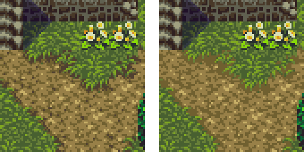

"Qu'est-ce qui s'est passé ? C'est tout plat maintenant !" C'est vrai. Non seulement c'est plat, mais si vous plissez les yeux pour que les couleurs soient un peu floues, vous remarquerez que vous pouvez toujours dire où est l'herbe et où est la terre dans le screen original. Par contre, si vous regardez ma version éditée, vous voyez que la terre et l'herbe commencent à un peu trop se mélanger. 

Aussi, si vous regardez au centre de la terre, ça semble plus lisse, moins rocailleux qu'avant.

Regardez de nouveau le screen d'origine et prêtez attention à où est placée cette teinte. Elle est toujours placée près des autres teintes foncées. On dirait qu'il y a des trous de différentes profondeurs dans le sol... Et les plus profonds sont ceux qui auraient les pixels les plus foncés pour le montrer. Ça rend le terrain rocheux et surtout, ça donne plus de variation de profondeur que l'herbe, parce que l'herbe n'utilise que trois teintes et n'en a pas une quatrième plus foncée. 

Alors à quoi est-ce que ça ressemblerait si l'herbe avait cette quatrième teinte ? Eh bien j'en ai ajouté une ici :

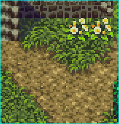

Maintenant, vous pouvez voir que l'herbe semble plus épaisse... Comme si d'autres brins d'herbe se cachaient en dessous. Et ça peut être sympa... Mais plissez à nouveau les yeux et observez les deux images. 

Quelle herbe semble bien plus gonflée que l'autre ? L'herbe de gauche. Pourquoi ? Parce qu'elle n'a pas de quatrième teinte. Avec seulement trois teintes, l'herbe de gauche a beaucoup de "joli vert foncé" pour lui donner un niveau sur lequel se reposer. On décide mentalement que cette herbe doit être plus haute que la terre, puisqu'il n'y a pas de teinte qui dit "Cette texture s'enfonce dans le sol".

Dans l'image de droite, on a plus de mal à différencier l'herbe de la terre, puisque maintenant que l'herbe a une quatrième teinte, elles sont toutes les deux au même niveau.

Vous remarquerez aussi que j'ai utilisé bien plus de vert foncé qu'il n'y a de marron foncé... Ce qui donne l'impression que l'herbe est encore plus basse que la terre. C'est subtil mais si vous relaxez vos yeux, le chemin a l'air d'être au dessus de l'herbe. 

C'est un calcul mental naturel : si c'est plus clair, c'est plus près. Donc si la terre a moins de teinte foncée, elle a l'air plus claire et donc plus proche. L'herbe, qui est désormais un tas de pixels clairs et sombres, semble repoussée. Tout ça à cause d'une teinte.

Passons désormais à l'arbre :

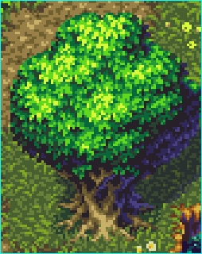

Pas mal l'arbre, hein ? Regardez-le de près, en commençant par la grande zone verte. En mettant de côté les pixels les plus foncés, pratiquement noirs, mis ici et là, vous avez cinq teintes de vert. Seulement cinq. "Mais ça ressemble tellement à... un arbre... et c'est... gonflé... Comment ?!"

Si vous vous reculez un peu, vous verrez comme des gros amas de feuilles, et pourtant elles ne sont pas séparées par des lignes noires ou que sais-je... On ressent juste leur présence. 

Eh bien ça marche de la même manière que la fameuse sphère avec de la lumière. Vous avez probablement déjà vu ça absolument partout si vous vous êtes renseignés ne serait-ce qu'une seule fois sur les concepts d'ombre, mais je vais rapidement en parler pour cet exemple :

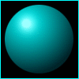

Voilà une sphère avec une lumière qui se reflète dessus. Vous pouvez dire instantanément que la lumière vient frapper le coin en haut à gauche parce que ce côté est plus clair, et l'opposé est, bien évidemment, plus foncé. On ressent la 3D, même si ce ne sont que des pixels, comme absolument tout ce qu'on a regardé depuis le début du cours.

Utilisons cette sphère pour recréer une partie de l'arbre : 

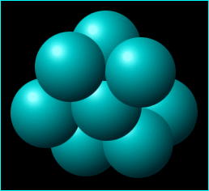

On dirait vraiment de la 3D... Mais souvenez-vous, ce n'est qu'un tas de pixels à l'écran, comme ce texte. 

En regardant l'image, les sphères ont l'air d'être placées devant ou derrière les autres... Ce n'est pas fait en dessinant une ligne noire, c'est réalisé uniquement grâce à l'ombrage. Si vous regardez une sphère individuellement, les pixels ont tous plus ou moins la même teinte, donc ça semble être un seul objet. Mais là où deux sphères se chevauchent, le changement de teinte est bien plus drastique. De presque noir à pratiquement blanc. C'est pour ça qu'on a l'impression que ce sont des zones séparées.

Retournons à notre arbre maintenant :

Vous voyez peut-être maintenant le rapport. Là où la sphère était claire, l'arbre a un vert proche du jaune. Et plus les teintes se rapprochent de la fin d'une section, plus elles deviennent foncées, jusqu'à arriver au début d'une nouvelle section où le jaune revient, et ainsi de suite. 

On va s'attarder maintenant sur la partie en bas à droite... Là c'est quand même très foncé, non ? Regardez de près, en ignorant la fine ligne noire et violette, j'y reviendrai juste après. 

Ce n'est pas que c'est plus foncé, c'est juste qu'il n'y a pas de jaune. C'est exactement comme pour l'herbe ! Quand vous utilisez des teintes foncées près de teintes claires, ça donne l'impression que c'est en retrait, ombré. 

> D'ailleurs, vous aviez remarqué que le tronc semble plus clair que la terre ? Eh bien ce n'est pas le cas. Le tronc a exactement les mêmes couleurs que la terre, il y a juste une plus grande zone de clair, ce qui donne l'impression que le tronc est plus lumineux. Tout est une question de placement stratégique du pixel. 

Parlons maintenant des bleus et violets un peu étranges... C'est la théorie des couleurs : les ombres ne sont *jamais* noires. Il y a toujours un peu de bleu dedans. Quand vous utilisez du noir, tout a l'air plat et inintéressant. Quand le noir en question a un peu de couleur dedans, vous le faîtes ressortir, vous le rapprochez de la caméra.

C'est pour ça que si vous regardez les parties les plus sombres de l'arbre, vous pouvez voir qu'elles ne sont pas noires... Ce sont juste des teintes très foncées de vert. Et pour continuer sur la règle des ombres bleues, c'est la raison pour laquelle la moitié de l'arbre est ombrée avec du bleu et du violet. 

Bon, vous n'avez pas besoin d'utiliser du bleu dans toutes vos ombres, mais gardez ça en tête... N'utilisez des ombres noires que si ça rend vraiment super bien, comme une scène de nuit par exemple. 

Attaquons maintenant le dernier screen, la plage :

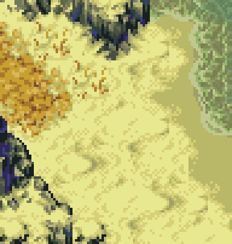

Je vais d'abord prendre une seconde pour dire que c'est un bon exemple d'élimination de la grille. C'est presque impossible de dire où sont les tiles. C'est aussi très intéressant.

Combien de fois avez-vous vus quelqu'un créer son RPG et prendre une tile de sable pour l'utiliser comme un tile d'herbe, remplir tout l'écran avec, et appeler ça une plage. 

Regardez celle là maintenant... Il y a non seulement plusieurs types de sable, que ce soient les dunes ou le sable mouillé, mais il y a aussi des pierres oranges et de l'herbe sechée. Ça, c'est intéressant à regarder.

"Eblouissant ! Il doit y avoir une tonne de teintes dans ce sable !" Allez-y, comptez-les. Dans le sable un peu jaune, le truc principal, il y a quatre teintes. Et pourtant on distingue plusieurs zones... La plus grande, les ombres des dunes, la teinte claire juste avant le sable humide et foncé, et enfin le sable humide et foncé. Et pourtant tout n'est fait qu'avec quatre teintes. 

La zone humide n'est que la deuxième plus sombre, avec aucune autre teinte... Pour lui donner un aspect plat, égalisé. Si vous êtes déjà allés à la plage, vous savez que c'est ce à quoi ressemble le sable quand une vague vient de passer.

La zone séparant le sable clair et la zone humide n'est qu'une longue ligne de pixels d'une teinte intermédiaire. Le sable clair est juste la teinte la plus claire. Pour avoir les creux et courbes du sable, ainsi que ses dunes, la seconde teinte la plus claire est utilisée pour les plus petites zones... Pour les grandes ombres, ce sont simplement les teintes claires à foncées, la plus foncée étant là où la dune est la plus haute, et projettant donc le plus d'ombre.

C'est plutôt subtil, mais la teinte la plus foncée n'est pas juste un jaune foncé. Il y a un peu de bleu dedans... Je pensais juste le souligner, heh.

Au programme ensuite : le génial et très connu Final Fantasy 3. Hailed a la meilleure apparence des Final Fantasy originaux, et pour une bonne raison comme vous pouvez le voir :

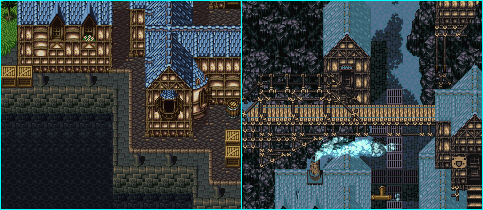

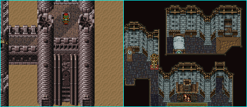

FF3 est moins extravaguant que Secret of Mana 3, mais SoM3 a été fait après, donc c'était attendu.

Bref, FF3 n'est pas aussi impressionnant, mais si vous pouvez faire des graphismes comme ça, prenez ma place et écrivez ce cours. Enfin, on est là pour apprendre de ces screens, donc commençons par celui en haut à gauche : 

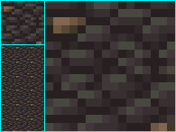

C'est un tile de sol des sections importantes de la ville. J'ai une version tile, une version étalée et une version à 900%, heh... En ignorant les pierres marrons pour le moment, les pierres grises consitent en... Devinez combien de teintes... Quatre. Surprise, surprise.

Il n'y a pas grand chose à dire sur ce tile, mais voyez comment la teinte la plus foncée est utilisée pour ombrer chaque pierre... Juste une fine ligne d'un pixel ici et là. Chaque pierre est ensuite faîte avec les autres teintes. Etudiez ça par vous-mêmes, heh. Mais notez la version étalée... Pouvez-vous voir les tiles ? Oui, vous pouvez. Mauvais Squaresoft ! MAUVAIS !! Mais, parce que le reste du jeu est si joli, on va laisser passer pour cette fois. 

Comme vous pouvez le voir, utiliser la pierre dans le tile fait apparaître la grille. Pour contrer ça, ils auraient dû ajouter un tile sans pierre marron, celui-ci avec les deux pierres, et un autre avec une seule pierre, peut-être en bas à gauche ou quelque chose dans le genre. 

Ecoutez moi, je suis en train de critiquer Squaresoft, heh... Bref la suite, parlons "intéressant" un instant : 

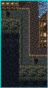

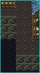

Regardez l'image de gauche. C'est intéressant... Mais pourquoi ? C'est grâce à l'attention donnée aux détails.

De ce que j'ai vu, les gens qui essaient de faire un bout de ville comme ça, avec de l'eau, vont faire quelque chose comme sur le screen de droite.

Ça montre la même chose, que la ville est au bord de l'eau... Mais c'est bien plus ennuyeux. L'autre n'a pas seulement le chemin de pierre bleu et ardoisé, il y a aussi la brique orange pour le contour, ainsi qu'un alignement de briques pour compléter le look. Il y a aussi des tuyaux, pour encore plus d'intérêt.

Notez la partie du mur qui descend dans l'eau. A droite, c'est juste le même tile, puis l'eau. Alors qu'à gauche, la partie supérieure des briques est normale, le suivant est plus foncé, et ensuite l'eau chevauche les briques pour créer un effet translucide. L'eau ressemble donc plus à de l'eau qu'à du pétrole. Je voulais juste le souligner une seconde. Passons au deuxième screen : 

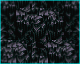

La grande question que vous vous posez, c'est probablement "Comment diable ont-ils faits ces rochers ?!"

J'ai honnêtement aucune réelle idée... Je pourrais probablement diviser tous les tiles pour trouver lesquels ils utilisent où et combien il y en a, mais je vous laisse faire cet exercice, heh...

Si je m'étais lancé dans quelque chose comme ça, j'écrirais ce cours depuis ma tombe et je serais encore loin d'avoir fini, heheh.

Cependant, on peut compter les couleurs. Il y en a sept en tout... Du violet le plus clair au noir le plus foncé. Pour avoir un rendu plat, comme des rectangles de pierre proéminants, vous verrez qu'ils n'ont utilisés que les couleurs les plus claires.

Les couleurs plates changent ensuite dramatiquement vers les plus foncées et le noir est utilisé pour les ombres, tandis que les lignes assombrissantes fondent dans les ombres pour donner un effet 3D.

Heh, c'est tout ce que je vais dire sur ces roches... Je me demande combien de temps ils ont dû enfermer les tile artistes dans la cave avant qu'ils acceptent de travailler sur ce set, heheh. Le reste est fait de la même manière que les autres parties... A peu près quatre couleurs par type de tile. Glissez l'image dans Paint, zoomez et faîtes quelques analyses.

Maintenant pour le troisième screen : 

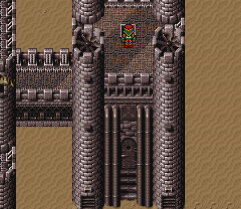

J'ai envie de souligner ici aussi l'attention donnée au détail et l'intérêt de l'image. 

Regardez où est la porte. C'est pas juste un mur solide avec une porte et ensuite l'étage supérieur. On a la porte, entourée de larges tuyaux, il y a un ventilateur au dessus, des escaliers qui mènent à la porte, ces... choses qui servent à... soutenir... au dessus des tuyaux (je n'ai aucune idée de ce que c'est mais ça rend super bien, heh), puis des briques carrées plus larges, et ensuite l'étage supérieur qui est aussi entouré d'une bordure de briques.

Aussi, sur la sorte de pont à gauche, il y a ces motifs triangulaires sur le côté des briques, ce n'est pas juste le même tile de briques que partout ailleurs.

Encore plus de détail, sur les colonnes à côté des tuyaux, ce ne sont pas juste des colonnes, il y a ces briques qui ressortent, des espèces de charnières en bas puis des grilles encore en dessous (encore une fois, je n'ai aucune idée d'à quoi ça sert mais ça rend le tout intéressant). 

Bien sûr ils ruinent tout en utilisant ce tile de désert encore et encore et encore dans le désert... Quelques pierres ou des arbres morts ou quelque chose aurait été bien pour briser les zones un peu.

Voilà un zoom des colonnes : 

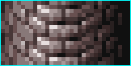

Ces tiles utilisent neuf couleurs, mais ce sont toutes des nuances de gris et elles sont utilisées partout donc ce n'est pas une perte. Si vous utilisiez neuf teintes par tile, vous seriez vite à court avec une palette de 256 couleurs.

Notez les extrêmes gauche et droite... Les bricjes ne sont faîtes que de deux ou trois couleurs, et ce sont les teintes les plus foncées. Tandis que les briques du milieu, les plus claires, ont les teintes brillantes et utilisent plus de teintes. Moins il y a de détail, plus on a l'impression que c'est dans le décor (vous vous rappelez de l'herbe qui semblait plus plate avec seulement deux couleurs plus tôt dans le cours ?). 

Passons maintenant au dernier screen :

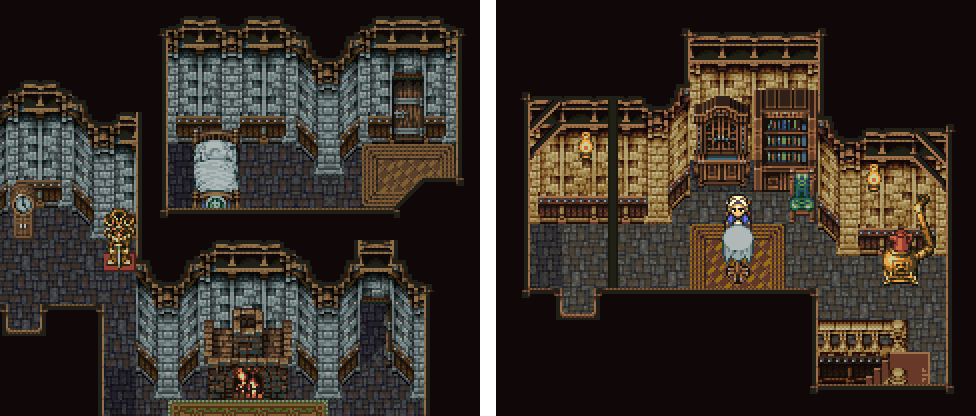

Voilà quelque chose d'amusant que je n'avais pas réalisé avant de vraiment regarder les tiles... Vous voyez des similarités entre ces deux pièces ? Elles viennent de différentes villes et ont toutes les deux une atmosphère différente : celle de gauche est froide et délabrée, celle de droite est chaleureuse et accueillante.

Pourtant elles utilisent exactement les mêmes tiles, avec des couleurs différentes. Et ça marche, parce qu'elles sont utilisées dans deux villes totalement différentes. Quand vous arrivez à la deuxième ville, les tiles de la première ne sont plus frais dans votre esprit, et souvent vous ne réalisez même pas qu'ils utilisent les mêmes tiles. Et ça a sûrement évité un paquet d'heures de dessins de tiles, heh... 

Bien que les tiles soient foncièrement les mêmes, vous pouvez distinguer les maisons d'une ville à une autre grâce au changement de palette. 

Bon eh bien, prenons une section du mur et observons le tile par tile : 

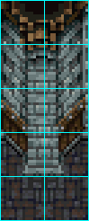

Voilà un des piliers... Au premier coup d'oeil, on dirait qu'un pilier est juste composée d'une ligne de tiles allant vers le haut... Mais il y a en fait deux tiles, ce qui rend le tout plus efficace. Si vous utilisez une colonne de tiles pour les briques du milieu, alors il faudrait une colonne supplémentaire de chaque côté pour les murs en diagonale. 

En utilisant deux colonnes, les sections diagonales font partie des tiles du pilier, ce qui veut dire qu'elles rentrent mieux sur la map, vu qu'elles demandent une colonne de tiles en moins.

Le problème avec cette méthode cependant, c'est que la seule manière d'avoir une autre diagonale à la suite (pour que cette partie de la maison continue en diagonale un peu plus longtemps que pendant ce petit morceau), c'est de faire une colonne spéciale de briques diagonales qu'ils pourraient répéter. Mais aucune des maps ne fait ça, elles ont toujours ces sections avec un seul tile.

Si vous regardez le screen de la pièce, juste au dessus, vous verrez que pour faire une bordure en coin (comme ce qui irait à gauche du screen que j'ai pris), ils n'utilisent que la moitié de la colonne. Donc ils ont de nouveau deux moitiés, et pour faire une large poutre au milieu du mur comme juste au dessus du lit, ils mettent juste ces deux moitiés dos à dos. Tout est dans l'assemblage les gens, heh. 

Bref, je voulais juste souligner la composition de cette scène. Si vous faîtes un peu de comptage de couleur, vous ferez ça énormément si vous voulez devenir un meilleur pixel artist, vous remarquerez encore, et à l'exception de quelques pixels vraiments noirs, que peu de teintes sont utilisées.

Une caractéristique intéressante des maps d'intérieur, c'est la composition des plafonds... C'est plus évident dans le screen de droite, au dessus. Regardez les coins... ils ont ces doubles poutres qui traversent, et de temps en temps il y a cette poutre qui va verticalement au dessus de tout... 

Aussi, les bordures ne vont jamais seulement des tiles internes à des tiles noires. Il y a un contour en bois autour de toute la pièce. Encore une fois, c'est l'attention aux détails de ce genre qui rend les choses intéressantes.

Notez aussi que les poutres supérieures et autres sont faîtes avec des teintes foncées de marron, et non des teintes claires. Si ça avait été le cas, elles seraient trop distrayantes et ruineraient le reste de la map. De même, si les lampes au mur étaient sous les poutres comme ça, leur partie supérieure ne serait pas éclairée, donc c'est réaliste. Mais surtout, ça les empêche de trop se mélanger avec le reste du décor.

Bon, assez avec l'analyse. Je pourrais continuer pendant des heures à étudier des jeux comme Chrono Trigger, Zelda, Shining Force 2, Phantasy Star IV et ainsi de suite mais ça prendrait une éternité et je ferais tout le travail à votre place... 

Avec tout ça, vous devriez avoir appris comment étudier une map et voir comment elle est faite. Observez les couleurs utilisées, comment les sections sont divisées et les différents types de contrastes et de choix de couleurs. Avec le temps ça devriendra plus naturel et vous serez capable de trouver combien de teintes ou de tiles sont utilisées avec un simple coup d'oeil. C'est un talent très important pour avancer dans l'art.

Faudra peut-être diviser le chapitre en plusieurs.