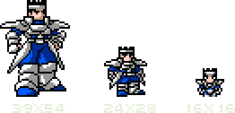
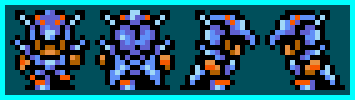
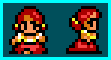
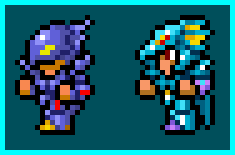
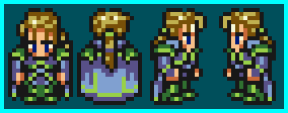
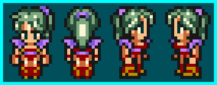
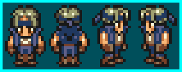

Une des premières chose que les gens voient de votre jeu, que ce soit via les screenshots ou les trailers, ce sont les sprites. Ils vont permettre aux potentiels futurs joueurs de se faire une première opinion sur votre jeu, il est donc essentiel d'y faire attention. Plus précisément, le sprite le plus important est celui du personnage principal. 

:::marvin
Mais pourquoi celui-là ? Et mon super méchant qui veut contrôler le monde sans raison connue ?
:::

:::astride
Bien sûr qu'il est important, mais pas autant que ton héros !
:::

Votre joueur pourra parcourir des centaines de kilomètres, traverser des dizaines de villes et de zones différentes, le seul sprite que le joueur verra quoi qu'il arrive est celui du héros. il sera donc difficile pour un joueur qui ne l'aime pas de s'investir jusqu'à la fin du jeu.
Pour créer un bon sprite, il faut commencer par décider de sa taille : 

Aujourd'hui, la limite de taille n'est plus vraiment un problème, mais si vous travaillez seul, un sprite aussi large vous demanderait trop de temps et d'énergie. Un bon compromis entre le détail et l'efficacité serait un sprite de 16x16. 

Le 16x16 est un classique pour les sprites. Vous en trouverez dans Final Fantasy et bien d'autres RPGs. Avec le temps, c'est devenu une tradition, mais les limites aujourd'hui n'existent plus vraiment.

Pour vous donner un exemple, je suis parti d'une taille très grande, puis j'ai petit à petit réduit le sprite pour vous montrer quoi enlever, jusqu'à arriver à un 16x16.

:::oofmarvin
Mais où sont passés les côtés de son armure ? Et les trois sections de ses gants ? Les... morceaux de ses bottes ? SA BOUCLE DE CEINTURE ? Tout a disparu ! 
:::

:::tssastride
On a dû les enlever. Le 16x16 reste une taille de sprite limitée, on ne peut mettre tous les détails !
:::

Comprendre comment travailler avec de petits sprites vous rendra la vie bien plus facile pour travailler sur des gros sprites. Cela vous permettra aussi de développer votre style !

Maintenant que l'on a vu la question de la taille, j'aimerais m'attarder un peu sur le sprite du milieu. Plus je le regarde, moins je l'aime. Le personnage est courtaud et a l'air un peu de travers. Le sprite a l'air encombré, et c'est difficile de dire qu'est-ce qui va où. La raison est plutôt simple : tout a un contour. Il y a donc trop de noir qui vient boucher certains endroits et ça ne marche globalement pas très bien.

La grande question, c'est "comment faire pour montrer les différentes parties de mon sprite si je ne contoure pas tout ?" Pour ça, il faut utiliser les couleurs stratégiquement. Si vous dessinez un personnage avec une cape qui tombe sur les épaules, vous n'avez pas besoin d'utiliser du noir pour différencier la cape du reste. Vous devez juste trouver quelle couleur utiliser pour contraster les différentes parties correctement.

Au fond, on cherche à *suggérer* les détails, exactement comme quand vous dessinez une main : vous n'avez pas besoin de faire tous les doigts pour qu'on comprenne que c'est une main. C'était beaucoup utilisé dans les jeux avec des sprites 16x16. Observons par exemple quelques sprites de Final Fantasy 2 et 3 : 

D'abord, le personne le plus cool de tous les jeux Final Fantasy... Kain, le Dragoon Knight ! Regardez ce sprite, il est bien. On peut dire qu'il a une armure dragon-pointue-cool. Prêtez attention à ses jambes dans la vue de face. Il a un pantalon... ou des piques, je ne sais pas trop ce que c'est, rouges, puis des bottes bleues. Pourtant les deux éléments ne sont pas séparés par une ligne noire, et malgré ça, vous pouvez toujours différencier les deux. C'est un exemple assez simple de division par la couleur (oh, j'ai inventé un terme) dans les sprites. On retrouve la même chose sur son casque, avec ces "yeux" rouges. Il n'y a pas de noir pour les séparer du reste.

Regardez ses pieds maintenant. Il n'y a pas de ligne noire en dessous, ils se "finissent" juste soudainement. Pourquoi ? Simplement parce qu'il n'y a pas besoin d'une ligne noire ici. Comme il y en a déjà sur les côtés des jambes, votre oeil les connecte automatiquement en dessinant une ligne "invisible". Bon, ça a l'air de rien dit comme ça, mais rendez-vous compte que cela fait économiser une ligne entière de pixels qui est à la place utilisée pour détailler le visage ou d'autres parties du corps ! On retrouve le même principe en haut du casque dans les vues de face et de dos. Votre oeil vous dit que puisque le bleu au milieu ressort par rapport au reste, c'est plus haut, et comme il y a du noir autour, c'est une partie de son casque. 

Kain n'est pas le meilleur exemple de division par la couleur, généralement les vêtements l'utilisent davantage par rapport à une armure qui ne change pas vraiment de couleur selon les sections, mais Kain est cool, donc il a sa place ici. 

Passons à la suite : 

Un PNJ quelconque d'une ville ! Je n'ai pris que ces deux vues parce que je n'avais pas grand chose à dire sur les autres. 

L'endroit où vous verrez le plus de division par la couleur sont ses cheveux. Regardez bien, il n'y a pas de ligne noire pour séparer le rouge de ses cheveux et le pêche de sa peau. Mais on peut dire sans problème que ses cheveux ne sont pas juste de la peau brûlée par le soleil, n'est-ce pas ? Les deux couleurs sont assez contrastées poue que l'on ait pas besoin d'une ligne noire. D'ailleurs, imaginez ce que ferait une ligne noire à ses yeux ! On ne pourrait plus les différencier des cheveux. Grâce à une division par la couleur, les cheveux et le visage sont en retrait et laissent donc la place aux yeux pour exprimer des émotions.

Attardons-nous maintenant sur son torse, du coup à la taille, les bras inclus. Les seules lignes noires sont celles qui contournent l'ensemble. Elles sont "en dehors" de la zone. Même si rien ne souligne son haut, on voit clairement qu'elle est habillée. Il faut comprendre que quand on travaille avec des corps qui font quelque chose comme 2 pixels de haut, on a juste pas la place de tout entourer. Et comme je le disais plus haut, faire ça peut parfois rendre la lecture du sprite compliquée.

Le dernier point que j'aimerais évoquer pour ce sprite sont les attaches de ses chignons, en jaune. Vous savez ce que c'est, vous savez pourquoi c'est là, même s'il n'y a pas de contour. Vous commencez à intégrer mon point ? 

On peut voir en revanche des lignes noires au menton et à la taille, mais celles-ci sont nécessaires pour ségmenter le pesonnage. Si vous ne séparez rien du tout, vous pourriez finir avec un grand blob de pixels colorés. Ne pas diviser assez les sections est une erreur commune, donc faîtes attention. Ça demande généralement de la pratique pour savoir quelles parties souligner et quelles parties mettre en second plan, mais ça viendra, ne vous en faîtes pas. 

Regardons maintenant les sprites des combats :

Cecil et Kain, tirez des scènes de combat de FF2. Ces sprites sont en 16x24, ce qui change des sprites 16x16 utilisés pour les maps. Grâce à cette taille, ils sont plus détaillés. Pourtant la division par la couleur est toujours là. Avec cette taille, Monsieur ou Madame Artiste a désormais 8 pixels de plus pour travailler.

:::hehemarvin
Oh ! Ça veut dire que je peux ajouter tous les contours noirs !
:::

:::tssastride
Eh bien... Tu pourrais faire ça, mais tu aurais juste un sprite en 16x16 où tout est séparé par du noir.
:::

:::marvin
Ah non, moi je veux des sprites sophistiqués !
:::

:::winkastride
Très bien, prête donc attention à ces sprites de Final Fantasy 2.
:::

D'abord Cecil, à gauche. Ce qui ressort le plus du sprite, c'est le casque, plus particulièrement la partie qui recouvre ses yeux. Suivez la ligne noire. Suivez-là... suivez-là... et elle s'est juste arrêtée. À partir du milieu du visage, la ligne noire devient une ligne violette foncée qui continue et donne la forme au casque avant de rejoindre la ligne noire en haut. Pourquoi est-ce que l'artiste a fait ça ? C'est à cause du contraste. Si vous regardez sa tête, la première chose que vous voyez est la partie avant, vers le nez. Ensuite, votre oeil scanne le reste et vous donne une image globale du casque. Si c'est cet endroit que vous remarquez en premier, c'est à cause de tout le noir qui s'y trouve. Si la ligne violette était noire, elle ressortirait trop et serait en compétition avec l'avant du casque, ce qui rendrait le visage moins important. Parce que c'est violet, cette partie se fond dans le reste de l'armure. Si vous plissez des yeux, vous verrez que les zones violettes ont tendence à se mêler les unes aux autres, parce qu'elles sont similaires, tandis que les parties noires ressortent toujours.

Bon, vous n'avez pas non plus besoin d'être aussi technique et philosophique à propos des lignes... Gardez juste en tête que vous n'avez pas toujours besoin de contours noirs. 

Regardez son bras gauche maintenant, celui qui est le plus prêt de nous. Encore une fois, il n'y a pas de ligne noire pour séparer les parties de son épaule à sa main. C'est divisé avec la couleur, et on peut clairement voir ces divisions ! C'est exactement pareil pour son torse, ses jambes, etc.

Maintenant Kain. Puisqu'il porte aussi une amrure, il est similaire à Cecil dans la façon dont les couleurs ont été utilisérs. En fait, si vous regardez attentivement, ses jambes sont exactement les mêmes que celles de Cecil, sauf que les couleurs sont différentes. Et tiens, tant qu'on parle des jambes ! Regardez celles de Cecil, puis celles de Kain. Vous remarquez la différence ? Chez Cecil, en bas à droite, il y a un point orange et un pixel noir dans le coin. Ces deux pixels changent presque complètement le style de la botte. Kain a des chaussures rondes et solides, tandis que Cecil a une partie orange qui ressort (peut-être un talon ?) et l'armure est comme dentelée. Ce pixel orange n'a d'ailleurs pas de contour noir, il est juste là, et il change le style de l'armure. 

Sur le casque de Kain maintenant, vous pouvez voir qu'il n'y a pas de séparation entre le bleu et le jaune à l'arrière. Les couleurs sont assez contrastées, et rajouter du noir rendrait juste cette partie illisible. Kain a un peu plus de division, notamment sur son avant-bras, et les lignes noires donnent à son armure un côté très solide. Aussi, l'armure de Cecil donne l'impression de manches au niveau du poignet, là où c'est un segment séparé chez Kain (merci la ligne noire). 

Encore une fois, cela va vous demander de la pratique pour utiliser le noir "comme les pros". Bon, allons un peu voir du côté de Final Fantasy 3 maintenant : 

Ce bon vieux Edgar... N'est-il pas beau avec ses vêtements distingués ?

Pour un peu d'information inutile, les sprites des personnages dans Final Fantasy 3 sont en 16x24, la même taille que les sprites de combat de FF2. La différence étant que là où FF2 jonglait entre du 16x16 et du 16x24, FF3 utilise le 16x24 tout le temps. 

Ces sprites utilisent énormément la division par la couleur. En fait, et assez étrangement, les grands sprites l'utilisent davantage par rapport aux petits. Il faut comprendre qu'utiliser des sprites plus large ne veut pas dire que vous n'avez plus besoin de penser à ce que vous faîtes. Toutes ces lignes noires que vous mettez autour de chaque mèche de cheveux pourraient servir à faire du shading ou ajouter des détails. 

Revenons à Edgar. Le plus intéressant à regarder, ce sont ses cheveux, particulièrement les deux mèches qui lui tombent sur les yeux. Juste deux traits sombres, pas de noir. Aussi, au sommet de son crâne, vous verrez qu'un pixel noir est manquant. La logique voudrait que si on désire que ses cheveux retombent au milieu, on devrait mettre le noir une ligne en dessous. Mais nous n'en avons pas besoin. Il suffit d'éliminer le pixel et de diviser la ligne noire en deux. Quand vos yeux suivent la ligne en haut de sa tête, ils arriver au creux, aller vers le bas jusqu'à la couleur, puis remonter jusqu'au noir. C'est ce qui va créer le creux dans ses cheveux ! 

Si vous observez la doublure verte de sa tenue, vous pourrez aussi voir que c'est simplement là, sans contour noir. S'il y en avait un, la doublure ressortirait beaucoup trop et ressemblerait à une pièce d'armure ou de tenue à part entière.

:::winkastride
D'ailleurs, c'est intéressant de remarquer qu'il n'y a techniquement pas de ligne noire ici ! Pour Final Fantasy 3, ils ont décidé d'avoir des lignes colorées. Si vous vous approchez, vous pourrez voir une pointe de vert dans les contours !
:::

Grâce à ce vert, le sprite semble plus réaliste que ceux de Final Fantasy 2, qui font davantage penser à des dessins à cause du contraste trop fort du noir. Le vert adoucit le sprite.

Une dernière chose pour Edgar : il n'y a pas de séparation entre ses jambes dans la vue de face. C'est, malheureusement, un inconvénient quand on utilise des nombres pairs pour les tailles des sprites (ici 16 en largeur). Avec un nombre pair, on a pas de colonne de pixel au milieu, et donc pas de point central sur le sprite. Si le sprite en avait une (donc un nombre impair pour la largeur), vous pourriez très bien avoir une ligne pour séparer les jambes, voire ajouter un nez entre les yeux, qui sait ! 
Ce problème de double colonne centrale touche aussi les visages, et ça explique pourquoi Edgar a un sourcil plus long que l'autre. Si les deux étaient longs, ça serait devenu un monosourcil... Si les deux étaient courts, Edgar aurait eu un air d'au petit bonheur la chance, alors qu'il a d'habitude beaucoup de choses à gérer. Donc ce pixel lui donne un air pensif, comme s'il voulait comprendre quelque chose. 

Je pourrais encore continuer à parler d'Edgar, mais je pense qu'à ce stade du cours, vous êtes capables de remarquer beaucoup de choses par vous-mêmes. C'est comme ça que vous pourrez progresser. 

Passons donc à la suite, Terra : 

Bon, normalement, vous devriez avoir tous les points clefs mémorisés. Regardez les cheveux, le sommet de la tête avec le pixel manquant, les jambes et le torse. Une fois que vous avez fait tout ça, attardez-vous sur son menton. Il n'y a pas de ligne noire pour le séparer de son corps ! Souvenez-vous de la PNJ de FF2 que l'on a vu un peu plus haut, elle a une ligne noire, elle. Alors pourquoi pas Terra ? La PNJ a l'air plus ronde, là où Terra apparaît comme assez fine. C'est en partie grâce à son menton. Si vous pensez à la tête d'une personne en surpoids, vous verrez sûrement un double-menton qui sépare la tête du buste. Lorsqu'un peu de graisse est repliée sur elle-même, vous obtenez un creux... donc une ligne sombre. Donc, pour la PNJ, il y a une ligne entre sa tête et son buste pour davantage séparer les deux, donnant un résultat plus segmenté. Pour ce qui est de Terra, elle est plus mince, donc à la place de cette ligne noire, il y a quelques pixels foncés. Ça montre qu'il y a un menton ici, mais qu'il n'est pas très défini. Une ligne noire pourrait aussi être utilisée pour un personnage à la mâchoire carrée ! L'absence de ligne comme ça, un peu comme un menton pointu, donne au personnage un air plus féminin.

Terminons avec Locke maintenant : 

Les choses importantes à voir chez Locke sont les mêmes que pour les autres. Mais Locke a l'air plus divisé parce qu'il a cette veste un peu funky. Mais là encore, si vous faîtes attention et que vous suivez une courbe de sa main gauche à sa main droite, il n'y a pas de pixel noir ! Le changement de couleur est tellement drastique entre le bleu et le pêche qu'on a déjà le sentiment de division. Si on remplaçait le bleu foncé de sa veste par du noir, sa veste ne serait pas une veste bleue, mais une veste noire avec une bande bleue ! C'est un autre avantage d'utiliser le noir avec parcimonie.

Sur les vues de dos et de côté, la partie nouée de son bandeau sont contourées avec du noir, tandis que la partie autour de sa tête ne l'est pas. Pourquoi ? Parce que la partie nouée ressort, et qu'elle forme un nouveau segment. Le bandeau est serré autour de sa tête, donc il n'a pas besoin d'être défini séparément. 

Est-ce que vous voyez où je veux en venir ? Si ce n'est pas encore imprimé dans votre cerveau, je vais le répéter une fois de plus. Vous n'avez pas besoin de tout entourer de noir. Donc la prochaine fois que vous jouerez à un jeu et que vous verrez des sprites, observez les contours et où la division par la couleur est utilisée. Vous seriez surpris du nombre de sprites qui utilisent cette méthode. 