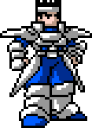

Les sprites... Une des premières chose que les gens voient de votre jeu, que ce soit via les screenshots ou les trailers ! Ces potentiels futurs joueurs vont instantanément baser leur opinion là-dessus, consciemment ou pas, et s'ils n'aiment pas les graphismes, ils n'arriveront pas à s'investir s'ils décident de jouer.

Plus spécifiquement, le sprite le plus important est celui du personnage principal. "Pourquoi celui-là ? Et mon super méchant ennemi juré qui veut contrôler le monde sans raison connue ?" Bien sûr, lui aussi est important, puisque c'est un personnage central de votre histoire, mais il n'est pas aussi important que votre héros, qui sera affiché pendant l'entièreté du jeu. Si le joueur ne l'aime pas, il ne s'investira pas et il pourrait même ne pas finir le jeu juste parce qu'il déteste regarder ce sprite en permanence. Je préfère jouer à un autre jeu qui me proposerait d'être un chevalier sombre ou un mage mystérieux !

Bon, je pense que vous avez compris... Le sprite du héros est le plus important. Donc, à partir de ça, où est-ce qu'on va ? Eh bien parlons des limites... et de comment les contourner. Voilà quelques sprites que j'ai faits à partir de celui plus haut :

