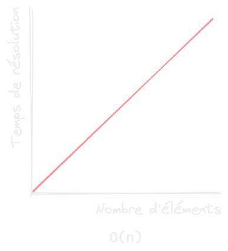

Dans le chapitre précédent, nous avons vu les opérateurs, les types, les fonctions et les structures de données. La base de la programmation, c'est d'utiliser tous ces outils pour construire un algorithme : un programme fait pour résoudre un problème.

Imaginons que l'on souhaite récupérer uniquement les chiens dans la liste des animaux de notre refuge. C'est un algorithme très simple, mais qui peut être écrit de plusieurs façons différentes ! On peut filtrer la liste avec une boucle *for in* ou bien avec une fonction de premier ordre.

```js
let dogs = []
for (animal in animals) {
    if (animal.race == "chien") {
        dogs.insert(animal)
    }
}
```

```js
let dogs = animals.filter(animal => animal.race == "chien")
```

Pour des problèmes plus complexes, il peut exister des approches radicalement différentes et plus ou moins intéressantes. Par exemple, pour ranger tous nos chiens dans l'ordre alphabétique de leur nom, il nous faudrait un algorithme de tri. Cela peut paraître simple, mais il existe des centaines de manières différentes d'implémenter un tel tri !

La méthode du [tri par sélection](https://fr.wikipedia.org/wiki/Tri_par_s%C3%A9lection) passe en revue tous les éléments, trouve le plus petit et le place au début de la liste, avant de recommencer avec le reste de la liste. Plus stupide, le [bogosort](https://fr.wikipedia.org/wiki/Tri_stupide) mélange tous les éléments au hasard en espérant tomber sur le bon ordre. C'est un algorithme si inefficace que si vous avez beaucoup d'éléments à trier, vous pourriez bien ne jamais tomber sur la bonne solution ! D'autres tris sont bien plus performants, mais seraient plus difficiles à résumer en quelques lignes...

Pour juger de la performance d'un algorithme, on peut étudier sa **complexité**, aussi appelée temps de calcul. Dans le cas le plus simple, un algorithme est noté O(*n*), nous indiquant que son temps de résolution augmente linéairement avec le nombre d'éléments étudiés.



Vous verrez également des algorithmes être notés O(log *n*), indiquant qu'ils sont performants sur de très nombreux éléments, ou à l'inverse, O(*n* log *n*) qui indique que le temps explose avec le nombre d'éléments. Un tel algorithme ne devrait être utilisé que sur de petites listes !


:::profremi
La complexité d'un algorithme peut être difficile à comprendre, mais ce qui est important à retenir, c'est que l'on juge de la performance d'un algorithme au temps qu'il met à résoudre un problème avec plus ou moins d'éléments.
:::

En programmation, il est important d'éviter de réinventer la roue. Pas besoin de recréer un algorithme de tri quand votre langage en embarque déjà un qui sera compris par tous les autres programmeurs et qui sera mis à jour.

De la même manière, si vous êtes confronté·e à un problème qui vous semble courant, il existe peut-être une manière standardisée d'y répondre. C'est ce que nous allons voir dans la section suivante.
