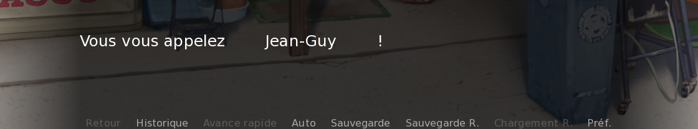

Les visual novels sont souvent basés sur des choix et des fins multiples. Vous vous êtes donc peut-être déjà demandé comment laisser le choix du nom aux joueurs et joueuses pour qu'elles s'approprient encore plus leur personnage !

```python
label start:
    scene magasin
    "Comment vous appelez-vous ?"

    $ nom_du_perso : "Marvin"
```

On ne peut pas écrire le texte directement ! C'est les joueurs et joueuses qui doivent l'écrire. Il y a une fonction de Ren'Py pour ça :

```python
$ nom_du_perso = renpy.input()
```

Dans cette fonction, on peut préciser un texte qui va s'afficher avec le champ.

```python
$ nom_du_perso = renpy.input("Entrez un nom.")
```

Pour afficher le nom dans un message, écrivez le nom de la variable entre crochets :

```python
"Vous vous appelez [nom_du_perso] !"
```

Il faudrait aussi afficher le nouveau nom en haut des messages. Définissez un nouveau personnage, et là où vous devez écrire le nom, mettez la variable !

```python
define perso = Character("[nom_du_perso]", color="ffc8c8")
```

Essayez votre système, et vous verrez que ça marche du tonnerre ! Excepté qu'il y a une faille... Si vous entrez plein d'espaces au début ou à la fin du nom, ils se verront par la suite.


*Ce n'est pas idéal...*

On peut contrer ce problème avec `strip()` :

```python
$ nom_du_perso = renpy.input("Entrez un nom.")
$ nom_du_perso = nom_du_perso.strip()
"Vous vous appelez [nom_du_perso] !"
```

Ici, on applique cette fonction au texte de `nom_du_perso`, et elle renvoie un nouveau texte sans les espaces au début et à la fin.

:::marvin
Et si... on écrit rien du tout ?
:::

C'est vrai, les joueurs et joueuses malicieuses pourraient faire ça. Nous pouvons le détecter avec la condition `if not nom_du_perso`, qui signifie « Si la variable n'a pas de valeur ».

```python
if not nom_du_perso:
    $ nom_du_heros = "Sam"
```

Ici, j'écris un nom par défaut si rien n'est entré, mais vous pourriez forcer les joueurs et joueuses à choisir en les renvoyant au début du label.

Et c'est avec cette astuce que se clôt ce chapitre sur les variables ! Vous devriez avoir une meilleure idée de tout ce qu'elles permettent, même si leur potentiel est évidemment décuplé lorsqu'on s'y connaît bien en programmation. Dans le chapitre suivant, vous apprendrez à ajouter des objets cliquables dans le décor, ajouter un inventaire et même une mini-carte de la zone !
