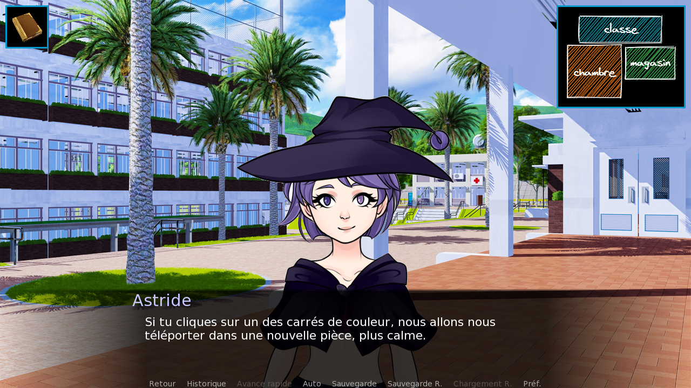
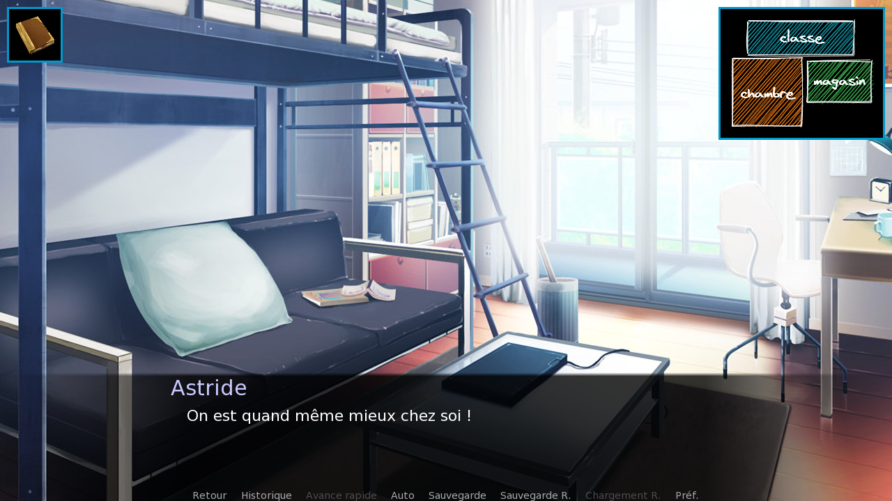

La dernière astuce de ce chapitre sur les point and click, c'est l'utilisation des imagemaps qui permet de rendre différentes zones d'une même image cliquables. Le moyen le plus simple de le montrer, c'est sans doute de créer une mini-carte contenant plusieurs destinations.



Préparons le terrain avec un petit script :

```renpy
a "Maintenant, il te faudrait un endroit calme pour écrire...{w} Pourquoi ne pas utiliser la carte pour te déplacer ?"

# La carte s'affiche avec le message
show screen minicarte

a "Si tu cliques sur un des carrés de couleur, nous allons nous téléporter dans une nouvelle pièce, plus calme."

# On est obligé de choisir une destination
call screen minicarte
```

Voici l'image que j'ai réalisée pour l'occasion. Simple mais efficace !


*minimap.png*

Avec ceci, on va pouvoir créer notre nouveau screen :

```renpy
screen minicarte:
    # On englobe l'imagemap dans une frame
    frame:
        xalign 1.0
        xpadding 10
        ypadding 10
        xmargin 10
        ymargin 10
        imagemap:
            ground "minimap.png"
            hotspot (31, 9, 152, 49) action Jump("map_classe")
            hotspot (10, 64, 99, 96) action Jump("map_chambre")
            hotspot (117, 67, 91, 59) action Jump("map_magasin")
```

Une imagemap peut contenir jusqu'à 6 images, `ground` étant une simple image de fond. On peut y ajouter des zones cliquables (hotspot) mais aussi des barres cliquables (hotbar). C'est utile pour créer une interface comme un menu d'options !

Pour obtenir les coordonnées du hotspot, il existe une astuce très pratique. Faites Shift+D en jeu, puis Sélecteur d'emplacement d'images. Cherchez l'image minimap.png puis dessinez une zone dans l'outil : les coordonnées seront copiées dans votre presse-papiers et vous pourrez les coller.

Préparons quelques labels pour tester le système :

```renpy
label map_classe:
    scene classe with dissolve
    a "Espérons qu'aucun cours ne viendra nous déranger !"
    return

label map_chambre:
    scene chambre with dissolve
    a "On est quand même mieux chez soi !"
    return

label map_magasin:
    scene magasin with dissolve
    a "Hmmm, ce n'est pas vraiment plus calme..."
    return
```



Et voilà ! Plutôt simple, non ? Cela dit, vous devez vous douter que pour chacun des concepts que l'on a vus dans ce chapitre (les frames, les imagemaps, etc) il existe de nombreuses fonctionnalités que je ne pourrais pas vous expliquer aussi simplement : c'est à vous de regarder ce qui vous intéresse pour votre propre jeu.

J'espère en tout cas qu'après avoir vu ces principes de base ensemble, la documentation de Ren'Py vous paraitra moins intimidante (même si, nous sommes d'accord, elle est tout de même très dense). La consulter est une étape incontournable pour étayer vos connaissances, mais vous saurez sans doute mieux par où commencer désormais.
