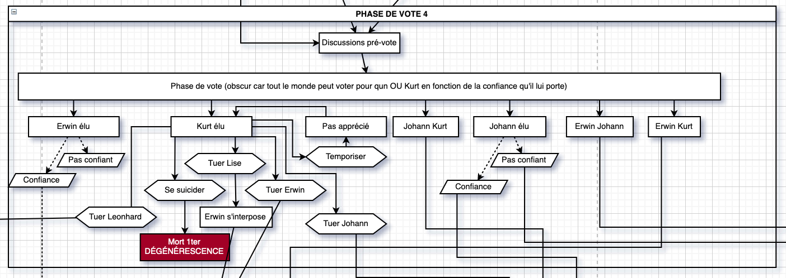
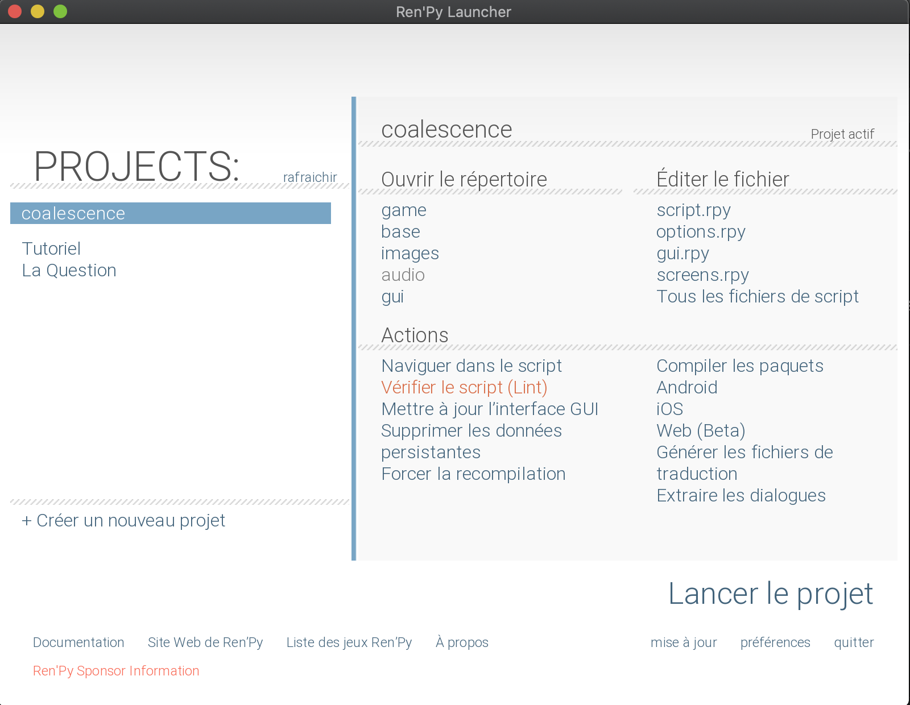

Même s'il fait bon se lancer enfin seul dans son propre projet, écouter les conseils des vieux sages rodés à Ren'Py ne vous fera pas de mal non plus !

### Faites un graphe

Un visual Novel, ça part rapidement en cacahuète. Si on n'y met pas un minimum de soin, ou qu'on se laisse emporter par la folie créatrice, il est courant d'avoir des problèmes scénaristiques.

Pour cela, faire un **graphe** des routes peut être un bon moyen de s'y retrouver. Vous n'imaginez pas écrire l'histoire suivante sur un éditeur de texte !

Comment est-ce que je peux créer quelque chose comme ça ?

#### Papier + crayon

Vous êtes entièrement libres de faire ce que vous voulez, mais si jamais il faut changer quelque chose en cours de jeu, c'est la cata, il faut gommer, griffonner à gauche et à droite -ou tout refaire.

#### Un outil de dessin en ligne

L'avantage est qu'il sera plus facile de changer quelque chose en cours de route (ca arrive régulièrement...) sans avoir a tout refaire! En plus, ces outils permettent souvent de faire un joli graphique, tres sympa!

Il existe principalement 2 outils :

-   [Excalidraw](https://excalidraw.com/), simple et joli
-   [Diagrams.net](https://app.diagrams.net), très complet (c'est l'outil utilisé ci-dessus)

#### Un outil tout automatisé

[Renpy-Graphviz](https://github.com/EwenQuim/renpy-graphviz) (créé par un membre de la communauté Ren'Py Française !) dessine un schéma a partir des `label` de vos fichiers `.rpy`. Il est sous la forme d'un fichier executable a mettre dans votre dossier, et il faut simplement le lancer (double-clic).

-   Il sort un schema tout seul, sans s'embeter a tout dessiner
-   Cela assure de ne pas avoir de _divergence_ entre le schema dessiné et le code (parce que sinon il faut mettre a jour les 2)
-   Il est par contre assez _peu customisable_ par rapport aux autres outils proposés ci dessus.

:::oofmarvin
Mais alors, je dois choisir quel outil ?
:::

:::astride
Ca depend du projet. Plus il est gros, plus il faudra se tourner vers un outil automatisé, qui simplifie la vie au detriment de la beauté.
:::

### Travaillez votre univers

Une histoire, ce n'est pas seulement ce que le joueur va lire. C'est aussi des personnages, un univers ! N'hésitez pas à **mettre toutes vos idées sur papier** (ou numérique, l'important est de l'écrire quelque part). Vous pouvez écrire 3 choses differentes:

-   les **personnages** : faites une petite fiche pour chacun d'entre eux. Plus vous connaitrez vos propres personnages, plus ils seront "vivants" et impacteront le lecteur
-   le **background** : ce qui s'est passé avant le debut de votre histoire. Il est essentiel pour poser un contexte, qui est la base de votre histoire.
-   le **joueur** de votre Visual Novel, un personnage tres special ! C'est souvent quelque chose de dificile a travailler, car il faut que le joueur puisse s'identifier, mais il doit quand meme avoir un rapport avec votre histoire... C'est pour ca qu'il est important de faire quelque chose de coherent !
-   une **ligne directrice** : eh oui, meme si vous etes fier des 10 fins de votre jeu, il faut garder un etat d'esprit general au jeu. Posez vous la question "qu'est ce qui fait que mon jeu est unique et se differencie des autres ?", et ecrivez la reponse. Meme si vous connaissez la reponse, ecrire permet d'exterioriser et de fixer les choses.

Vous verrez plus rapidement les points forts et points faible de votre histoire, et cela vous aidera à garder une ligne scénaristique cohérente !

### Pensez à votre joueur ❤️

Même s'il peut être tentant de maîtriser le **rythme** de votre Visual Novel, laissez votre joueur libre au maximum. Par exemple, ajouter des pauses obligatoires (qu'on ne peut pas passer) est souvent une mauvaise idée. De manière générale, laissez-le au maximum maître de votre jeu. Essayez de vous mettre à sa place, comme si vous découvrez votre propre jeu !

> N'hésitez pas à faire tester votre jeu par des proches, même avant de l'avoir fini !

Avoir des retours de vrais joueurs est essentiel. Essayez de prendre un maximum de retours constructifs avant de publier votre Visual Novel !

### Utilisez le Linter

Si le _launcher_ Ren'Py fonctionne, rien ne dit que tout va bien marcher plus tard... Utilisez le Linter du _launcher_ pour éviter de futurs bugs rapidement !

> Le linter ne signale pas toutes les erreurs de **logique**, mais il va vous aider en détectant les erreurs de **syntaxe** !
