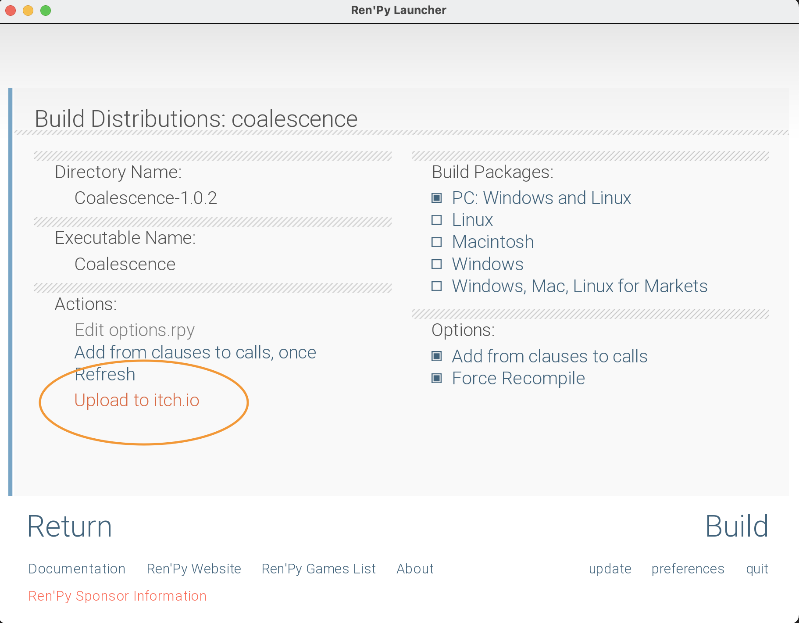
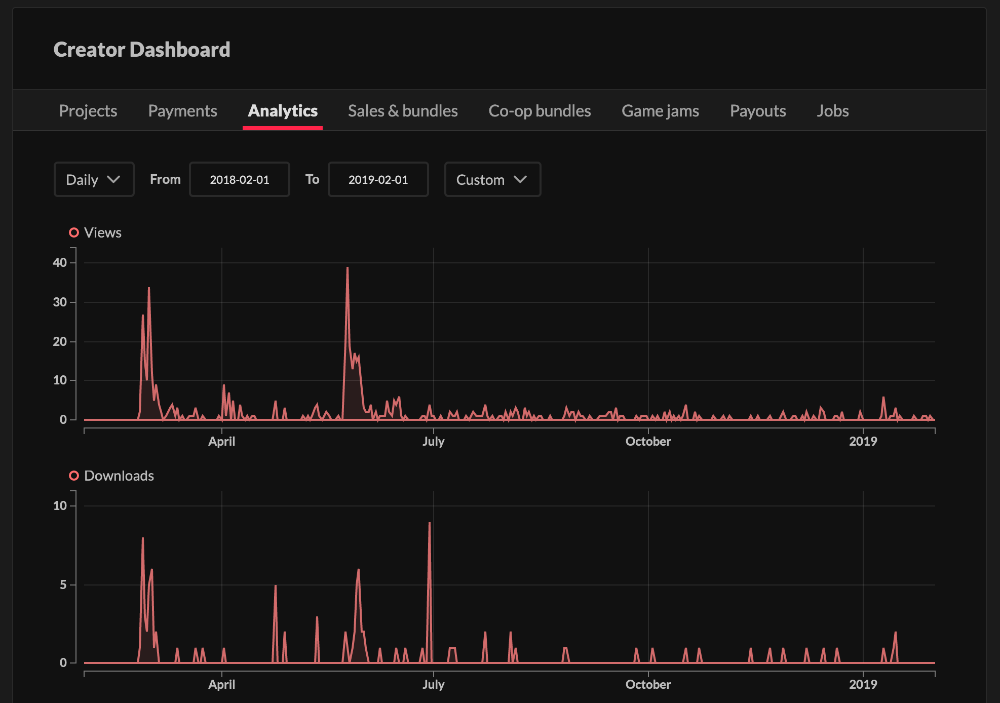

:::marvin
J'ai fini de coder mon jeu ! Hâte de savoir ce que les gens en pensent
:::

:::winkastride
Patience, encore une étape avant que ce soit fini : la **distribution**
:::

:::oofmarvin
Encore ? Ce sera long ?
:::

:::astride
Pas du tout : PyTom, le créateur de Ren'Py, a créé plein d'outils pour nous simplifier la vie !
:::

Et oui : créer un jeu c'est bien, mais le partager, c'est mieux !

### Le Build

Pour l'instant, vous pouvez seulement lancer le jeu depuis le _launcher_ Ren'Py. Mais vous il n'est pas question que vos joueurs téléchargent Ren'Py en plus de votre jeu ! C'est pourquoi il faut construire une version directement exécutable chez l'utilisateur.

> Une version ? Non, **des** versions : une par système d'exploitation (Linux, Windows, mac, mais aussi iOS ou Android !)

Avec Ren'Py, c'est très simple de générer tout cela, du moins pour ordinateur : il suffit de cliquer sur `Construire les paquets`, choisir les systèmes d'exploitations de nos joueurs. Ren'Py va créer un dossier à côté du code source, dans lequel se trouvent les versions du jeu.

### La distribution

Si votre jeu est un jeu PC, vous pouvez partager votre VN sur [itch.io](https://itch.io/), un super site... de partage de jeu, justement ! En plus, il y a plein de fonctionnalités interessantes.

#### Une integration directe à Ren'Py

#### Des statistiques

### Commercialisation ?

La question de la commercialisation est un sujet complexe. Je vous renvoie à notre video [Comment gagner de l'argent avec un jeu indé](https://www.youtube.com/watch?v=5rj0rOjrkL8).

### Android

Ouh la la, si vous avez decidé de faire un jeu pour Android (comme l'auteur de ces lignes), vous êtes dans une sacree galere. Mais avec du courage, c'est totalement faisable ! Le createur de Ren'Py a cree une extension de Ren'Py appellee RAPT permettant de faire des builds pour Android. La procedure est presque la même que pour PC, une fois JDK et RAPT telechargés, avec un peu de configuration a faire a chaque fois.

Une fois le build créé, il faut le distribuer. Pour cela, vous pouvez envoyer le fichier .apk a tous vos amis, mais ce n'est pas tres pratique. Sinon, vous pouvez partager le jeu via une plateforme, un peu comme avec itch.io. La plateforme, vous la connaissez, c'est le Play Store. Un compte developpeur Google n'est pas gratuit : cela coute 25\$ (à vie), ce qui est en fait assez faible au vu des outils qu'offre la plateforme. De plus, chaque mise a jour sur le play Store est très lente (parfois plusieurs jours), l'equipe du Play Store devant valider toutes les applications qui sont envoyées.

### Apple

Il n'est possible de faire des builds iOS/macOS seulement depuis un mac. La distribution sur l'App Store est assez fermée et exigeante (plus que pour Android), mais il est tout à fait envisageable de faire cela, avec de la patience.

### Courage à vous, et profitez bien !

C'est le plus important ❤️
