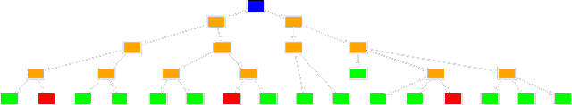
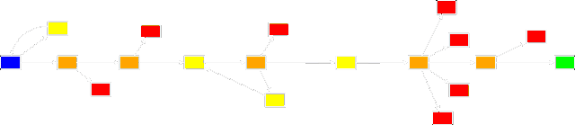
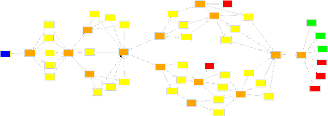

Vous trépignez d'impatience de commencer votre propre projet... Mais l'écriture d'un visual novel est un parcours semé de quelques pièges à éviter ! Ces conseils vous aideront donc à gérer les choix de dialogues pour maintenir une cohérence scénaristique.

### Commencer petit

Tout d'abord, gardez des ambitions humbles pour vos premiers projets. Imaginez une histoire contrainte à une petite échelle de lieu ou de temps, par exemple une seule maison, ou bien une seule journée. Ainsi, vous aurez plus de facilité à mener un projet du début à la fin, ce qui vous apprendra beaucoup dans la gestion du rythme et des embranchements d'une histoire. Cela vous permettra aussi d'obtenir des retours de vos proches sur un jeu complet ! Après avoir écrit quelques petites histoires, vous serez mieux armé·e pour réaliser des projets de plus grande envergure.

### Structurer une histoire

Les embranchements multiples, s'ils font partie intégrante des visual novels, peuvent vous mener dans des impasses créatives lorsqu'ils sont mal gérés. Sans contrôler la portée de vos embranchements, vous pourriez rapidement perdre le fil de votre histoire qui partirait dans toutes les directions :

_Des scènes structurées par des embranchements multiples._

Cette structure permet une grande liberté d'action pour le joueur, mais elle implique des défauts évidents. Vous devrez réaliser de nombreuses scènes tout en sachant que les joueurs n'en verront qu'une petite partie !

Si cette structure peut être adaptée à des petits jeux que l'on recommence plusieurs fois, elle est à proscrire pour un jeu plus long, qui deviendrait rapidement hors de contrôle voire impossible à terminer. Ainsi, pour se protéger de cette éventualité, les auteurs en herbe peuvent avoir tendance à écrire une structure complètement linéaire par sécurité.

Dans ce type de structure, les choix de dialogue peuvent mener à un cul-de-sac (une scène optionnelle revient au fil principal lorsqu'elle est terminée) ou présenter plusieurs alternatives de dialogue qui mèneront toutes, en réalité, à la même scène suivante.

Cette structure a le mérite d'être simple à écrire, mais il faut garder en tête que le joueur pourrait finir par réaliser qu'il est « sur des rails » et n'a pas de pouvoir sur les événements (on parle d'une absence de _player agency_). Dans certains jeux, cette sensation de linéarité fait justement partie du propos de l'histoire !

A mi-chemin entre ces deux structures, il existe un procédé utilisé par de nombreux visual novels : l'enchaînement de carrefours et d'entonnoirs. Durant le fil principal, un carrefour d'embranchements mène à différentes scènes qui finiront toutes par revenir à un point commun, comme un entonnoir. Celui-ci proposera un nouveau carrefour, qui mènera à l'entonnoir suivant, et ainsi de suite.

Cette structure permet aux joueurs de s'exprimer davantage et de faire des choix plus conséquents, car il est impossible de voir toutes les scènes dans une même partie. En tant que créateur ou créatrice, vous pouvez utiliser les entonnoirs pour vous assurer que tous les joueurs verront les scènes les plus impressionnantes, qui vous auront coûté le plus d'argent et d'énergie.

Au fil des embranchements, votre joueur aura développé un rapport de plus en plus personnel à l'histoire, que vous pourrez conclure par une variété de fins. C'est donc une structure adaptée à des jeux longs, centrée autour de l'évolution du personnage en fonction de ses choix. Pour vos premiers projets, ce ne sera peut-être pas la solution la plus pertinente, car votre histoire sera trop courte pour mettre en valeur ce procédé !

Pour en apprendre plus sur les différentes structures des jeux à choix multiples, vous pouvez consulter [cet article](https://heterogenoustasks.wordpress.com/2015/01/26/standard-patterns-in-choice-based-games/) dont sont tirés les graphes d'illustration.

### Réaliser un graphe

Vous l'avez vu, dessiner un graphe des différents parcours est un bon moyen de mieux s'y retrouver et d'appréhender la structure de son histoire. Plusieurs méthodes sont possibles pour créer votre propre graphe.

#### Papier et crayon

Cette bonne vieille méthode vous donne une totale liberté. Cependant, si vous veniez à changer l'histoire en cours de route (cela arrive régulièrement !), alors il vous faudrait gommer, griffonner à gauche et à droite... ou tout refaire.

#### Un outil de dessin en ligne

Sur ordinateur, il est plus facile de changer quelque chose en cours d'écriture. De plus, le résultat est souvent très joli ! Il existe de nombreux outils en ligne, dont ceux-ci :

-   [Excalidraw](https://excalidraw.com/), simple et joli
-   [Diagrams.net](https://app.diagrams.net), très complet

#### Un outil automatisé

[Renpy-Graphviz](https://github.com/EwenQuim/renpy-graphviz), créé par un membre de la communauté francophone, dessine un schéma à partir des `label` de vos fichiers Ren'Py. Il suffit de placer le fichier exécutable dans le dossier de votre projet puis de le lancer.

Ce type d'outil vous permet de travailler plus rapidement et vous assure de ne pas avoir de différence entre votre schéma et votre code. Par contre, le résultat est moins personnalisable qu'avec un outil manuel.

:::oofmarvin
Mais alors, je dois choisir quel outil, moi ?
:::

:::astride
Cela dépend du projet. Plus il est vaste et plus il sera intéressant d'utiliser un outil automatisé, qui simplifie la vie au détriment de la beauté.
:::

### Travaillez votre univers

Une histoire, ce n'est pas seulement les dialogues que le joueur pourra lire. C'est aussi des personnages et tout un univers qui se cache derrière ! N'hésitez pas à noter toutes vos idées, en pensant aux éléments fondateurs de votre histoire :

-   les **personnages** : faites une petite fiche pour chacun d'entre eux. Plus vous connaîtrez vos personnages, plus il sera facile de leur donner vie pour impacter le lecteur.
-   le **background** : les événements précédant votre histoire. Essentiel pour poser un contexte qui sera la base de votre histoire.
-   le **personnage principal** de votre visual novel. C'est un un personnage très spécial et souvent difficile a travailler. Généralement, le joueur doit pouvoir s'identifier tout en laissant le personnage avoir son propre rapport au monde.
-   une **ligne directrice**. Eh oui, même si vous êtes fièr·e des 10 fins de votre jeu, il faut garder un état d'esprit général. Posez-vous la question : « Qu'est-ce qui rend mon jeu unique et différent des autres ? » Ecrivez la réponse afin de mieux fixer les choses.

En travaillant chaque point, vous identifierez plus facilement les points forts et points faibles de votre histoire, ce qui vous aidera à vous concentrer sur l'essentiel et maintenir une ligne scénaristique cohérente !

### Pensez à votre joueur

Même s'il peut être tentant de maîtriser le rythme de votre visual novel, laissez votre joueur ou joueuse libre au maximum. Par exemple, les pauses obligatoires (non passables) sont souvent une mauvaise idée. De manière générale, laissez les lecteurs et lectrices maîtres de votre jeu. Mettez-vous à leur place, comme si vous découvriez votre propre jeu ! Pour cela, rien de tel que de le faire tester par vos proches, même s'il n'est pas encore fini.

Avoir des retours de plusieurs personnes est essentiel. Prenez en compte les retours constructifs avant de publier votre visual novel !
