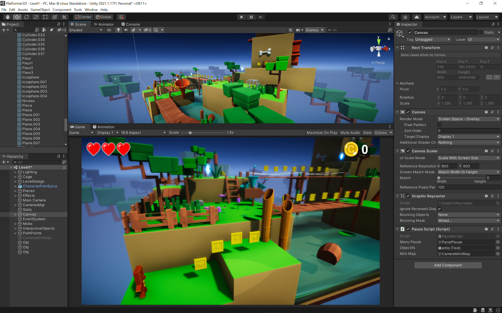

Unity est un moteur de jeu très populaire qui permet de développer des jeux pour toutes les plateformes (PC, MAC, Linux, Consoles, Android, iOS, Web…). Vous développez votre projet une fois et vous pouvez l’exporter pour n’importe quelle plateforme. C’est un atout majeur et un gain de temps considérable. La création de jeux se fait sous Unity (pour la partie conception des niveaux, paramétrages, assemblage des éléments…) et sous un éditeur de code comme Visual Studio pour la partie développement. Le langage de programmation utilisé dans Unity est le C#. Il s’agit d’un langage plus simple à apprendre que le C++ car la syntaxe est moins lourde.

Unity est un éditeur WYSIWYG (What you see is what you get). En d’autres mots, tout ce que vous créez dans Unity (par exemple un niveau) sera visible tel quel par le joueur final. Cela est bien pratique car vous pouvez tester vos niveaux à la volée et savoir quel sera le rendu final sur l’écran de l’utilisateur. Le tout se passe dans une interface intuitive et assez simple à prendre en main.

_L'interface du logiciel Unity et un exemple de projet_

Malgré tout, Unity existe depuis 2005 environ (le logiciel existait déjà avant mais sous un autre nom et non accessible au grand public) et dispose aujourd’hui de très nombreuses fonctionnalités. La principale difficulté dans l’apprentissage de Unity est donc de s’y retrouver dans la quantité d’informations et d’outils.

Ce cours a pour but de vous accompagner dans la prise en main de Unity de façon simple en utilisant des fonctionnalités basiques afin de démarrer en douceur. Les quelques fonctionnalités que nous apprendrons vous seront cependant utiles pour l’ensemble de vos futurs projets car je me concentrerai sur ce qui est le plus utilisé pour créer des jeux. Pour découvrir comment créer des jeux avec Unity, je vous propose de développer une sorte de clone de Pong en 3D avec une caméra fixe. Cela nous permettra d’apprendre en nous basant sur un projet concret.

Enfin, pour terminer cette petite présentation, je précise que si votre but est de créer un jeu AAA comme GTA, Fortnite, Warcraft, Hogwarts legacy ou autre, vous n’êtes pas au bon endroit. En effet ces jeux sont développés durant des années, par des centaines (ou milliers) de développeurs et nécessitent des millions de dollars d’investissement tout au long du développement. Il n’est pas possible de développer de tels jeux tout seul ou en petite équipe. A notre niveau, ce que nous pouvons faire se sont de petits jeux indépendants, principalement à destination des mobiles car c’est ce qui reste le plus simple. En revanche, après avoir créé plusieurs petits projets, après avoir acquis une forte expérience et après avoir fait vos preuves, vous pourrez trouver un emploi dans le secteur et potentiellement travailler sur un gros projet dans le futur.

Cela étant dit, commençons par télécharger Unity.
