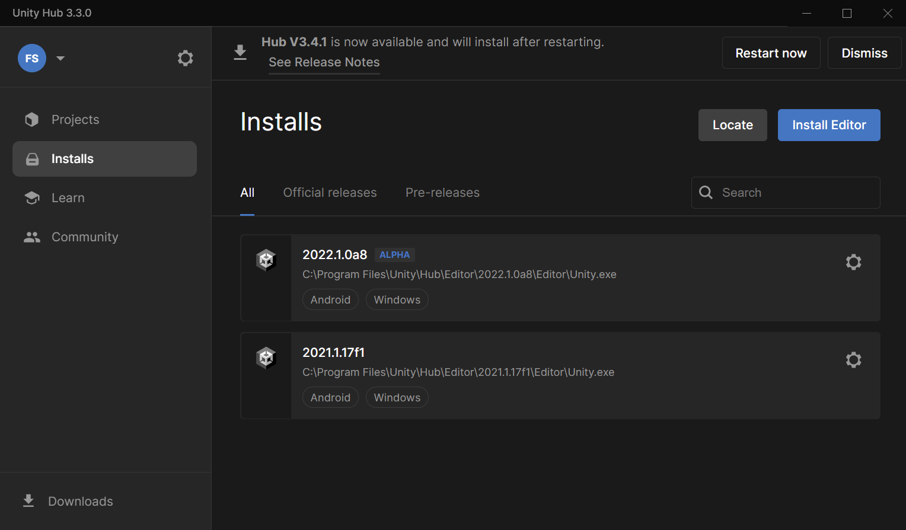
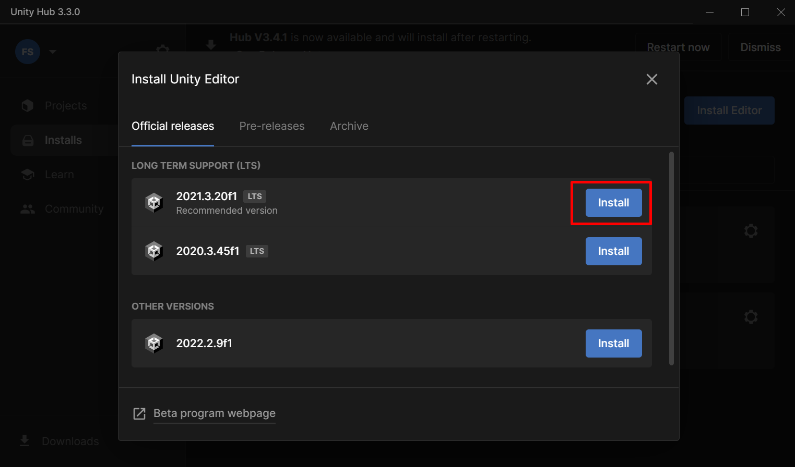
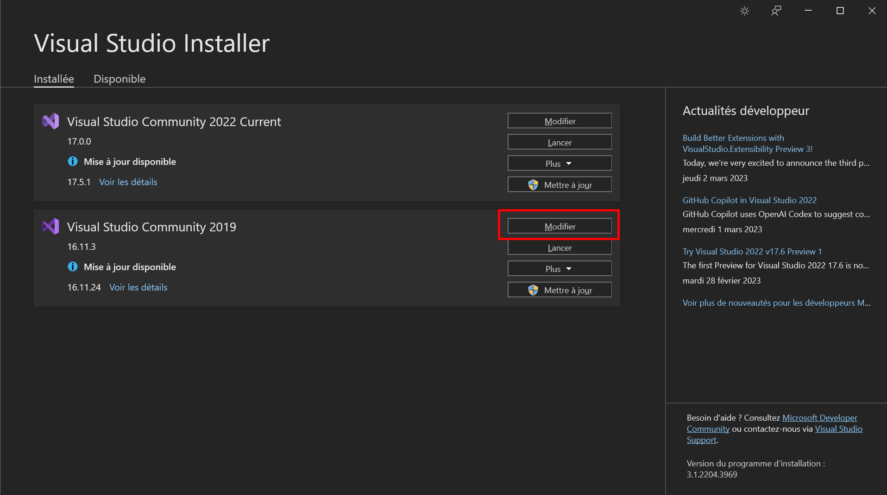
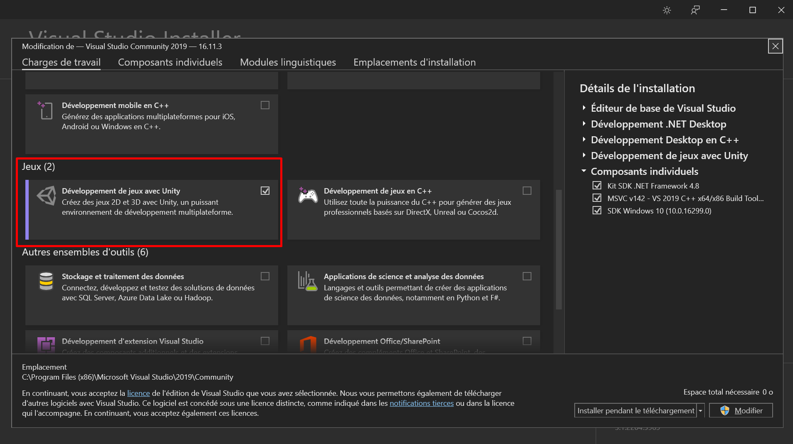
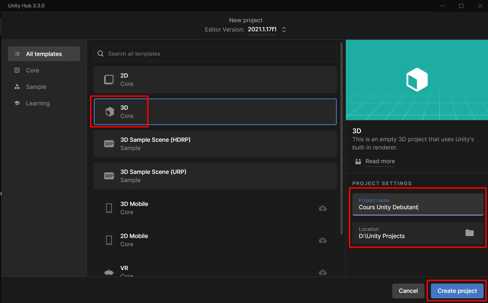
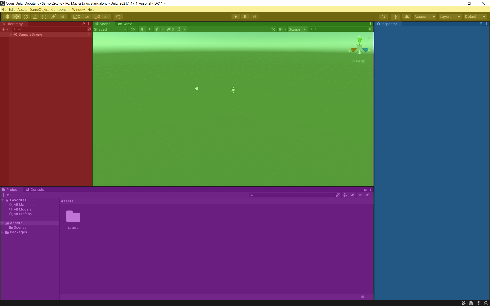

Avant toute chose, nous devons télécharger le logiciel afin de pouvoir l’installer. Pour cela, je vous invite à vous rendre sur le [site officiel](https://unity.com/fr) et à vous rendre dans la section [téléchargement](https://unity.com/fr/download) afin de télécharger la version de Unity HUB qui correspond à votre système d’exploitation.

Unity HUB est un petit utilitaire qui vous permet de télécharger Unity et de gérer différentes versions du logiciel. Vous pouvez en effet avoir plusieurs versions du logiciel installées en simultané sur votre ordinateur. Le HUB vous permettra de lancer vos différents projets avec la bonne version de Unity.

Unity est un logiciel gratuit (tant que vous réalisez un chiffre d’affaires de moins de 100 000 $ par an). Pensez bien à choisir la version « Personnal » lorsque vous aurez à choisir votre situation. La version personnal est gratuite mais nécessite de créer un compte sur le site de Unity pour pouvoir l’activer. De plus, votre compte vous permettra aussi de télécharger des ressources sur l’assetstore (magasin de Unity qui regroupe des milliers de modèles 3D, textures, musiques etc.).

Une fois Unity HUB installé, vous retrouverez sur la gauche de la fenêtre le menu `Installs` qui vous permettra d’installer Unity :

_Installer Unity depuis Unity HUB_

Cliquez sur `Install Editor` afin de choisir la version de Unity que vous souhaitez installer. Je vous recommande d’installer la version LTS la plus récente. Les versions LTS sont celles qui disposent de mises à jour sur le long terme.

Depuis Unity HUB vous avez accès à toutes les versions de Unity, les anciennes, les nouvelles mais aussi les versions en alpha ou bêta. Évitez d’utiliser des pré-versions pour de vrais projets. Ces versions en cours de développement permettent juste de tester et d’apprendre en avance mais ne sont pas faites pour être utilisées pour de la production. Cliquez sur le bouton `Install` qui correspond à la version que vous souhaitez installer :

_Choix de la version à installer_

Sachez que ce qui est présenté dans ce cours devrait marcher peu importe la version que vous utilisez. Donc si au moment où vous lisez ce cours la version LTS est différente, cela ne devrait pas poser de problème.

Lorsque vous cliquez sur `Install` une popup s’ouvre et vous invite à sélectionner les fonctionnalités que vous souhaitez installer. Vous pouvez par exemple installer les outils de développement pour mobiles, consoles, TV connectées, navigateurs etc. Dans un premier temps, je vous recommande d’installer uniquement la version standard (qui fait déjà plus de 5 Gb) et d’installer Visual Studio Community afin de pouvoir développer avec le langage de programmation C#. Visual studio est indispensable pour bien suivre ce cours. Si jamais vous rencontrez des difficultés avec l’installation de Visual Studio, vous pouvez le télécharger et l’installer manuellement en téléchargeant l’installeur sur le [site officiel](https://visualstudio.microsoft.com/fr/downloads/).

Une fois les options cochées, cliquez sur « Install » pour poursuivre et allez jusqu’au bout du processus d’installation.

Avant de poursuivre, pour être sûr que Visual Studio est correctement installé, je vous invite à ouvrir Visual Studio Installer. Si vous n’avez pas cet utilitaire, vous pouvez le retrouver sur le [site de Microsoft](https://visualstudio.microsoft.com/fr/downloads/).

Comme pour Unity HUB, Visual Studio Installer est un utilitaire qui vous permet de gérer les différentes versions du logiciel. Vérifiez que le logiciel est installé et cliquez sur le bouton `Modifier` afin d’afficher les fonctionnalités activées :

_Modifier Visual Studio depuis VS Installer_

Ici, ce que je souhaite que vous vérifiiez, c’est que le développement de jeux avec Unity est bien installé :

_Développer des jeux pour Unity avec Visual Studio_

Si ce n’est pas le cas, faites le nécessaire. Cela permettra de programmer plus efficacement grâce à un assistant intelligent.

Retournons sur Unity HUB et cliquez sur `New project` afin de créer un nouveau projet. Choisissez le type de projet `3D`, donnez un nom à votre projet, sélectionnez un emplacement puis cliquez sur `Create project` pour valider :

_Création d'un nouveau projet 3D sous Unity_

Le projet va alors se créer et Unity Editor devrait s’ouvrir. Je vous propose de regarder rapidement l’interface du logiciel pour comprendre comment celle-ci est découpée :

_L'interface de Unity_

Avant tout, sachez que toutes les zones de l’interface peuvent être redimensionnées, déplacées, masquées, ajustées. Vous pouvez donc adapter l’interface à vos besoins. Je vais essayer cependant de garder l’interface par défaut afin que ce soit plus facile pour vous pour débuter. J’ai découpé les principales zones par couleur :

-   **En jaune**, vous avez le menu et la barre d’outils. Vous y retrouverez quelques raccourcis dont certains qui permettent de manipuler les modèles 3D et d’autres qui permettent de tester le jeu à la volée directement dans Unity.
-   **En rouge** vous avez la hierarchy (J’utiliserai toujours le mot anglais car Unity n’existe pas en français). Il s’agit de la liste de tous les éléments composant votre scène.
-   **En vert** la scene (encore une fois en anglais donc sans accent). C’est là que vous allez concevoir vos niveaux, placer les objets, manipuler les assets (ressources). Vous avez également un système d’onglets permettant de basculer de la scene au game. Game est la fenêtre correspondant au rendu final de votre jeu tel que le verra le joueur. C’est dans cette zone que vous pourrez tester le projet.
-   **En bleu** l’inspector. Lorsque vous sélectionnerez un objet sur la scène, vous verrez l’ensemble de ses propriétés et caractéristiques directement dans l’inspector.
-   **En violet** le project. C’est ici que vous retrouverez toutes les ressources (assets) que vous aurez importées dans Unity. Ces ressources seront utilisables pour concevoir votre jeu. Dans un onglet séparé vous aurez la console qui affichera les différentes erreurs de votre code afin de vous aider à les corriger.

Voila rapidement ce qui compose l’interface du logiciel. Nous aurons l’occasion de découvrir plus en détail les différentes zones au moment où nous aurons à les utiliser dans la suite de ce cours.
