Dans cette partie, nous allons voir comment concevoir le niveau de notre jeu. Ce que je vous propose c’est d’apprendre en faisant. Comme notre objectif est de créer un clone de Pong, notre scène sera très basique. Nous allons commencer par créer le sol du niveau. Pour cela, cliquez sur le menu `GameObject / 3D Object / Plane` :

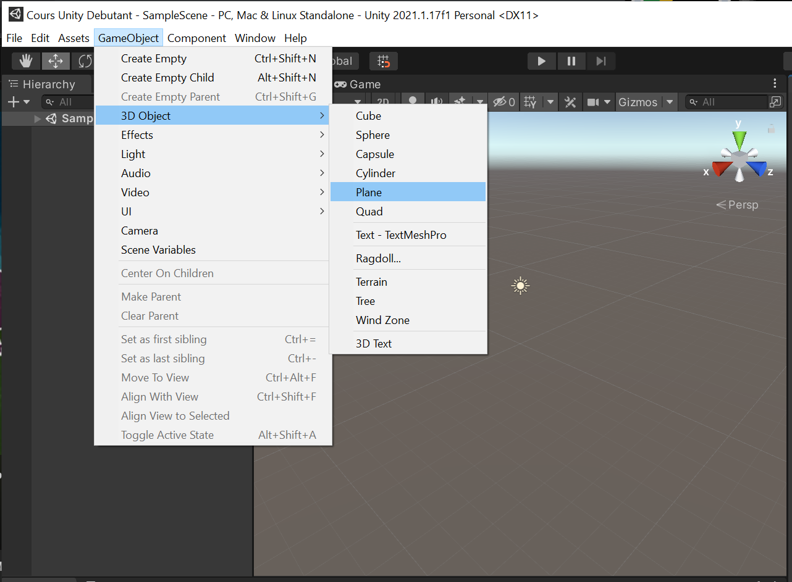
_Création d'un Plane pour représenter le sol_

Cela va nous permettre de créer une forme plane. Si vous ne touchez à rien, la forme sera sélectionnée par défaut à sa création. Si vous cliquez à côté alors elle sera désélectionnée. Vous pourrez alors cliquer dessus ce plan pour le sélectionner de nouveau. Si un objet est sélectionné vous pourrez visualiser toutes ses propriétés dans l’inspector :

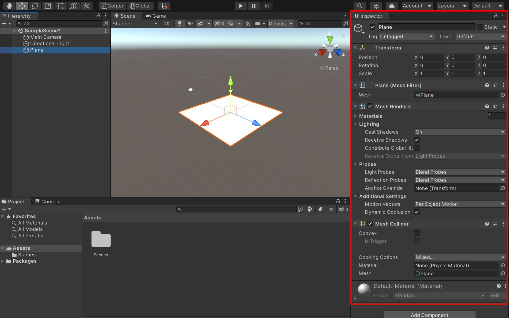
_Les propriétés du plane_

Si on analyse ces différentes propriétés nous pouvons retrouver :

-   **Transform** : correspond à la position, la rotation et l’échelle de la forme 3D.
-   **Mesh Renderer** : correspond au composant qui permet de rendre visible le modèle à l’écran. Si ce composant est décoché (désactivé) alors le modèle 3D sera invisible (mais toujours présent).
-   **Mesh Collider** : c’est le composant qui permet de rendre solide la forme. Grâce au collider, les collisions peuvent être détectées.
-   **Material** : ce composant permet de donner la couleur à l’objet. Un material est un composant complexe qui peut gérer beaucoup de choses comme la couleur, la texture, la façon dont la lumière interagit avec l’objet, la texture de l’objet, la transparence…

Il est possible de modifier ces propriétés directement via l’inspector ou par glisser/déposer du project sur la scène. Si vous vous souvenez bien, la fenêtre project contient vos ressources. Si vous avez par exemple une texture dans project et que vous la glissez/déposez sur le plan alors le material du plan sera modifié et contiendra la texture déposée.

Dans notre cas nous n’allons pas utiliser de texture. Nous allons plutôt créer un nouveau material avec une couleur spécifique. Dans la fenêtre project faites un clic droit et sélectionnez `Create / Material` :

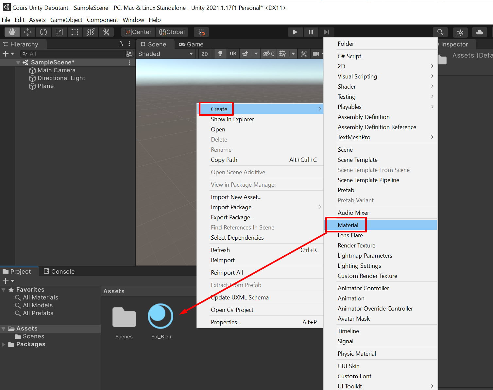
_Création d'un material pour le sol_

Comme vous pouvez le constater vous pouvez renommer votre material. Dans mon cas j’ai donné un nom au material afin de mieux m’y retrouver.

Cliquez sur ce material nouvellement créé afin d’afficher ses propriétés dans l’inspector. Modifiez sa couleur via le color picker afin de choisir une teinte bleu foncé :

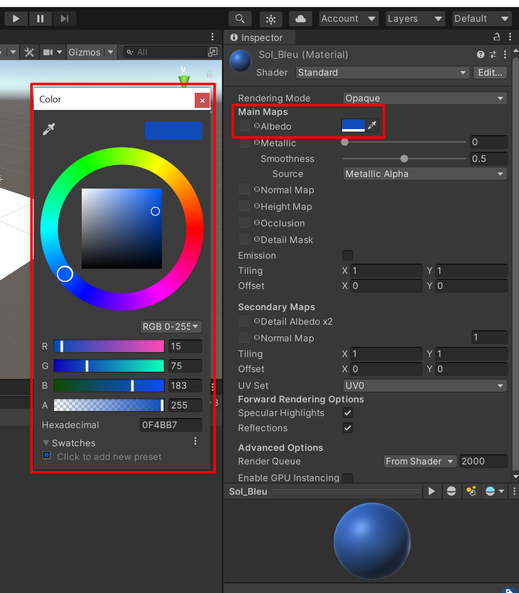
_Choix de la couleur du sol_

Une fois votre material prêt, faites un glisser/déposer de celui-ci sur le plan de la scène :

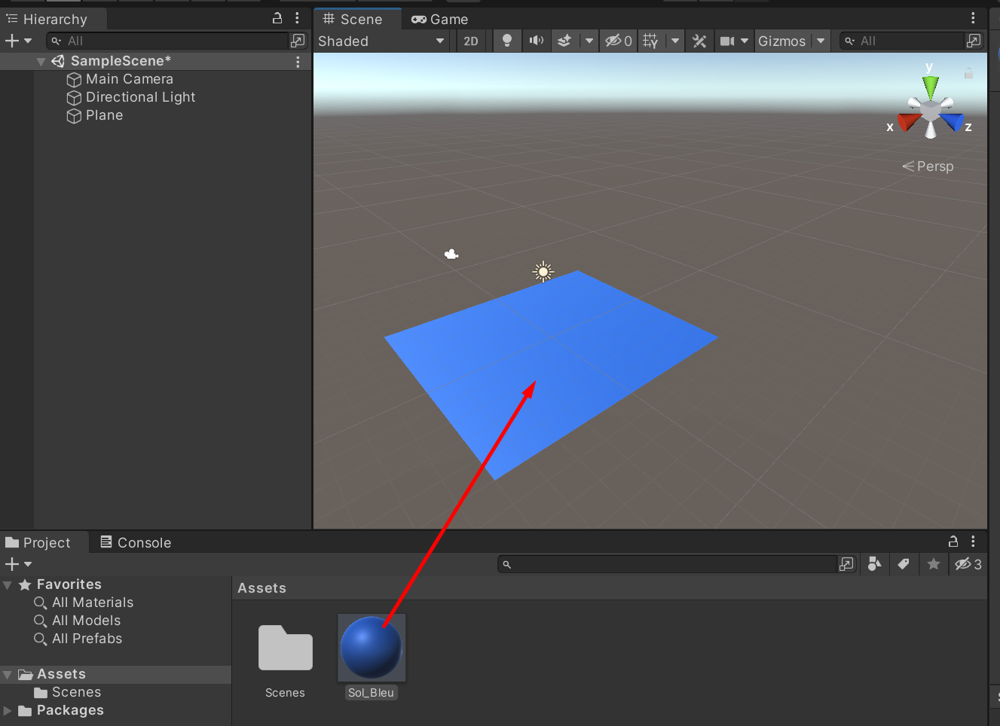
_Coloration du sol à l'aide du material_

Maintenant nous allons modifier la taille du plan afin que tout le monde ait exactement la même forme que moi. Nous allons agrandir le plan et l’étendre sur la longueur. Cliquez sur le plan afin d’afficher ses propriétés dans l’inspector et modifiez la position et le scale en utilisant les mêmes paramètres que moi :

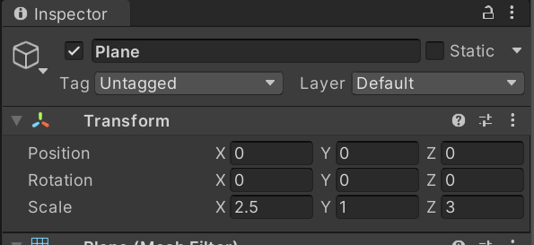
_Paramétrage du Transform_

Nous allons maintenant ajouter des bordures à gauche et à droite de notre niveau. Pour cela nous allons créer un cube via le menu `GameObject / 3D Object / Cube` :

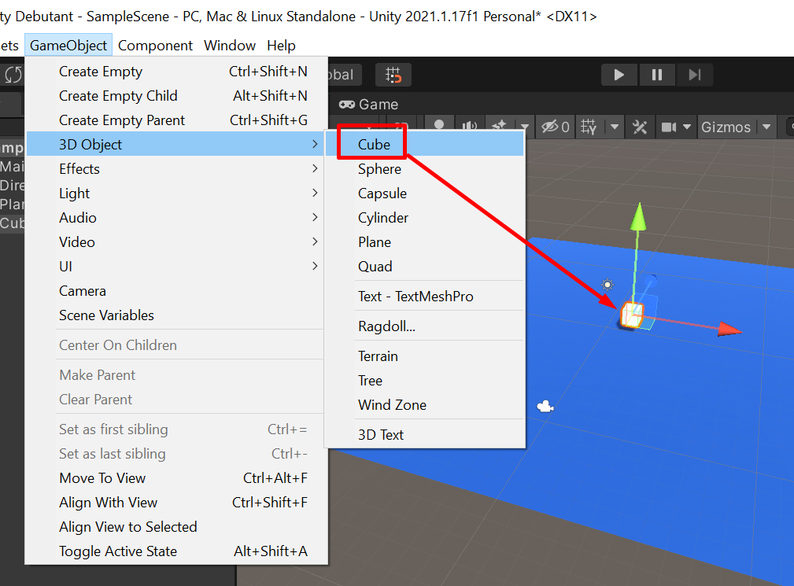
_Ajout d'un cube 3D_

Positionnez le cube (via l’inspector) en `-12, 0.5, 0`.

Modifiez sa taille en `1, 1, 30`.

Le résultat devrait être le suivant :

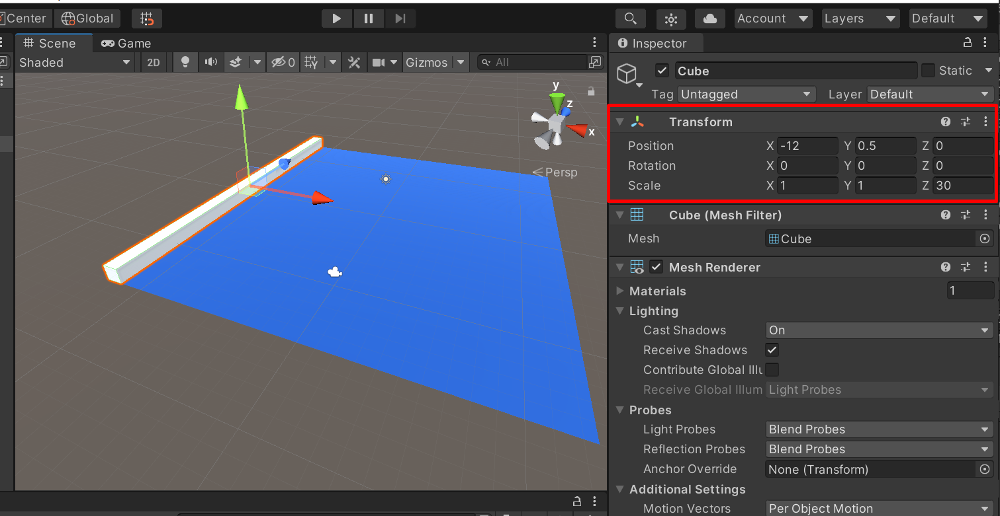
_Propriétés du Transform du mur gauche_

Vous pouvez alors dupliquer ce cube. Pour cela, avec le cube sélectionné, faites `CTRL + D`. Le cube sera alors dupliqué. Vous ne pouvez pas le voir car les 2 cubes sont superposés mais si vous regardez la fenêtre hierarchy vous verrez les 2 cubes.

Le second cube étant sélectionné, maintenez la touche `CTRL` de votre clavier et utilisez la flèche rouge (il s’agit d’une flèche visible parmi les 3 axes) afin de déplacer le cube. La touche `CTRL` permet de déplacer le cube cran par cran afin de garder une position précise. L’idée est de placer le second cube à l’autre extrémité du sol (soit x = 12) :

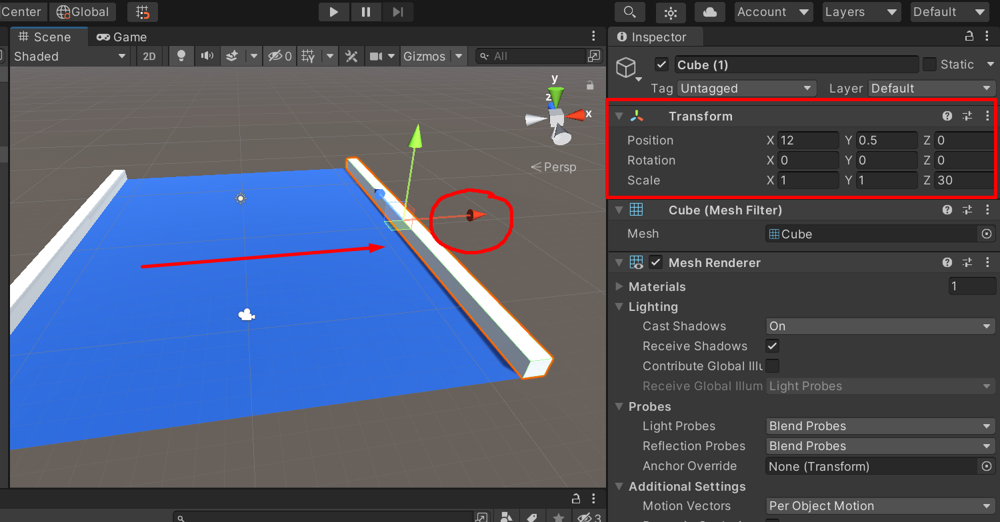
_Duplication du mur_

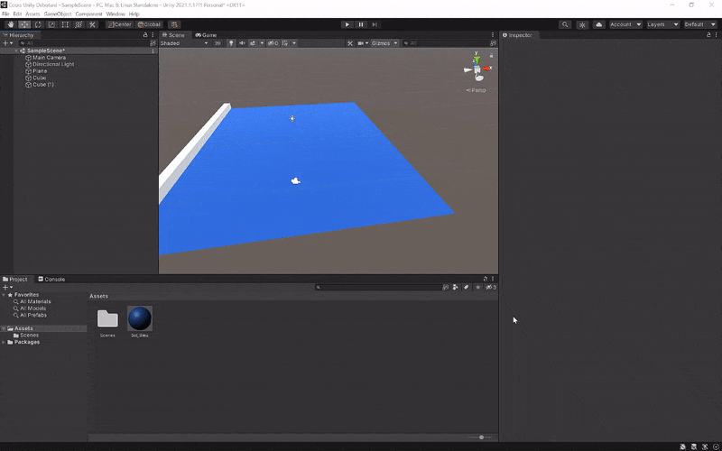
_Duplication du mur (animation)_

Dans Unity nous avons la possibilité de renommer les objets (on en a déjà parlé, c’est utile pour s’y retrouver dans la fenêtre hierarchy) et nous avons aussi la possibilité d’ajouter un tag à un objet. Le tag permet en général de classer un objet. On peut par exemple imaginer de taguer les pièces en `coin`, les portes en `door`, les pièges en `trap` etc. Le but est ensuite de pouvoir par la suite, interagir avec ces objets via un script C# en les ciblant grâce à ce tag.

Dans notre cas présent, nous allons avoir besoin de tags. Nous allons avoir besoin de savoir si la balle touche un côté (un mur) du niveau afin de pouvoir faire rebondir la balle. Je vous propose donc de créer le tag `Side` (qui signifie côté) afin de pouvoir taguer les côtés du niveau. Pour créer un tag, cliquez sur le menu déroulant `Tag` via l’inspector (attention, pour voir ce menu, un objet doit être sélectionné) et sélectionnez `Add Tag` :

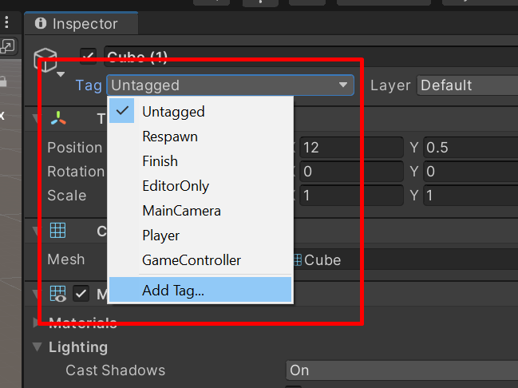
_Liste des tags_

Puis dans la liste des tags, cliquez sur le petit plus pour ajouter un tag personnalisé et saisissez `Side` :

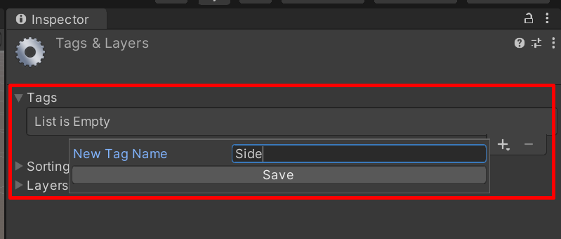
_Ajout d'un tag_

Pensez à cliquer sur `Save`. Retournez sur la scène et sélectionnez le mur de gauche. Maintenez la touche `CTRL` enfoncée et cliquez sur le mur de droite. Cela permet de faire une sélection simultanée des deux objets.

Avec ces deux objets sélectionnés, retournez dans le menu déroulant des tags afin de sélectionner le tag nouvellement créé pour l’appliquer à la sélection :

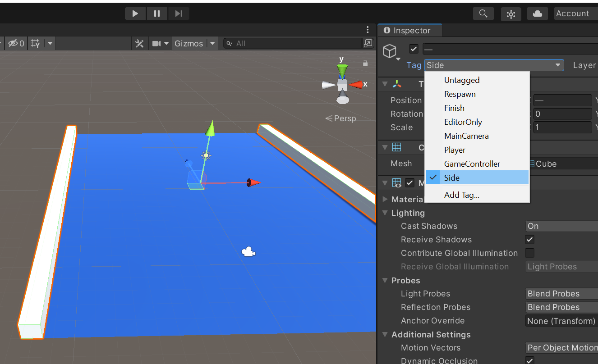
_Ajout du tag au mur_

Les côtés de notre niveau seront maintenant facilement identifiables dans un script C#. Nous verrons cela dans une prochaine section du cours.

A chaque fin de section, pensez bien à enregistrer votre travail avec un `CTRL + S`. Cela sauvegardera la scène actuelle qui s’appelle par défaut `SampleScene` et qui se trouve dans le dossier `Scenes` :

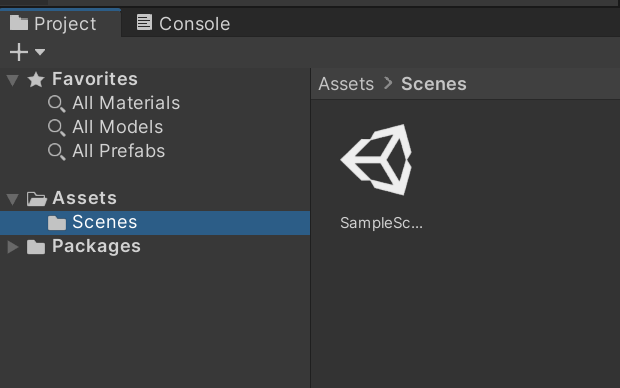
_La scène sauvegardée_
