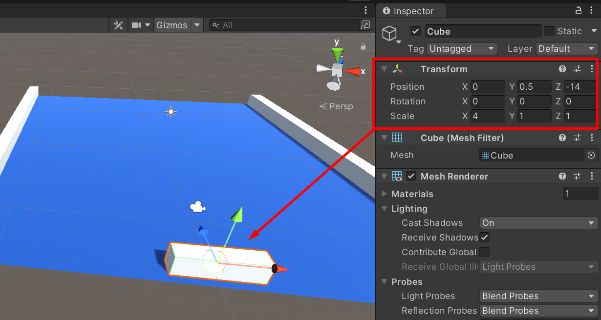
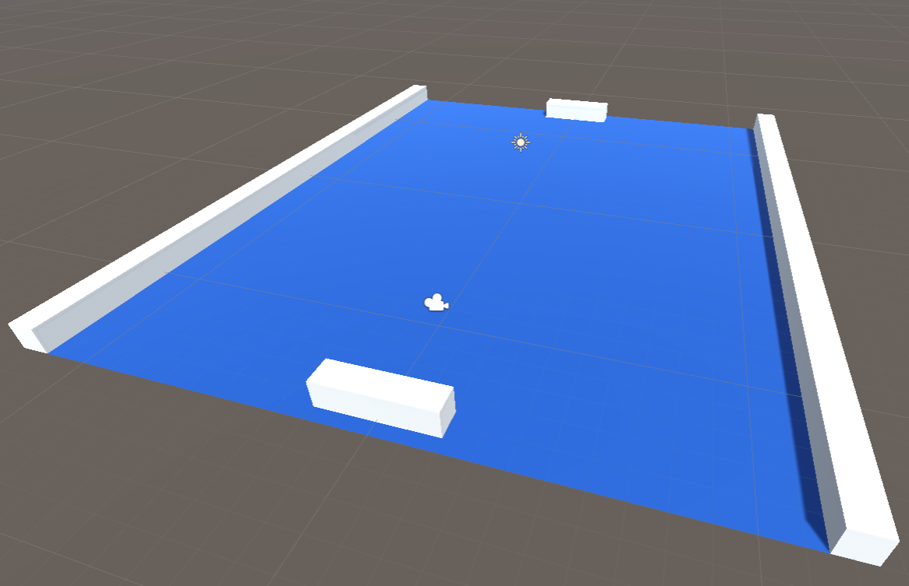
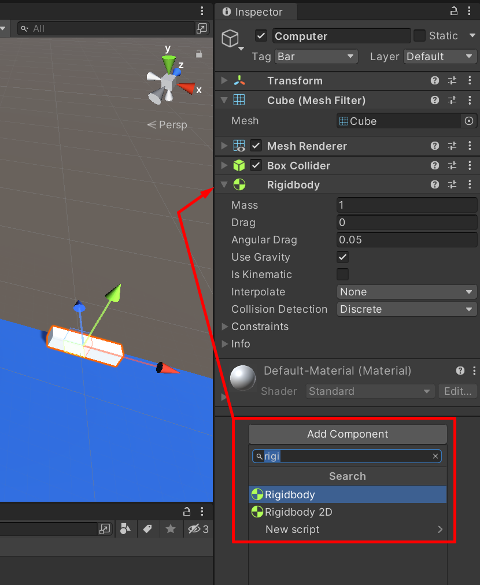
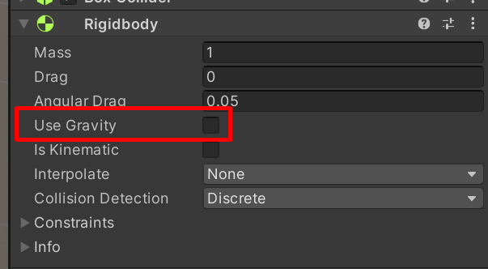
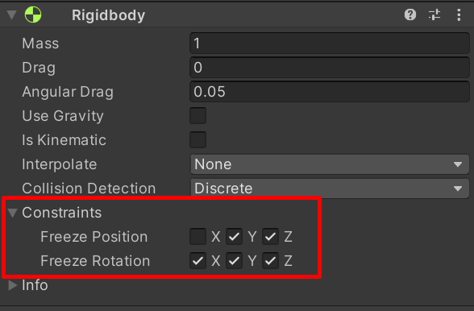

Ce que j’appelle les raquettes, ce sont les barres qui représentent les joueurs. Ces barres qui permettent de se renvoyer la balle ; le but étant de ne pas laisser passer la balle derrière soi.

Pour créer ces barres, nous allons encore une fois partir d’un simple cube `GameObject / 3D object / Cube` que nous allons étendre sur l’axe X pour lui donner une longueur de 4 unités. La barre contrôlée par le joueur sera positionnée en `0, 0.5, -14` :

_Position de la raquette du joueur_

Il ne vous reste plus qu’à dupliquer cette barre `CTRL + D` et placer la copie en Z = 14 pour créer la barre contrôlée par l’ordinateur :

_Création de la raquette de l'ordinateur_

Je vous propose ensuite de créer le tag `Bar` que vous utiliserez pour les 2 barres. Pensez aussi à renommer les barres en `Player` et `Computeur` pour mieux vous y retrouver.

Pour ces 2 barres, nous allons avoir besoin d’ajouter un peu de physique afin de pouvoir détecter des collisions avec la balle. Ce que nous allons faire ici n’est en général pas nécessaire. Cependant, la façon dont la balle sera gérée nécessite de faire la manipulation que je vais vous présenter pour que les collisions soient détectées (en temps normal, seul le collider est nécessaire).

Pour notre cas particulier, nous allons avoir besoin d’ajouter un RigidBody aux barres. Le RigidBody est un composant utilisé en général pour faire en sorte qu’un objet subisse la gravité. Si vous créez un cube et que ce cube possède un RigidBody alors il tombera comme un objet qui tomberait dans le monde réel. Par défaut les objets « flottent », ils ne sont pas affectés par la gravité.

Pour ajouter un RigidBody à un objet, il y a plusieurs façons possibles. Vous pouvez sélectionner un objet (dans notre cas la barre joueur) et utiliser le menu `Component / Physics / Rigidbody`. Le Rigidbody sera alors ajouté à votre objet.

La seconde méthode consiste à sélectionner l’objet (pour ce second exemple prenons la barre contrôlée par l’ordinateur) et à utiliser le bouton `Add Component` visible dans l’inspector. Vous pourrez alors soit naviguer soit saisir le nom du composant que vous recherchez afin de l’ajouter :

_Ajout d'un Rigidbody à la raquette_

Attention de ne pas confondre avec le Rigidbody 2D qui lui est spécifique aux jeux en 2D.

Maintenant, sélectionnez les barres player et computer (en maintenant `CTRL` pour une sélection multiple). Cela permet de voir les composants des deux barres dans l’inspector. Décochez ensuite la propriété `Use gravity` du Rigidbody :

_Paramétrage du Rigidbody_

Cette propriété permet, comme son nom l’indique, de faire en sorte que l’objet soit affecté par la gravité. Dans notre cas ce n’est pas ce que nous voulons. Il n’y a pas de gravité dans notre jeu. Nous avons simplement besoin du Rigidbody pour permettre la détection des collisions entre la barre et la balle.

Plus tard, si nous ne changeons rien, nous rencontrerons un problème avec les barres. En effet, le Rigidbody permet à la physique de s’appliquer sur un objet. En d’autres mots, lorsque la balle viendra percuter la barre, alors la collision provoquera une sorte de force d’impact qui propulsera la barre en arrière. Ce n’est pas ce que nous voulons, la barre doit rester en place et ne pas subir de forces extérieures. Nous allons donc figer la rotation ainsi que la position des barres sur l’axe Z. Pour cela, tout en ayant encore les deux barres sélectionnées, dépliez le sous menu `Constraints` du Rigidbody afin de le paramétrer comme ceci :

_Les contraintes du Rigidbody_

De cette façon, les barres ne pourront ni pivoter, ni être déplacées sur un axe autre que l’axe X (gauche / droite).

Pour conclure sur cette section, sachez qu’il y a un petit point d’interrogation visible dans l’inspector sur tous les composants qui existent dans Unity. Il s’agit d’un lien vers la documentation qui vous permettra d’en savoir plus sur les propriétés et les fonctionnalités des différents composants de Unity.
