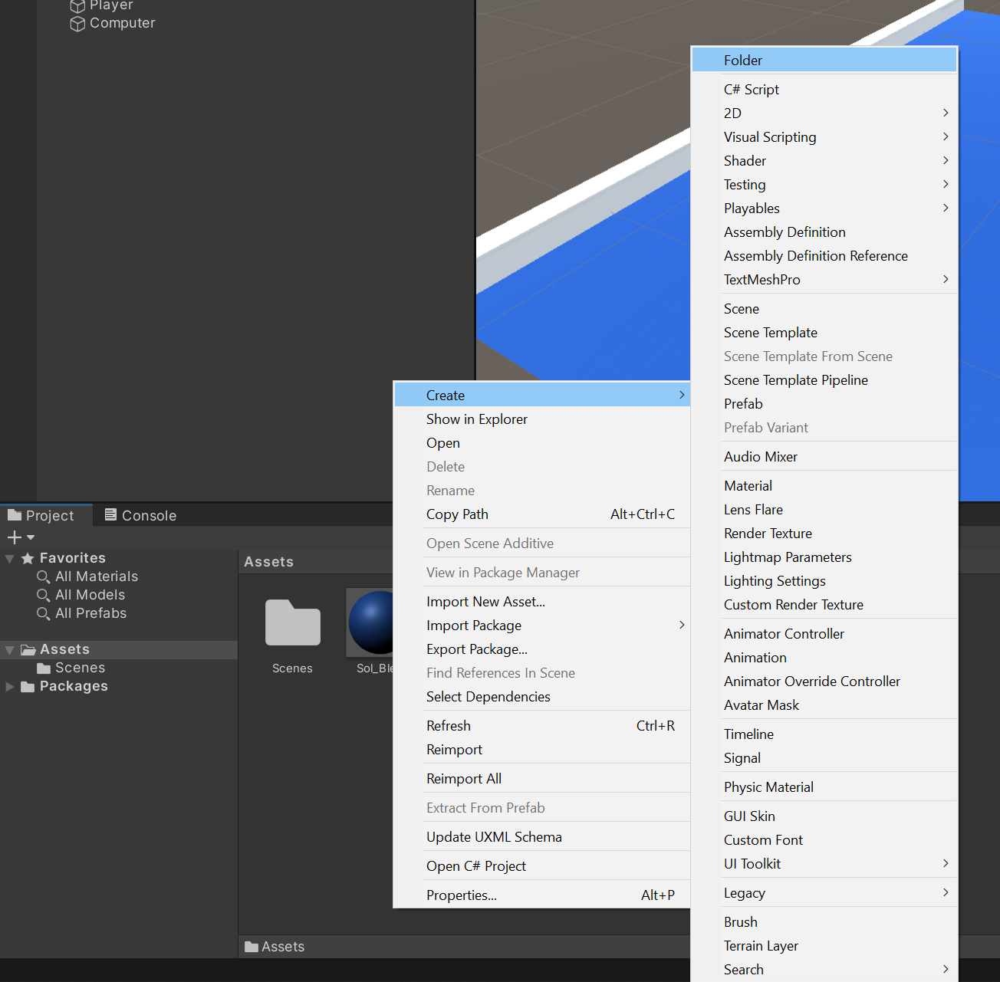
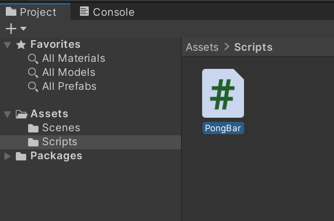
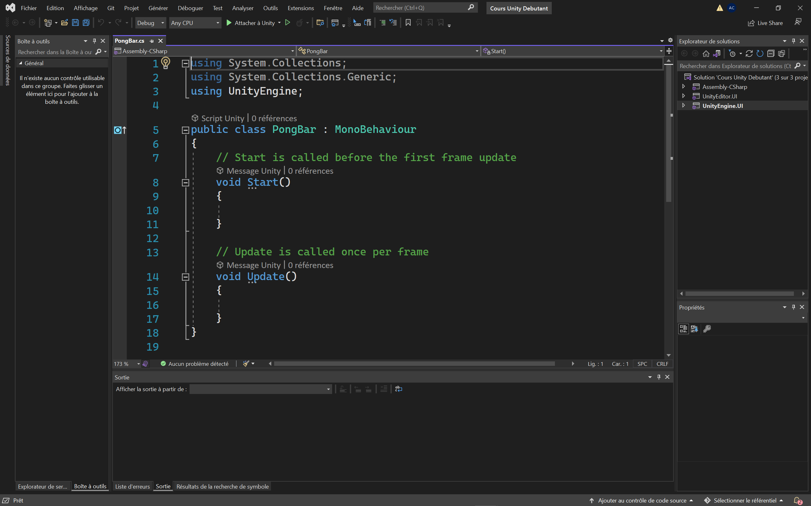
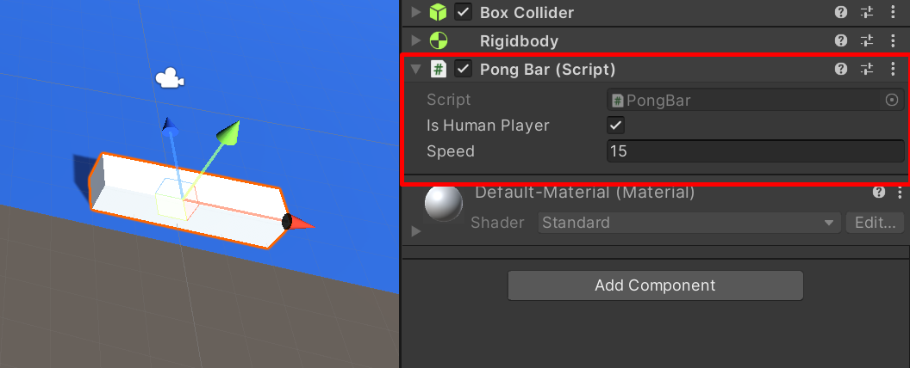
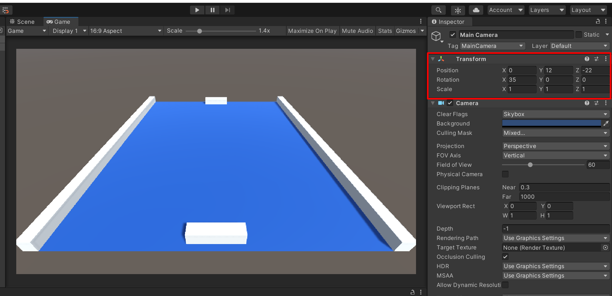
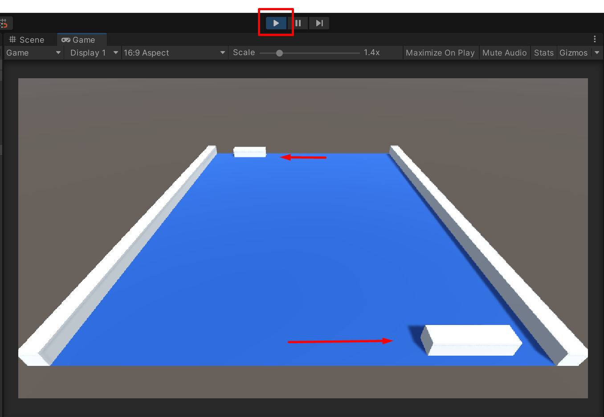

Dans cette section, nous allons créer le script C# des raquettes. Dans Unity, la programmation se fait avec le langage C#. L’écriture des scripts se fait sous Visual Studio (bien qu’il soit possible d’utiliser d’autres éditeurs de code). Les scripts créés sous Visual Studio peuvent ensuite être utilisés dans Unity. Pour cela, il faudra faire un glisser/déposer du script sur l’objet sur lequel on souhaite attacher le script. Un script peut être réutilisé plusieurs fois sur plusieurs objets différents. Dans notre cas nous aurons le même script pour les deux raquettes.

Des notions en programmation sont nécessaires pour bien comprendre cette section. J’essayerai cependant de tout détailler. Si vous ne connaissez pas C# mais que vous avez des notions dans un autre langage orienté objet alors c’est parfait pour comprendre les exemples présentés ici.

Avant de créer un script, je vous invite à créer un nouveau dossier dans la fenêtre project afin d’y stocker les scripts. Pour créer un dossier, cliquez sur le dossier `Assets` puis faites un clic droit dans la fenêtre project et cliquez sur `Create / Folder` :


_Création d'un dossier pour stocker les scripts_

Appelez ce dossier `Scripts` et ouvrez-le. Dans ce dossier, faites un clic droit puis choisissez `Create / C# Script` afin de créer un script que vous appellerez `PongBar` :


_Création du script pour la raquette_

Double cliquez sur ce script afin de l’ouvrir dans Visual Studio :


_Ouverture du script dans Visual Studio_

Vous constatez que le script n’est pas vide. Si nous analysons le contenu du script il y a dans l’ordre :

-   Des **using** qui permettent d’inclure des fonctionnalités comme UnityEngine qui permet d’utiliser les fonctions de Unity dans le code C#.
-   La classe **PongBar** dont le nom correspond au nom du script. Il est d’ailleurs indispensable que le script et la classe aient exactement le même nom sinon cela ne fonctionnera pas.
-   La fonction **Start** qui se déclenche au lancement du programme.
-   La fonction **Update** qui tourne en boucle à l’infini. Si votre jeu tourne en 60 images par seconde alors Update s’exécutera 60 fois par seconde.

Voilà en quelques lignes le descriptif du code par défaut. Nous n’allons pas avoir besoin de la fonction Start. Vous pouvez donc la supprimer.

Dans notre script, nous allons avoir besoin de savoir si la raquette est celle du joueur ou celle de l’ordinateur. Si vous vous souvenez bien, j’ai dit que nous allons utiliser ce script pour les 2 raquettes, nous devons donc les différencier.

Nous allons donc créer une variable booléenne (donc la valeur de cette variable ne peut être égale qu’à vrai ou faux). Cette variable permettra de savoir si le script est attaché au joueur humain :

```cs
public bool isHumanPlayer = false;
```

Comme cette variable est définie comme `public`, la valeur sera visible et modifiable dans l’inspector. Cela nous permettra d’indiquer la valeur selon s’il s’agit de la raquette player ou computer.

La raquette aura également une vitesse de déplacement. Nous allons créer une autre variable de type float cette fois-ci (nombre à virgule) pour y stocker la vitesse :

```cs
public float speed = 15;
```

Maintenant, à l’intérieur de la fonction Update, créez une variable qui stockera le mouvement de la raquette :

```cs
float move;
```

La barre pourra être déplacée avec les flèches gauche et droite du clavier. Pour détecter l’appuie sur une touche il faut utiliser le mot-clé Input. Dans la classe Input nous avons accès à toutes les touches. Parmi ces touches, nous retrouvons les axes (horizontal / vertical). Cela nous permet de tester les flèches du clavier. Pour récupérer la valeur de l’axe horizontal il faudra donc utiliser :

```cs
Input.GetAxis("Horizontal")
```

Nous allons donc utiliser cela pour définir la valeur de notre variable move. Il faudra également multiplier cette valeur par speed (notre variable vitesse) afin que la barre se déplace à la vitesse donnée. Enfin nous devront multiplier également par Time.deltaTime, ce qui nous permettra d’avoir la même vitesse de déplacement peu importe la puissance de l’ordinateur. Cela nous donne donc le bout de code suivant :

```cs
move = Input.GetAxis("Horizontal") * speed * Time.deltaTime;
```

Ce déplacement ne doit se faire que s’il s’agit du joueur. Nous devons donc entourer cette ligne de la condition suivante :

```cs
if (isHumanPlayer)
{
    move = Input.GetAxis("Horizontal") * speed * Time.deltaTime;
}
```

Si vous souhaitez également contrôler la raquette de l’ordinateur (par exemple pour faire des tests durant le développement), vous pouvez ajouter ce bout de code :

```cs
else
{
    move = Input.GetAxis("Vertical") * speed * Time.deltaTime;
}
```

Tout ceci nous permet de stocker le mouvement souhaité dans la variable move. Mais ce mouvement n’est pas appliqué, il est juste stocké. Pour l’appliquer, il faudra utiliser la fonction Translate (translation) sur le Transform (si vous vous rappelez bien, le transform correspond à la position, rotation et taille de l’objet) afin de matérialiser le mouvement.

Notre variable move est un float. La fonction Translate attend un Vector3 en entrée (vecteur à 3 dimensions X, Y et Z). Nous devons donc multiplier move par un Vector3 afin que le type corresponde à ce qui est attendu :

```cs
transform.Translate(move * Vector3.right);
```

Vous devriez avoir le code suivant :

```cs
using System.Collections;
using System.Collections.Generic;
using UnityEngine;

public class PongBar : MonoBehaviour
{
    public bool isHumanPlayer = false;
    public float speed = 15;

    void Update()
    {
        float move;

        if (isHumanPlayer)
        {
            move = Input.GetAxis("Horizontal") * speed * Time.deltaTime;
        }
        else
        {
            move = Input.GetAxis("Vertical") * speed * Time.deltaTime;
        }

        transform.Translate(move * Vector3.right);
    }
}
```

Afin de tester ce script, enregistrez-le. Retournez dans Unity et vérifiez dans la console si vous avez une erreur. Si tel est le cas, corrigez-la. Ensuite, ajoutez ce script aux 2 raquettes avec un glisser/déposer du script sur l’objet. Vérifiez via l’inspector que le script est bien ajouté :


_Ajout du script aux raquettes_

Pensez à cocher la variable `Is human player` sur le script attaché à la raquette du joueur.

Avant de tester notre script, nous allons positionner la caméra comme il faut. Pour cela, sélectionnez la caméra et ajustez les valeurs du transform comme ceci :


_Positionnement de la caméra de jeu_

Cliquez ensuite sur l’icône `Play` en haut de l’écran pour lancer le jeu. Utilisez les flèches du clavier afin de vérifier que la barre se déplace convenablement :


_PlayTest du jeu dans unity_

Si tout fonctionne, bravo, vous avez écrit votre premier bout de code fonctionnel. Vous pouvez cliquer sur Play de nouveau pour sortir du jeu.

Notre script n’est cependant pas parfait. En effet, les raquettes peuvent se déplacer à l’infini, dépasser les murs et sortir de l’écran. Pour remédier à cela, retournez dans le script et ajoutez la variable suivante :

```cs
private float xMaxDistance = 9.5f;
```

Cette valeur correspond à la distance maximale autorisée sur l’axe X.

Ajoutez ensuite deux conditions dans la fonction Update afin de bloquer le déplacement lorsque cette distance maximale est atteinte :

```cs
if (transform.position.x < -xMaxDistance)
{
    transform.position = new Vector3(-xMaxDistance, transform.position.y, transform.position.z);
}

if (transform.position.x > xMaxDistance)
{
    transform.position = new Vector3(xMaxDistance, transform.position.y, transform.position.z);
}
```

Comme vous pouvez le voir, si la position de la raquette sur l’axe X est hors limite, alors je modifie la position de la raquette afin de lui donner sa position actuelle en Y et en Z et je spécifie la valeur de X manuellement.

Le code complet pour ce script est le suivant :

```cs
using System.Collections;
using System.Collections.Generic;
using UnityEngine;

public class PongBar : MonoBehaviour
{
    public bool isHumanPlayer = false;
    public float speed = 15;

    private float xMaxDistance = 9.5f;

    void Update()
    {
        float move;

        if (isHumanPlayer)
        {
            move = Input.GetAxis("Horizontal") * speed * Time.deltaTime;
        }
        else
        {
            move = Input.GetAxis("Vertical") * speed * Time.deltaTime;
        }

        transform.Translate(move * Vector3.right);

        if (transform.position.x < -xMaxDistance)
        {
            transform.position = new Vector3(-xMaxDistance, transform.position.y, transform.position.z);
        }

        if (transform.position.x > xMaxDistance)
        {
            transform.position = new Vector3(xMaxDistance, transform.position.y, transform.position.z);
        }
    }
}
```

Vous pouvez maintenant tester de nouveau votre projet et constater que les raquettes ne peuvent plus sortir du terrain de jeu.

Pensez comme d’habitude à enregistrer votre travail avant de passer à la prochaine section.
