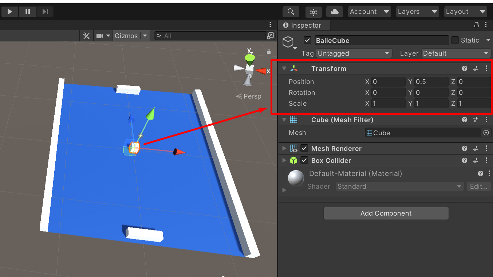
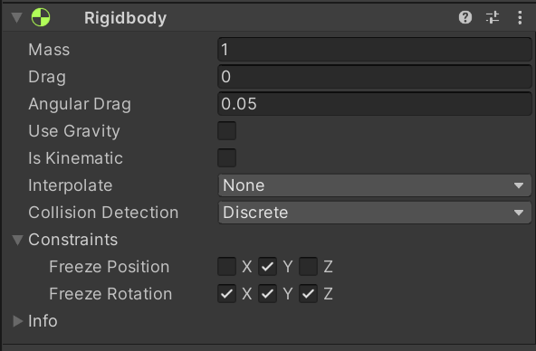
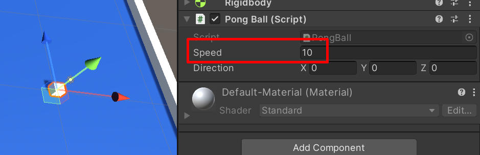

Maintenant que nos raquettes sont fonctionnelles, ce serait bien de pouvoir se renvoyer la balle. Le seul problème c’est que nous n’avons pas de balle !

Créez donc un simple cube que vous placerez en `0, 0.5, 0` (soit au centre du plateau) :


_Création du modèle 3D de la balle_

Ajoutez un RigidBody à cette balle et configurer-le de cette façon :


_Configuration du Rigidbody_

Créez ensuite un script `PongBall` que vous ajouterez également à la balle. Une fois ajouté, ouvrez ce script pour pouvoir l’éditer dans Visual Studio.

Dans ce script nous allons avoir besoin de quelques variables. Il nous faut la vitesse de déplacement qui sera un float, la direction du mouvement qui sera un Vector3 et une distance max sur l’axe Z qui nous permettra de savoir si la balle passe derrière un joueur :

```cs
public float speed;
public Vector3 direction;
private float zMaxDistance = 15f;
```

Dans la fonction Start nous allons appeler la fonction SetDirection :

```cs
SetDirection();
```

Cette fonction n’existe pas encore. Nous allons la créer dans un instant. Elle permettra de donner une direction initiale à la balle. Cette fonction sera aussi utilisée pour réinitialiser la balle quand elle passe derrière un joueur. L’intérêt de faire une fonction c’est de pouvoir réutiliser le code à plusieurs endroits du script.

Cette fonction contiendra deux instructions :

-   Réinitialiser la position de la balle afin de la placer au centre.
-   Donner un mouvement initial aléatoire (Random) et normalisé (Normalize).

Normaliser un mouvement permet d’avoir une vitesse constante. Voilà le code de cette fonction :

```cs
public void SetDirection()
{
    transform.position = new Vector3(0, .5f, 0);
    direction = new Vector3(Random.Range(0.75f, 1.75f), 0, -1).normalized;
}
```

Dans la fonction Update, nous allons utiliser la fonction Translate (fonction existante dans Unity et déjà utilisée dans le script de la raquette) afin d’appliquer le mouvement à la balle :

```cs
transform.Translate(direction * speed * Time.deltaTime);
```

Nous devons également tester avec des conditions si la balle passe derrière le joueur ou derrière l’ordinateur. Si tel est le cas, on réinitialise la balle en utilisant notre fonction :

```cs
// IA gange
if (transform.position.z < -zMaxDistance && direction.z < 0)
{
    SetDirection();
}

// Joueur gange
if (transform.position.z > zMaxDistance && direction.z > 0)
{
    SetDirection();
}
```

Dans ces deux tests, je vérifie si la balle passe derrière un des joueurs et que celle-ci continue d’aller derrière le joueur.

Il faut maintenant gérer les rebonds de la balle. Si la balle rentre en collision avec un mur, elle doit rebondir sur l’axe X. Si elle rentre en collision avec une raquette, elle doit rebondir en Z. Pour coder le rebond, il faudra juste multiplier la valeur de l’axe par -1 afin d’inverser la direction.

La particularité du rebond sur la raquette est qu’il faut savoir s’il s’agit de la raquette du joueur ou de l’ordinateur afin de pouvoir appliquer le bon rebond selon la situation. Il est possible depuis le script de la balle d’accéder au script de la raquette afin de récupérer cette info.

Enfin, pour détecter une collision, on peut utiliser la fonction OnCollisionEnter de Unity comme cela :

```cs
private void OnCollisionEnter(Collision collision)
{
        if (collision.gameObject.tag == "Bar")
        {
            bool isPlayer = collision.gameObject.GetComponent<PongBar>().isHumanPlayer;
            if ((isPlayer && direction.z < 0) || (!isPlayer && direction.z > 0))
            {
                direction.z *= -1;
            }
        }

        if (collision.gameObject.tag == "Side")
        {
            direction.x *= -1;
        }
}
```

Le script complet est le suivant :

```cs
using System.Collections;
using System.Collections.Generic;
using UnityEngine;

public class PongBall : MonoBehaviour
{
    public float speed;
    public Vector3 direction;
    private float zMaxDistance = 15f;

    private void Start()
    {
        SetDirection();
    }

    void Update()
    {
        transform.Translate(direction * speed * Time.deltaTime);

        // IA gange
        if (transform.position.z < -zMaxDistance && direction.z < 0)
        {
            SetDirection();
        }

        // Joueur gange
        if (transform.position.z > zMaxDistance && direction.z > 0)
        {
            SetDirection();
        }
    }

    public void SetDirection()
    {
        transform.position = new Vector3(0, .5f, 0);
        direction = new Vector3(Random.Range(0.75f, 1.75f), 0, -1).normalized;
    }

    private void OnCollisionEnter(Collision collision)
    {
        if (collision.gameObject.tag == "Bar")
        {
            bool isPlayer = collision.gameObject.GetComponent<PongBar>().isHumanPlayer;
            if ((isPlayer && direction.z < 0) || (!isPlayer && direction.z > 0))
            {
                direction.z *= -1;
            }
        }

        if (collision.gameObject.tag == "Side")
        {
            direction.x *= -1;
        }
    }
}
```

Enregistrez-le et retournez dans Unity. Avant de tester le code, pensez à cliquer sur la balle et à modifier la valeur de la variable speed pour indiquer 10 :


_Modification de la vitesse de la balle_

Cela permettra d’avoir une vitesse de déplacement non nulle. 10 étant une valeur qui me semble correcte dans notre cas.

Vous pouvez à présent tester votre jeu et vérifier que la balle fonctionne comme prévu. Si ce n’est pas le cas, reprenez ce chapitre avant de passer au suivant.
