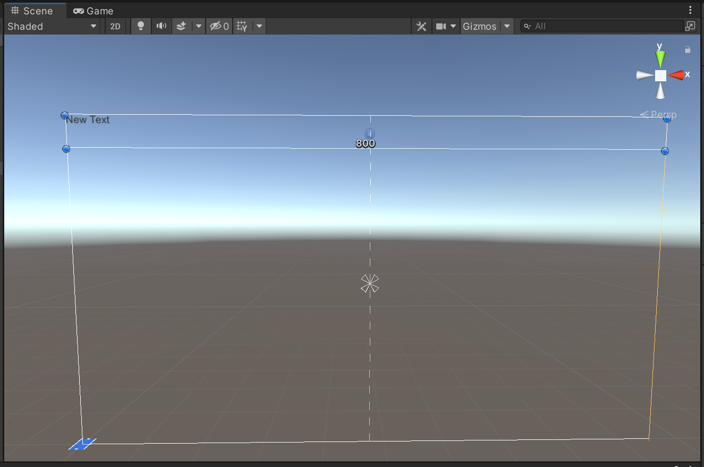
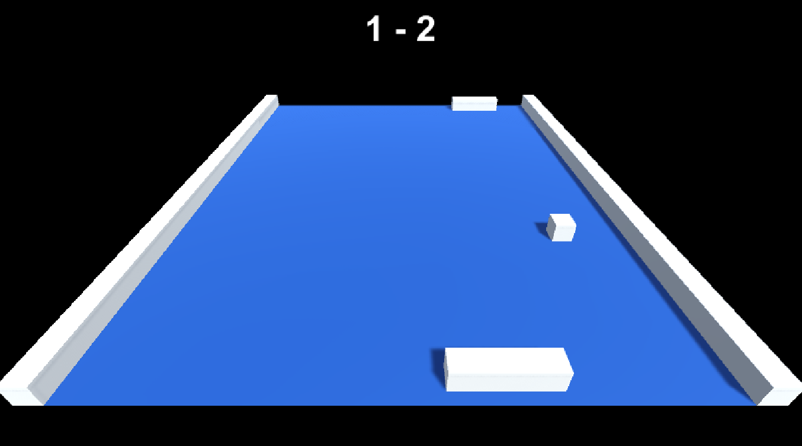

Notre jeu est maintenant fonctionnel. Nous pouvons affronter l’ordinateur et jouer à l’infini à notre clone de Pong en 3D. Cependant, nous ne calculons pas le score. Très rapidement on oublie quel est le score et qui gagne. Nous allons donc voir comment afficher le score à l’écran afin qu’il soit plus simple d’identifier qui a le plus de points entre le joueur et l’ordinateur.

Pour afficher le score à l’écran, nous allons utiliser les outils d’UI (user interface) de Unity. Le principe est assez simple : Nous créons un canvas (une sorte de rectangle qui apparaît dans la scène) et dans ce canvas nous créons l’interface utilisateur. Tout ce qui se trouve à l’intérieur du canvas sera affiché à l’écran au-dessus du jeu 3D.

Nous allons faire cela afin de mieux visualiser le tout. Cliquez sur `GameObject / UI / text` :


_Création d'un texte dans un Canvas_

Cela aura pour effet de créer un texte mais aussi un Canvas automatiquement pour nous (vous pouvez constater les changements dans la hierarchy).

Si vous regardez la scène, vous remarquerez un rectangle blanc géant :


_Visualisation du texte dans la scène_

C’est notre canvas. Le texte apparaît en bas à gauche du canvas. Si le texte est dans le rectangle blanc alors il apparaîtra dans le jeu.

Cliquez sur le Canvas (via la hierarchy) et ajustez le réglage `Scale Mode` depuis l’inspector afin de choisir `Scale with screen size` :


_Mode d'affichage du Canvas_

Ce changement permettra de faire en sorte que les proportions du canvas soient en pourcentage de la taille de l’écran. En d’autres mots, même si vous jouez sur petit écran vous verrez les éléments à l’écran avec une taille proportionnelle.

Je sais que tout cela fait beaucoup d’informations. J’essaye de donner des explications simples et concises mais c’est normal de ne pas forcément tout retenir. L’idée c’est de savoir que ça existe, que c’est possible et ensuite vous pourrez plus facilement rechercher des informations sur le net en tapant les bons mots-clés pour retrouver une information le moment venu.

Utilisez l’icône suivant de la barre d’outils :


_Outil pour travailler avec un Canvas_

Cet outil permet de déplacer, tourner et changer la taille d’un élément UI. C’est donc spécifique aux éléments qui se trouvent dans un canvas.

Cliquez ensuite sur le texte et déplacez-le en haut du canvas. Augmentez la taille du rectangle du texte afin de l’étendre sur toute la largeur du canvas :


_Positionnement du texte dans le Canvas_

Vous pouvez utiliser les petits ronds bleus (visibles sur ma capture) pour agrandir le rectangle et le positionner comme moi.

Toujours avec le texte sélectionné, modifiez ses propriétés via l’inspector. Vous avez accès à un certain nombre de réglages comme la valeur du texte, son style, sa taille, sa couleur, son indentation etc. Modifiez le tout avec les mêmes réglages que moi pour aboutir au même résultat :


_Modification des propriétés du texte_

Pour vous faciliter la tâche, j’ai mis en évidence les différentes propriétés à modifier.

Nous allons également cliquer sur la caméra et modifier ces réglages afin d’afficher un fond de couleur unie (fond noir) :


_Modification de la couleur d'arrière-plan_

Cela nous permettra de rendre le texte beaucoup plus lisible à l’écran.

Sauvegardez et testez le jeu. Vous devriez voir le texte apparaître à l’écran :


_Test du projet et aperçu de l'UI_

Evidement ce texte n’est pas dynamique, le score reste à 0 – 0 mais nous progressons. Nous avons maintenant un texte qui s’affiche et il ne nous reste plus qu’à le modifier par script.

Retournez dans le script `PongBall` et ajoutez deux nouvelles variables :

```cs
private int scorePlayer = 0;
private int scoreComputer = 0;
```

Ces variables permettront de stocker le score des deux joueurs.

Au moment ou l’IA marque un but (cas géré dans la condition de la fonction Update), augmentez son score de cette façon :

```cs
scoreComputer++;
```

Si c’est le joueur qui marque alors utilisez cette ligne de code :

```cs
scorePlayer++;
```

Maintenant que le score est bien calculé, nous devons l’afficher. Créez une variable qui permettra de stocker le texte :

```cs
public Text scoreText;
```

Le type Text est spécifique aux composants UI de Unity. Pour pouvoir utiliser (par script) les composants UI, nous devons ajouter une instruction using tout en haut du script :

```cs
using UnityEngine.UI;
```

Modifiez ensuite la fonction SetDirection qui réinitialise le jeu à chaque but. Ajoutez la ligne de code suivante qui permet de modifier le texte pour afficher les deux scores :

```cs
scoreText.text = scorePlayer.ToString() + " - " + scoreComputer.ToString();
```

Ainsi, à chaque but le score sera mis à jour sur l’interface utilisateur. Le nouveau code complet du script `PongBall` est le suivant :

```cs
using System.Collections;
using System.Collections.Generic;
using UnityEngine;
using UnityEngine.UI;

public class PongBall : MonoBehaviour
{
    public float speed;
    public Vector3 direction;
    public Text scoreText;
    private float zMaxDistance = 15f;
    private int scorePlayer = 0;
    private int scoreComputer = 0;

    private void Start()
    {
        SetDirection();
    }

    void Update()
    {
        transform.Translate(direction * speed * Time.deltaTime);

        // IA gange
        if (transform.position.z < -zMaxDistance && direction.z < 0)
        {
            scoreComputer++;
            SetDirection();
        }

        // Joueur gange
        if (transform.position.z > zMaxDistance && direction.z > 0)
        {
            scorePlayer++;
            SetDirection();
        }
    }

    public void SetDirection()
    {
        scoreText.text = scorePlayer.ToString() + " - " + scoreComputer.ToString();
        transform.position = new Vector3(0, .5f, 0);
        direction = new Vector3(Random.Range(0.75f, 1.75f), 0, -1).normalized;
    }

    private void OnCollisionEnter(Collision collision)
    {
        if (collision.gameObject.tag == "Bar")
        {
            bool isPlayer = collision.gameObject.GetComponent<PongBar>().isHumanPlayer;
            if ((isPlayer && direction.z < 0) || (!isPlayer && direction.z > 0))
            {
                direction.z *= -1;
            }

            if(!isPlayer)
            {
                collision.gameObject.GetComponent<PongAi>().AddBounce();
            }
        }

        if (collision.gameObject.tag == "Side")
        {
            direction.x *= -1;
        }
    }
}
```

Sauvegardez le tout et retournez dans Unity. Vous devez à présent cliquer sur la balle et ajuster ses variables dans l’inspector afin de glisser le texte dans la variable associée :


_Lier le texte à sa variable_

Le script aura alors accès au texte et pourra le modifier comme décrit dans notre code. Vous pouvez à présent tester le jeu et vérifier que le score est correctement mis à jour en temps réel :


_Test de l'affichage du score_

Si c’est le cas, bravo ! Votre jeu est prêt. Vous pouvez bien sûr améliorer celui-ci, ajouter des fonctionnalités et l’élaborer un peu plus mais la base est là. Dans le prochain chapitre nous allons le peaufiner.
