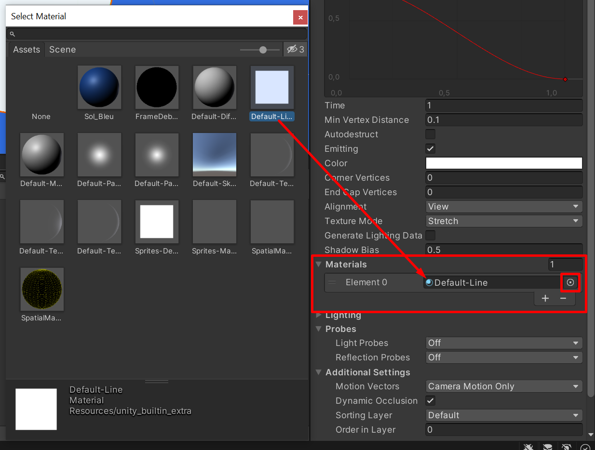
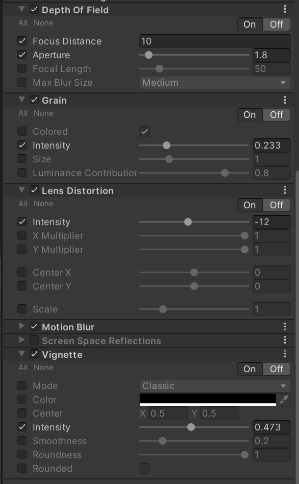

Dans cette section, nous allons rajouter quelques effets visuels au projet afin de l’améliorer et de le rendre plus plaisant à regarder. Je vais partager avec vous quelques astuces réutilisables dans tous vos futurs projets.

Commençons par ajouter une trainée lumineuse derrière la balle. Pour cela, cliquez sur celle-ci et utilisez le bouton `Add Component` de l’inspector afin de rechercher et de sélectionner `Trail Renderer`. Ce composant permet de faire apparaître une lueur derrière un objet en mouvement. Nous allons devoir configurer ce Trail Renderer afin d’ajuster les paramètres.

Commencez par modifier la ligne rouge qui apparaît. Pour la valeur width, mettez 0.8. Ensuite, double-cliquez sur cette courbe afin d’y ajouter un nouveau point. Ce point, placez-le en bas à droite afin de faire diminuer la valeur au cours du temps :

_Ajustement largeur trail renderer_

Ce réglage permettra d’avoir une trainée lumineuse dont la taille diminuera au cours du temps afin qu’elle s’estompe progressivement.

Modifiez aussi la valeur `Time` juste en dessous afin de passer de 5 à 1 pour la durée d’affichage del’effet.

Enfin, modifiez le material en cliquant sur le petit rond de sélection (voir la capture suivante) et glissez le material `Default Line` dans la variable :

_Modification du material du Trail Renderer_

Vous pouvez maintenant tester votre projet et constater que l’effet visuel apparaît bien :

_Test du trail renderer_

Nous allons maintenant appliquer des effets de post-traitement. Pour cela, cliquez sur le menu `Window / Package Manager`. Une fenêtre s’ouvre alors. Sélectionnez `Unity Registry` dans la liste déroulante que je mets en évidence sur la capture suivante puis sélectionnez et installez le package `Post Processing` :

_Installation d'un package_

Cela va permettre d’ajouter les fonctionnalités de post-processing. Ces fonctionnalités permettent d’appliquer des effets visuels sur le rendu final du jeu.

Cliquez sur la caméra et placez-la dans le layer `Post Proc` que vous aurez créé au préalable. La création d’un layer se déroule comme la création d’un Tag :

_Création et sélection d'un Layer_

Cliquez ensuite sur le bouton `Add Component` pour ajouter un `Post-process Layer` et un `Post-process Volume` à la caméra.

Pour la propriété `Volume Layer` sélectionnez `Post Proc`. Pour l’anti-aliasing, sélectionnez `SMAA`.

Pour le volume, cochez `Is Global`. Voilà les réglages que vous devez avoir à ce stade :

_Préparation des composants de post-traitement_

Tout ceci va permettre d’appliquer les effets à la caméra car celle-ci est dans le layer sur lequel les effets vont s’appliquer. L’anti-aliasing permet de lisser les arêtes des modèles 3D. Is Global permet d’appliquer les effets sur la globalité de la scène.

Cliquez ensuite sur le bouton `New` à côté de `Profile` dans le Post-process Volume afin de créer un volume. Ce volume permet de lister et de configurer les effets que vous souhaitez appliquer. Pour ajouter des effets, après avoir créé ce volume, cliquez sur le bouton `Add effect` pour aller chercher un effet dans la liste. Je vous propose de tous les sélectionner afin que l’on fasse un tour complet. Vous devriez donc avoir ce résultat :

_Ajout des effets à la liste_

Par défaut, même s’ils sont ajoutés, ces effets n’ont aucun impact. Vous devez un à un les déplier et cocher chaque sous-paramètre individuellement et modifier les valeurs comme bon vous semble. Il existe beaucoup d’effets et de paramètres, je ne pourrai pas tout détailler ici mais vous avez de la [documentation en ligne](https://docs.unity3d.com/Manual/PostProcessingOverview.html) pour en savoir plus.

Je vais brièvement décrire les effets :

-   **Ambient occlusion** ajoute des sortes d’ombres autour des arêtes.
-   **Auto exposure** simule l’éblouissement de nos yeux quand on sort d’une pièce sombre pour aller dans un endroit éclairé.
-   **Bloom** crée une lueur (glowing). Utile par exemple pour la flamme d’une torche, la vitre d’un pare-brise, un néon etc.
-   **Chromatic aberration** crée un effet de séparation de la lumière blanche en 3 couleurs primaire (comme sur les vieilles caméras).
-   **Color Grading** permet de modifier les couleurs, je détaillerai cela plus tard.
-   **Depth of field** crée un effet de profondeur permettant de flouter l’arrière-plan (ou l’avant-plan).
-   **Grain** ajoute du grain à l’image comme sur les vieilles vidéos cassettes.
-   **Lens distortion** permet de « tordre » l’image comme par exemple l’effet fish eye.
-   **Motion blur** ajoute un flou de mouvement.
-   **Screen space reflection** permet de mettre en place des réflections par exemple dans une flaque d’eau au sol.
-   **Vignette** crée un effet de vignetage et assombrit les contours de l’image.

Voici un exemple de paramétrage (hors color grading) :

_Paramétrage des effets 1/2_

_Paramétrage des effets 2/2_

Vous pouvez jouer avec ces réglages. Il n’est pas nécessaire de copier exactement les mieux, vous pouvez vous en inspirer mais paramétrez votre projet comme bon vous semble. Vous pouvez prévisualiser le rendu en direct dans Unity. L’idée est de modifier le rendu du jeu selon ce qui vous plait.

Pour le color grading, vous pouvez aussi paramétrer votre rendu. Cet effet permet de modifier l’image, ses couleurs, la saturation, le contraste, les nuances de couleur etc. Voilà un exemple de réglage :

_Paramétrage du color grading_

Tout cela nous donne le rendu final suivant :

_Rendu final_

Pour rappel et pour comparer, je vous partage de nouveau l’image sans les effets :

_Rendu sans post-traitement_

Vous remarquez que ces effets de post-traitement ont un impact majeur sur le rendu de votre projet.

Notre jeu Pong est bien sûr un exemple basique et ultra simple avec à peine 6 modèles 3D au total mais vous avez déjà une bonne idée de l’impact.

Pour une idée plus précise sur le rendu d’une scène plus complexe, voici un comparatif avec / sans post-traitement :

_Comparatif avec/sans post-traitement_

Vous savez maintenant comment peaufiner votre projet avant de le partager. Et en parlant de partager, pour générer votre projet cliquez sur `File / Build Settings` puis cliquez sur `Add open Scenes` pour ajouter votre scène au build. Le build permet de générer l’exécutable de votre jeu afin de le partager. Cliquez ensuite sur `Build` pour lancer une compilation du projet :

_Compilation du projet_

Vous verrez qu’après compilation vous aurez votre exécutable avec ses dépendances :

_L'exécutable généré_

Comme nous n’avons pas codé de menu, pour quitter le jeu il faudra faire un Alt + F4 (Sous Windows). Mais vous pouvez aussi modifier un script pour tester la touche échap et faire un Application.Quit() pour coder une fonction proprement. Un exemple complet est disponible [ici](https://docs.unity3d.com/ScriptReference/Application.Quit.html).

Voilà ce qui permet de conclure ce tutoriel Unity. Vous aurez vu les bases du développement sous Unity au travers d’un projet simple. Vous pouvez maintenant vous lancer sur des projets un peu plus complexes plus sereinement.

Vous pouvez télécharger les sources du projet [ici](./sources.zip).
