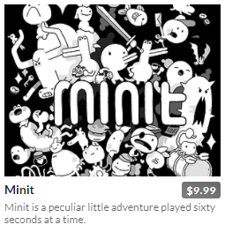
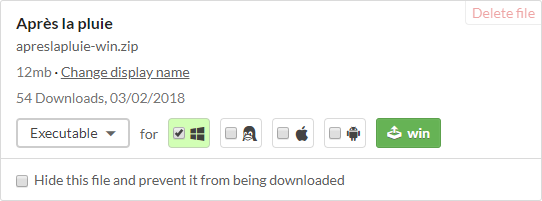
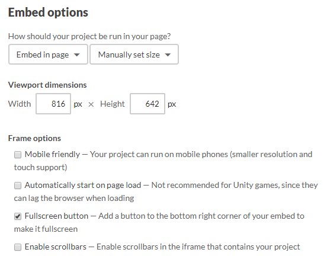

Créer une page de jeu sur itch.io est plutôt simple, mais il existe quelques subtilités qui pourraient vous échapper si vous ne maîtrisez pas bien l'anglais. Dans le menu de l'en-tête, cliquez sur [Upload new projet](https://itch.io/game/new). Vous arrivez alors sur une page contenant plein de paramètres que vous pouvez changer à votre guise.

### Titre et miniature

La première chose que vous devrez préciser pour votre jeu, c'est son titre. Un bon titre est évocateur : en le lisant, on peut déjà imaginer à quel jeu on aura affaire. Un nom trop cryptique inspirera au contraire de la méfiance. Les visiteurs seront plus enclins à cliquer sur votre jeu s'ils peuvent s'en faire une idée rien qu'avec son nom.

Il est également important que le titre soit facile à écrire et à prononcer. Cela facilite grandement l'apparition dans les résultats de recherche ainsi que le bouche à oreille, qui sont deux aspects essentiels de la promotion d'un jeu. Testez le nom avec vos amis : dites-leur le titre du jeu et demandez-leur de l'écrire. S'ils y arrivent, c'est bon signe !

La miniature est aussi essentielle pour attirer les joueurs sur votre page. Elle doit se démarquer des milliers d'autres miniatures que les visiteurs verront sur le site, donc n'hésitez pas à bien la fignoler. Jouez avec le contraste, utilisez des couleurs et des formes qui évoquent l'identité du jeu... et assurez-vous qu'elle reste bien lisible malgré sa petite taille.

Généralement, une phrase d'accroche est affichée sous la miniature. Vous pouvez l'écrire dans *Desc or tagline*. C'est un outil de plus pour attirer la curiosité des visiteurs !

*Affichage de la phrase d'accroche sur l'accueil.*

### Images et description

Si vous avez réussi à attirer l'attention des viiteurs pour qu'ils cliquent sur votre jeu, c'est un très bon début ! Il ne manque plus qu'à faire une jolie page pour les inciter à télécharger.

Sur la droite, vous pouvez entrer un lien YouTube vers un trailer représentant efficacement votre jeu. Rien de mieux qu'une vidéo pour mettre dans l'ambiance ! Si vous n'en avez pas, ce n'est pas grave : choisissez simplement 3 à 5 images pour donner envie au public de jouer. Une erreur fréquente des débutants est de montrer des images de tous leurs menus : l'écran-titre, l'inventaire, etc. Ce n'est pas pour les menus que les gens voudront essayer votre jeu, donc montrez plutôt ce qui en fait la sève !

Vient ensuite la description du jeu, qui s'affiche au coeur de la page. On dit souvent que la description d'un jeu est survolée par la plupart des joueurs, voire complètement ignorée. D'ailleurs, sur la plupart des magasins, la description est cachée par défaut pour laisser plus de place aux images et aux avis des utilisateurs. Cela dit, la description est très visible sur itch.io, donc il vaut mieux la soigner un minimum.

En l'écrivant, gardez à l'esprit que vos lecteurs ont déjà trouvé votre jeu et que leur curiosité a été suffisamment attisée par les images pour qu'ils lisent la description. La première impression est déjà réussie : vous n'avez plus qu'à trouver les mots justes pour conclure le deal. Listez les points forts de votre jeu, sans pour autant tout expliquer jusqu'aux moindres détails.

### Prix et donations

L'option de paiment par défaut est "*$0 or donate*". Cela signifie qu'en cliquant sur le bouton de téléchargement, les visiteurs devront passer par une fenêtre qui leur demande s'ils veulent envoyer une donation, mais ils peuvent passer cette étape pour accéder aux fichiers gratuitement. Cela dit, pour recevoir de l'argent, vous devez d'abord renseigner les informations de paiement pour votre compte. **Choisissez plutôt "*No payments*" pour commencer,** afin d'être tranquille. Vous pourrez toujours le changer plus tard.

Sur itch.io, le prix est libre : même si vous imposez un prix minimum à votre jeu, les utilisateurs peuvent vous donner davantage. Il est aussi possible de proposer plusieurs fichiers à des prix différents : vous pourriez proposer une démo gratuite mais un jeu complet payant, ou encore proposer un artbook en bonus pour inciter à payer un peu plus cher.

### Envoyer les fichiers

Dans *Uploads*, envoyez un fichier zip différent par version de votre jeu. Pour chaque fichier, il est important de cocher la compatibilité avec Windows, Linux, Mac ou Android, si applicable.

*Ce fichier fonctionne sur Windows uniquement.*

Vous pouvez également envoyer vos fichiers avec butler, un outil très utile, mais nous y viendrons plus tard !

### Publier un jeu web

Si votre jeu doit être téléchargé, laissez *Downloadable* dans *Kind of project*, mais s'il peut se jouer sur navigateur, changez pour *HTML*. Ensuite, dans *Uploads*, vous pourrez cocher cette case sur le zip contenant la version web du jeu :

Rien ne vous empêche d'également proposer des versions supplémentaires téléchargeables de votre jeu web.

Plus bas, dans *Embed options*, vous devez spécifier la taille de la zone dans laquelle s'affichera le jeu web.

Vous pouvez personnaliser la fenêtre du jeu, en ajoutant un bouton plein-écran par exemple.

### Rendre la page publique

L'option *Visibility* définit les conditions d'accès à votre page. *Restricted* vous permet de spécifier une liste précise d'utilisateurs itch.io autorisés, et *Draft*, le mode par défaut, empêche toute autre personne que les créateurs d'accéder à la page.

Lors de votre premier passage sur ce formulaire, **vous ne pouvez pas passer votre page en mode *Public*.** Vous devez rester en mode *Draft* (brouillon) ou en *Restricted* (accès restreint). Sauvegardez d'abord votre page une première fois afin de la consulter.

Vous êtes sur la page de votre jeu ! Elle est un peu simple pour le moment. Remarquez les outils à votre disposition dans l'en-tête.

*Entête de la page du jeu.*

Commencez par cliquer sur Edit theme. C'est l'occasion de transmettre l'identité de votre jeu : un simple changement de couleurs crée une ambiance plus saisissante alors que cela ne prend qu'une minute. Avec un peu de créativité, vous pouvez la transformer complètement !

Lorsque le résultat vous plaît, cliquez sur Edit game pour revenir au précédent formulaire. Tout en bas, vous pouvez maintenant choisir *Public*. Si vous le souhaitez, vous pouvez afficher les options supplémentaires afin de publier votre jeu sans l'inclure à la recherche du site.

*Options de visibilité.*

Sauvegardez, retournez sur la page de votre jeu, et partagez son adresse au monde !

### Normes de qualité

itch.io est un site très vivant, sur lequel de nombreux jeux sont postés chaque jour. Les administrateurs font tout leur possible pour que les joueurs puissent s'y retrouver malgré le flot d'informations. Par respect pour les utilisateurs et le travail des administrateurs, assurez-vous que votre page soit de bonne qualité avant de la rendre publique.

Si vous ne respectez pas les [normes de qualité](https://itch.io/docs/creators/quality-guidelines) établies par itch.io, un administrateur pourra retirer votre jeu de la recherche du site. Ainsi, votre jeu sera toujours accessible par son lien et par votre profil sans pour autant nuire à la navigation des joueurs. Mais pas de pression : si vous avez préparé votre page correctement, tout va bien se passer !
