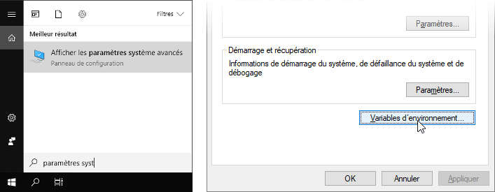
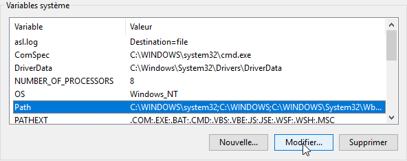
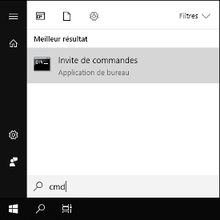

Maintenant que vous avez eu un bon tour d'horizon d'itch.io, laissez-moi vous montrer une des choses qui, à mes yeux, rend ce site vraiment pratique. butler est un petit outil qui s'utilise en ligne de commande et permet de mettre ses jeux en ligne très efficacement.

Le programme détecte automatiquement les fichiers modifiés depuis la dernière mise à jour, et envoie uniquement ces différences. Ainsi, les utilisateurs de [l'application itch](https://itch.io/app) téléchargeront un patch optimisé, tout comme sur Steam.

### Télécharger butler

Il existe deux moyens d'obtenir butler. Vous pouvez télécharger [l'application itch](https://itch.io/app), qui l'inclut dans son dossier d'installation et le met à jour à chaque lancement.

Sur Windows, l'appli itch se trouve par défaut dans le dossier `%APPDATA%\itch`, ou en version longue :

```
C:\Users\UTILISATEUR\AppData\Roaming\itch
```

Le chemin est `~/.config/itch/bin` sur Linux et `~/Library/Application Support/itch/bin` sur macOS.

Sinon, vous pouvez tout simplement [télécharger butler manuellement](https://fasterthanlime.itch.io/butler), et le placer dans le dossier de votre choix.

### Installer butler

#### Sur Windows 10

Il ne se passera rien si vous ouvrez directement `butler.exe` car il doit être utilisé depuis l'invite de commandes (aussi appelé terminal). Pour cela, vous devez l'ajouter à votre Path.

Ajouter un dossier au Path permet d'utiliser les programmes qu'il contient dans le terminal. Vous devez donc ajouter le dossier qui contient `butler.exe`. Dans mes images, butler est situé dans le dossier suivant, mais vous pouvez adapter à votre propre cas :

```
C:\Users\Aurelien\AppData\Roaming\itch\bin
```

Ouvrez les Paramètres système avancés, puis cliquez sur Variables d'environnement.



Dans la section Variables système, sélectionnez la ligne Path et cliquez sur Modifier.



Dans une nouvelle ligne, renseignez le dossier dans lequel se trouve `butler.exe`.


Le programme est maintenant disponible dans l'invite de commandes ! Recherchez `cmd` pour y accéder rapidement.



#### Sur Linux

Pour utiliser la version de butler incluse avec l'application itch, il suffit d'ajouter cette ligne au fichier `~/.bashrc` (`~` étant votre répertoire personnel) :

```bash
export PATH="$PATH:$HOME/.config/itch/apps/butler"
```

Si vous préférez télécharger butler manuellement, référez-vous à la [documentation](https://itch.io/docs/butler/installing.html).

#### Sur macOS

Le procédé est similaire à Linux. Pour utiliser la version de butler incluse avec l'application itch, ajoutez cette ligne au fichier `~/.bash_profile`. Si ce fichier n'existe pas, vous pouvez le créer.

```bash
export PATH="$PATH:$HOME/Library/Application Support/itch/apps/butler"
```

### Se connecter

Vous êtes maintenant dans le terminal. La première fois que vous utiliserez butler, il vous demandera de vous connecter. Vous pouvez le faire directement en écrivant `butler login` puis en validant avec Entrée. Il suffit ensuite de suivre les instructions. Et voilà, butler est configuré !

Si vous souhaitez changer de compte, vous pouvez vous déconnecter à tout moment avec `butler logout`.
