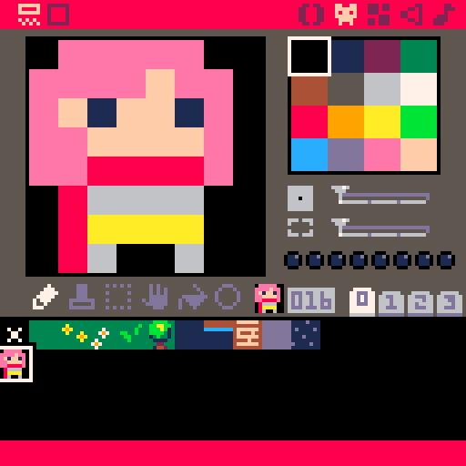
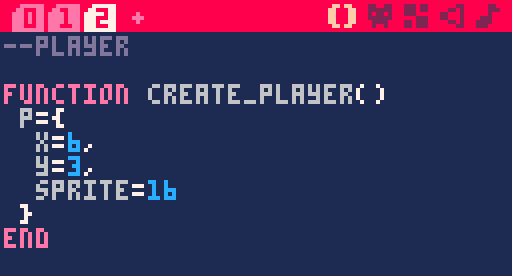
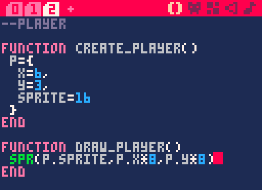
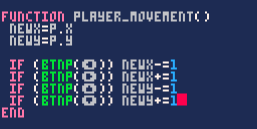
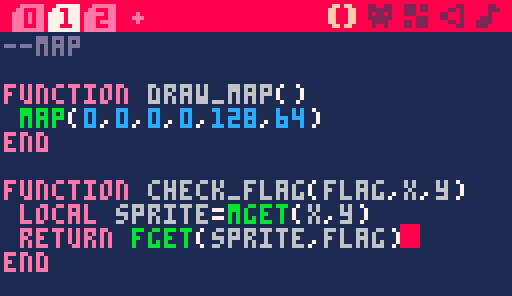
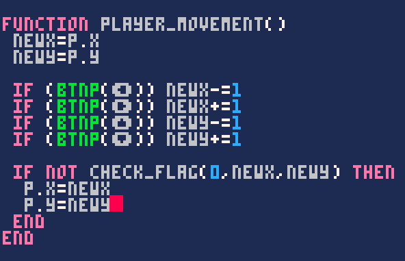
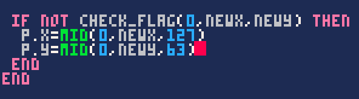
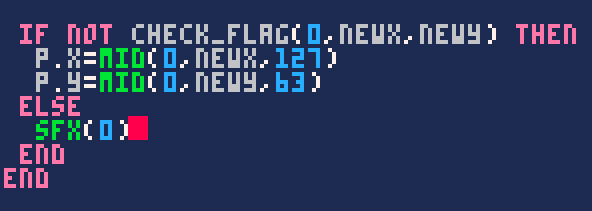
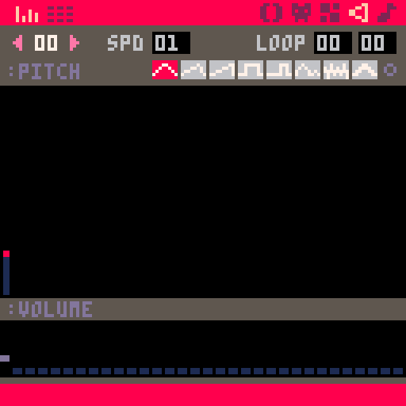

Dans le chapitre sur le shooter, vous avez appris à déplacer un vaisseau pixel par pixel. Nous pourrions refaire la même chose ici, mais je vous propose plutôt de varier les plaisirs et de voir comment se déplacer en case par case ! C'est très utile pour les roguelike et les RPG en tout genre, ainsi que pour les jeux de stratégie par exemple.

### Afficher le personnage

Commencez par dessiner votre héroïne ou héros comme il se doit.



Ensuite, dans un nouvel onglet "*Player*", créez un tableau pour préciser la position X et Y de départ du personnage et le sprite utilisé.



Comme nous faisons un jeu en case par case, les coordonnées n'indiqueront pas la position à l'écran mais bien la position sur la grille de la carte. Ici, le personnage se situe donc sur la 7<sup>ème</sup> case en X et la 4<sup>ème</sup> en Y, puisque les coordonnées de la carte commencent à 0.

Pour afficher le sprite en jeu, nous devons utiliser la commande que vous connaissez bien, `spr(sprite, x, y)`. Problème : elle prend une position d'écran alors que les coordonnées du personnage correspondent à la carte ! Mais comme une case fait 8 pixels, il suffit de multiplier les coordonnées par 8 pour obtenir la bonne position à l'écran.



Appelons ces deux fonctions dans notre game loop :


Testez votre jeu pour voir votre personnage s'afficher ! N'hésitez pas à changer ses coordonnées pour vérifier que le système fonctionne.

### Programmer le mouvement

La première méthode qui vous viendra à l'esprit pour réaliser le mouvement sera probablement celle-ci :


Simple, efficace. Cela dit, si vous créez cette fonction et l'appelez dans update, vous verrez que le personnage peut passer à travers les obstacles, donc nous devons affiner le système. Au lieu de directement déplacer le personnage, nous allons plutôt stocker la nouvelle position souhaitée afin de vérifier qu'elle soit valide.


*La position à tester sera appelée "New X" et "New Y".*

Maintenant, nous devons vérifier si le tile "*New X Y*" est un obstacle, c'est-à-dire vérifier si ce tile a le flag 0 !

#### Vérifier l'état d'un flag

Nous allons créer une fonction qui nous servira souvent, pour vérifier si une case de la carte a un certain flag activé. Quand on écrira `check_flag(flag, x, y)`, le résultat sera `true` si le flag en question est activé, `false` sinon. Voici le code :



Avant toute chose, dites-vous que techniquement, une case de la carte n'a pas de flag : c'est le sprite qui les a. Donc la commande `fget` qui vérifie l'état d'un flag ne peut pas être utilisée directement sur une case de la carte. Nous devons d'abord récupérer le numéro de sprite qui correspond à cette case avec `mget`.

> Le fait de créer une variable locale avec `local` est simplement une bonne pratique car nous n'aurons pas besoin de la variable `sprite` en dehors de cette fonction.

Maintenant que nous connaissons le sprite, nous pouvons utiliser `fget(sprite, flag)` qui renvoie `true` ou `false` selon l'état du flag choisi. Grâce à `return`, notre fonction renvoie donc `true` ou `false`.

#### Gérer la collision

Revenons à `player_movement()` et récapitulons... `check_flag` renverra `true` si la case examinée est un obstacle, donc nous voulons avancer uniquement si `check_flag` renvoie `false`. On peut l'écrire de deux façons : la façon ennuyeuse, et la façon cool.

```lua
if check_flag(0, newx, newy) then
    -- c'est un obstacle
else
    -- on peut avancer
end
```

```lua
if not check_flag(0, newx, newy) then
    -- on peut avancer
end
```

Comme `not` inverse le signal de ce qui suit, la condition est validée quand il n'y a pas d'obstacle. Très pratique ! Plus qu'à mettre à jour la position du personnage en conséquence.



Testez le jeu et cela devrait fonctionner ! Si vous allez vers la droite ou le bas, la caméra ne vous suit pas encore mais nous nous en occuperons à l'étape suivante. Par contre, si vous allez vers le haut ou la gauche, vous dépasserez les limites de la carte de PICO-8 en ayant des coordonnées négatives, et il vaudrait mieux l'empêcher. Là aussi, il y a une façon barbante et une façon cool de l'écrire :

```lua
p.x = newx
p.y = newy
if (p.x < 0) p.x = 0
if (p.x > 127) p.x = 127
if (p.y < 0) p.y = 0
if (p.y > 63) p.y = 63
```

Voilà ce que ça donnerait si votre map est de 128×64 cases. Pas très fun, hein... Heureusement, il existe la fonction `mid` : si vous lui donnez 3 nombres, elle vous renverra le nombre entre les deux autres.

```lua
p.x = mid(0, newx, 127)
p.y = mid(0, newy, 63)
```

Généralement, la valeur du milieu sera `newx`. Par contre, si vous allez trop à gauche et que `newx` devient -1, la valeur du milieu sera alors 0 ! `p.x` ne pourra donc jamais dépasser 0 ou 127.



#### Ajouter un feedback sonore

C'est la cerise sur le gâteau. Pour que le jeu soit plus fun et que votre joueur ou joueuse comprenne bien qu'elle essaie d'aller dans un mur, on peut ajouter un petit son.



Quelque chose de court et discret devrait faire l'affaire :


*Boup.*

Parfait ! Comme promis, dans la section suivante nous verrons comment faire suivre la caméra avec deux types de vues différentes !
