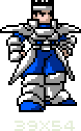
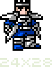
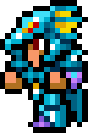
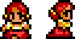
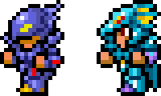
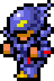
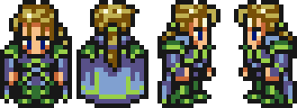
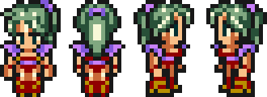
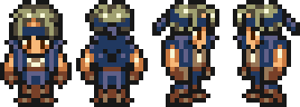

Une des premières choses que les gens voient de votre jeu, que ce soit via les screenshots ou les trailers, ce sont les sprites. Ils vont permettre aux potentiels futurs joueurs de se faire une première opinion sur votre jeu, il est donc essentiel d'y faire attention. Plus précisément, le sprite le plus important est celui du personnage principal. 

:::hypemarvin
Mais alors, et mon super méchant qui veut contrôler le monde sans raison connue ?
:::

:::astride
Bien sûr qu'il est important, mais pas autant que ton héros !
:::

Votre joueur ou joueuse pourra parcourir des centaines de kilomètres, traverser des dizaines de villes et de zones différentes, mais le seul sprite qu'elle verra quoi qu'il arrive est celui du héros. Il sera donc difficile pour quelqu'un qui ne l'aime pas de s'investir jusqu'à la fin du jeu.
Pour créer un bon sprite, il faut commencer par déterminer sa taille : 

Aujourd'hui, la limite de taille n'est plus vraiment un problème, mais si vous travaillez seul·e, un sprite aussi grand vous demanderait trop de temps et d'énergie. Un bon compromis entre le détail et l'efficacité serait un sprite de 16×16. 

Le 16×16 est un format très répandu dans les vieux RPG. Avec le temps, c'est devenu une tradition, bien que les limites techniques de l'époque n'existent plus vraiment.

Pour vous donner un exemple, je suis parti de cette taille très grande, puis j'ai progressivement réduit le sprite pour vous montrer quoi enlever, jusqu'à arriver à un 16×16.

:::oofmarvin
Mais où sont passés les côtés de son armure ? Et les trois sections de ses gants ? Les... morceaux de ses bottes ? SA BOUCLE DE CEINTURE ? Tout a disparu ! 
:::

:::sighastride
On a dû les enlever. Le 16×16 reste une taille de sprite limitée, on ne peut mettre tous les détails !
:::

Comprendre comment travailler avec des petits sprites vous rendra la vie bien plus facile pour travailler sur des gros sprites. Cela vous permettra aussi de développer votre style !

Maintenant que l'on a vu la question de la taille, j'aimerais m'attarder un peu sur le sprite du milieu.

Plus je le regarde, moins je l'aime. Le personnage est courtaud et a l'air un peu de travers. Le sprite a l'air encombré, et c'est difficile de dire qu'est-ce qui va où. La raison est plutôt simple : tout a un contour. Il y a donc trop de noir qui vient boucher certains endroits et ça ne marche globalement pas très bien.

La grande question, c'est « comment faire pour montrer les différentes parties de mon sprite si je ne contoure pas tout ? » Pour ça, il faut utiliser les couleurs stratégiquement. Si vous dessinez un personnage avec une cape qui tombe sur les épaules, vous n'avez pas besoin d'utiliser du noir pour différencier la cape du reste. Vous devez juste trouver quelle couleur utiliser pour contraster les différentes parties correctement.

Au fond, on cherche à *suggérer* les détails, exactement comme quand vous dessinez une main : vous n'avez pas besoin de faire tous les doigts pour qu'on comprenne que c'est une main. Ce principe était très important dans les jeux avec des sprites 16×16. Observons par exemple quelques personnages de Final Fantasy : 

D'abord, le personnage le plus cool de tous les FF... Kain, le Chevalier Dragon ! Regardez ce sprite, il est bien. On comprend facilement qu'il a une armure dragon-pointue-cool. Prêtez attention à ses jambes dans la vue de face : il a un pantalon rouge – ou des piques, je ne sais pas trop ce que c'est – et des bottes bleues. Pourtant, les deux éléments ne sont pas séparés par une ligne noire, et malgré ça, vous pouvez toujours différencier les deux. C'est un exemple assez simple de division par la couleur – oh, j'ai inventé un terme. On retrouve la même chose sur son casque, avec ces « yeux » rouges. Il n'y a pas de noir pour les séparer du reste.

Regardez ses pieds maintenant. Il n'y a pas de ligne noire en dessous, ils se « finissent » soudainement. Pourquoi ? Simplement parce qu'il n'y a pas besoin d'une ligne noire ici. Comme il y en a déjà sur les côtés des jambes, votre oeil les connecte automatiquement en dessinant une ligne invisible. Ça n'a l'air de rien dit comme ça, mais rendez-vous compte que cela fait économiser une ligne entière de pixels qui est à la place utilisée pour détailler le visage ou d'autres parties du corps ! On retrouve le même principe en haut du casque dans les vues de face et de dos. Votre oeil vous dit que puisque le bleu au milieu ressort par rapport au reste, c'est plus haut, et comme il y a du noir autour, c'est une partie de son casque. 

Kain n'est pas le meilleur exemple de division par la couleur, puisque généralement des vêtements en tirent davantage parti qu'une armure qui ne change pas de couleur entre les sections. Mais Kain est cool, donc il a sa place ici. Passons à la suite : 

Un PNJ quelconque d'une ville ! Je n'ai pris que ces deux vues parce que je n'avais pas grand chose à dire sur les autres. 

L'endroit où vous verrez le plus de division par la couleur sont ses cheveux. Regardez bien, il n'y a pas de ligne noire pour séparer le rouge de ses cheveux et le pêche de sa peau. Mais on peut dire sans problème que ses cheveux ne seront pas confondus avec de la peau brûlée par le soleil ! Les deux couleurs sont assez contrastées poue que l'on ait pas besoin d'une ligne noire. D'ailleurs, imaginez ce que ferait une ligne noire à ses yeux ! On ne pourrait plus les différencier des cheveux. Grâce à une division par la couleur, les cheveux et le visage sont en retrait et laissent donc la place aux yeux pour exprimer des émotions.

Attardons-nous maintenant sur son torse, du coup à la taille, les bras inclus. Les seules lignes noires sont celles qui contournent l'ensemble : elles sont « en dehors » du dessin. Même si rien ne souligne son haut, on voit clairement qu'elle est habillée. Il faut comprendre que quand on travaille avec des corps qui font quelque chose comme 2 pixels de haut, on n'a juste pas la place de tout entourer. Et comme je le disais plus haut, le faire pourrait rendre la lecture du sprite compliquée.

Le dernier point que j'aimerais évoquer pour ce sprite sont les attaches de ses chignons, en jaune. Vous savez ce que c'est, vous savez pourquoi c'est là, même s'il n'y a pas de contour. Vous commencez à intégrer mon point ? 

On peut voir en revanche des lignes noires au menton et à la taille, mais celles-ci sont nécessaires pour ségmenter le pesonnage. Si vous ne séparez rien du tout, vous pourriez finir avec un grand blob de pixels colorés. Ne pas diviser assez les sections est une erreur commune, donc faites attention. Ça demande généralement de la pratique pour savoir quelles parties souligner et quelles parties mettre en second plan, mais ça viendra, ne vous en faites pas.

Changeons un peu de scène !

*Cecil et Kain en combat.*

Dans Final Fantasy, les sprites de la scène de combat sont en 16x24, et pourtant la division par la couleur est toujours là. Avec cette taille, Monsieur ou Madame Artiste a désormais 8 pixels de plus pour travailler.

:::hypemarvin
Oh ! Ça veut dire que je peux ajouter tous les contours noirs !
:::

:::sighastride
Eh bien... Tu pourrais faire ça, mais tu aurais juste un sprite en 16×16 où tout est séparé par du noir.
:::

:::marvin
Ah non, moi je veux des sprites sophistiqués !
:::

D'abord Cecil. Ce qui ressort le plus du sprite, c'est le casque, plus particulièrement la partie qui recouvre ses yeux. À cet endroit, la ligne noire devient une ligne violette foncée qui continue et donne la forme au casque avant de redevenir une ligne noire en haut. Pourquoi est-ce que l'artiste a fait ça ? C'est à cause du contraste. Si vous regardez sa tête, la première chose qui attire l'œil est la partie avant, vers le nez, et ce à cause de tout le noir qui s'y trouve. Si la ligne violette était noire, elle ressortirait trop et serait en compétition avec l'avant du casque, ce qui rendrait le visage moins important. Parce que c'est violet, cette partie se fond dans le reste de l'armure. Lorsqu'on plisse les yeux, les zones violettes ont tendance à se mêler les unes aux autres, tandis que les parties noires ressortent toujours.

Regardez son bras gauche maintenant, celui qui est le plus près de nous. Là non plus, il n'y a pas de ligne noire pour séparer l'armure de la main. C'est divisé avec la couleur, mais la séparation est très franche ! C'est pareil pour son torse et ses jambes.

Maintenant Kain. Puisqu'il porte aussi une armure, les techniques utilisées sont similaires. En fait, si vous regardez attentivement, ses jambes sont presque exactement les mêmes que celles de Cecil, sauf que les couleurs sont différentes ! Remarquez tout de même les subtiles différences dans le coin de la botte.

Sur le casque de Kain, le bleu et le jaune à l'arrière ne sont pas séparés. A vrai dire, les couleurs sont déjà très contrastées, alors rajouter du noir rendrait cette partie illisible. Le sprite de Kain paraît davantage segmenté, notamment au niveau de l'avant-bras, et toutes ces lignes noires donnent à l'armure un côté très solide.

Voilà qui devrait vous inspirer pour vous mettre à utiliser le noir « comme les pros ». Allons voir ce qui se passe du côté de Final Fantasy VI maintenant : 

Ce bon vieux Edgar... N'est-il pas charmant avec ses vêtements distingués ?

Pour un peu d'information inutile, les sprites sur la map dans Final Fantasy VI sont en 16×24, la même taille que les sprites de combat de FF4. La différence étant que là où FF4 jonglait entre du 16×16 et du 16×24, FF6 utilise le 16×24 tout le temps. 

Ces sprites utilisent énormément la division par la couleur. En fait, assez étrangement, les grands sprites en comportent davantage par rapport aux petits. Chez Edgar, ce qui est particulièrement intéressant à regarder, ce sont ses cheveux, plus précisément les deux mèches qui lui tombent sur les yeux. Juste deux traits sombres, pas de noir. Aussi, au sommet de son crâne, vous verrez qu'un pixel noir est manquant. Une façon très subtile de suggérer la forme des cheveux, sans pour autant trop l'appuyer en rajoutant du noir sur la ligne d'en dessous !

Observez également la doublure verte de sa tenue, qui ressort sans pour autant apparaître comme un élément à part entière, grâce à l'absence de contour noir.

D'ailleurs, vous avez probablement remarqué qu'il n'y a techniquement pas de ligne noire ici ! Pour Final Fantasy VI, ils ont décidé d'utiliser des lignes colorées. Grâce à ce vert foncé, le sprite semble plus réaliste que ceux de Final Fantasy IV, qui font davantage penser à des dessins à cause du contraste très fort du noir. Ces nouvelles couleurs donnent un aspect plus doux et cinématographique.

Une dernière chose pour Edgar : il n'y a pas de séparation entre ses jambes dans la vue de face. C'est, malheureusement, un inconvénient quand on utilise des nombres pairs pour la taille des sprites (ici 16 en largeur). Avec un nombre pair, on n'a pas de colonne de pixel au milieu, et donc pas de point central sur le sprite. Si le sprite en avait une (donc un nombre impair pour la largeur), vous pourriez très bien avoir une ligne pour séparer les jambes, voire ajouter un nez entre les yeux, qui sait ! 
Ce problème de double colonne centrale touche aussi les visages, et ça explique pourquoi Edgar a un sourcil plus long que l'autre. Si les deux étaient longs, ce serait devenu un monosourcil... Si les deux étaient courts, Edgar aurait eu un air d'au petit bonheur la chance, alors que c'est un homme avec beaucoup de choses à gérer. Donc ce pixel lui donne un air pensif, comme s'il cherchait à comprendre quelque chose. 

Je pourrais continuer à parler d'Edgar toute la journée, mais je pense qu'à ce stade vous êtes capable de remarquer beaucoup de ces choses par vous-même. C'est comme ça que vous pourrez progresser !

Passons donc à notre prochain sprite, Terra : 

Bon, normalement, vous devriez avoir tous les points clefs mémorisés. Les cheveux, le sommet de la tête avec le pixel manquant, les jambes et le torse. Une fois que vous avez examiné ça, attardez-vous sur son menton. Il n'y a pas de ligne noire pour le séparer de son corps ! Souvenez-vous du PNJ de FF2 que l'on a vu un peu plus haut, et qui avait une ligne noire, elle. Alors pourquoi pas Terra ? La femme de FF2 avait l'air plus ronde, là où Terra apparaît comme assez fine. C'est en partie grâce à ce menton ! Si vous pensez à la tête d'une personne en surpoids, vous imaginez sûrement un double-menton qui sépare la tête du buste. Lorsqu'un peu de graisse est repliée sur elle-même, vous obtenez un creux... donc une ligne sombre. Donc, pour le PNJ, il y a une ligne entre sa tête et son buste pour davantage séparer les deux, donnant un résultat plus segmenté. Pour ce qui est de Terra, elle est plus mince, donc à la place de cette ligne noire, il y a quelques pixels foncés. Ça montre qu'il y a un menton ici, mais qu'il n'est pas très défini. Une ligne noire pourrait aussi être utilisée pour un personnage à la mâchoire carrée ! Cet absence de ligne suggère donc un menton plus pointu et plus féminin.

Pour finir, voici Locke : 

Par rapport aux autres, Locke est plus segmenté en raison de cette veste un peu funky. Mais là encore, pas besoin de pixel noir pour cela ! Le changement de couleur est assez fort entre le bleu et le pêche. En se passant du noir, on a davantage de pixels pour bien représenter le bleu de la veste.

Sur les vues de dos et de côté, la partie nouée de son bandeau est contourée de noir, tandis que la partie autour de sa tête ne l'est pas. Pourquoi ? Parce que la partie nouée ressort physiquement, et qu'elle forme un nouveau segment. Le bandeau est serré autour de sa tête, donc on ne le définit pas séparément. 

Est-ce que vous voyez où je veux en venir ? Je pense que c'est bien imprimé dans votre cerveau, mais je vais le répéter une fois de plus. Vous n'avez pas besoin de tout entourer de noir. Donc la prochaine fois que vous jouerez à un jeu en pixel art, observez les contours et la division par la couleur. Vous serez surpris·e du nombre de sprites qui utilisent cette méthode.
