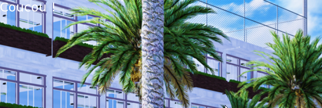
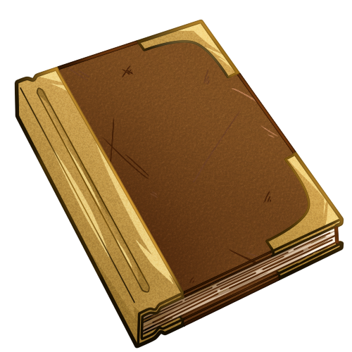
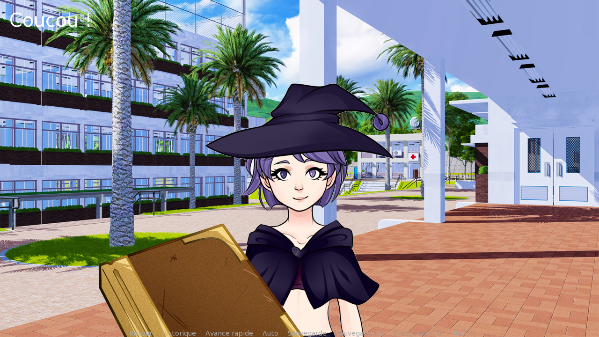
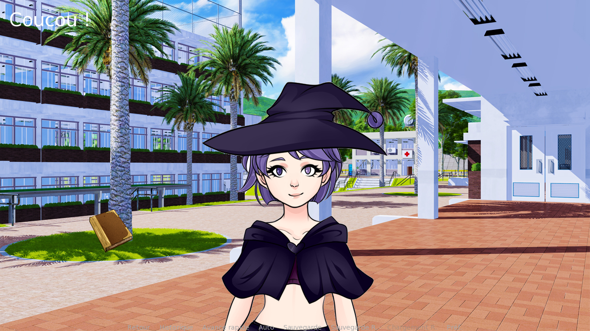

Dans ce troisième chapitre, vous verrez comment ajouter des mécaniques de point and click à vos jeux, à l'aide des screens de Ren'Py et d'une utilisation plus poussée des variables.

Dans cette première étape, nous allons utiliser un screen pour afficher un objet sur lequel on pourra cliquer. Vous pouvez récupérer ce script pour suivre avec moi : j'ai repris ce que nous avions écrit au début de la formation, avec quelques modifications.

```renpy
define m = Character("Marvin", color="#ffc8c8")
define a = Character("Astride", color="#c8c8ff")

label start:
    scene ecole with dissolve
    m "J'aimerais tant créer un visual novel..."

    show astride with dissolve
    a "Je peux t'aider si tu veux !"
    a "Pour écrire ton histoire, il te faudrait un carnet. Je crois que j'ai oublié le mien au pied de l'arbre..."

label livre_recupere:
    a "Félicitations, tu l'as retrouvé !"
```

:::hypemarvin
Mais c'est quoi un screen, au juste ?
:::

:::winkastride
Ce sont tous les éléments d'interface que l'on peut ajouter en plus des personnages et des décors.
:::

:::profremi
Par exemple, l'écran-titre est un screen, et le menu de sauvegarde aussi.
:::

:::marvin
Donc je pourrai les changer en allant dans les screens ? Génial !
:::

### Un tout premier screen

Vous pouvez ajouter votre screen à l'intérieur de `screens.rpy` ou créer votre propre fichier, nommé `myscreens.rpy` par exemple.

```renpy
screen texte_coucou:
    text "Coucou !"
```

Pour afficher le screen, nous avons le choix entre deux méthodes : `show screen` et `call screen` :

- `show` n'interrompt pas le jeu, et affiche le screen en parallèle du reste.
- `call` bloque le jeu dans ce screen tant que l'on ne fait pas d'action qui nous fasse sortir.

Pour ce petit texte, nous allons utiliser `show`.

```renpy
a "Je peux t'aider si tu veux !"
show screen texte_coucou
a "Pour écrire ton histoire, il te faudrait un carnet. Je crois que j'ai oublié le mien au pied de l'arbre..."
```


*Le texte s'affiche bien dans le coin de l'écran !*

On ne le voit presque pas... On peut améliorer cela en lui ajoutant quelques propriétés. Ces deux écritures produisent le même effet :

```renpy
screen texte_coucou:
    text "Coucou !" xpos 20 ypos 20 size 40

screen texte_coucou:
    text "Coucou !":
        xpos 20
        ypos 20
        size 40
```


Pas mal, mais on peut encore faire mieux ! Affichons notre texte dans une frame : c'est une fenêtre avec un fond et une bordure.

```renpy
screen texte_coucou:
    frame xpos 20 ypos 20:
        text "Coucou !" size 40

screen texte_coucou:
    frame:
        xpos 20
        ypos 20
        text "Coucou !":
            size 40
```


*Eh ben voilà ! Que demande le peuple ?*

Je pense que vous comprenez le principe maintenant. Vous voyez que créer une interface, ça consiste souvent à trouver la meilleure façon de mettre des trucs dans d'autres. Passons au vif du sujet : notre livre !

### Créer une imagebutton

Une imagebutton, comme son nom l'indique, est une image qui peut avoir le comportement d'un bouton. Nous allons afficher un livre au pied de l'arbre que l'on peut ramasser. Je vais utiliser ce fichier :


*Provient de [ce pack](https://red-baby.itch.io/sprite-pack-fantasy-inventory-icons).*

Créons le screen contenant notre imagebutton :

```renpy
screen livre:
    imagebutton:
        xpos 190
        ypos 450
        idle "livre.png"
```

Remarquez que je donne le nom de l'image dans `idle`, qui signifie « quand l'objet n'est pas survolé par la souris ». C'est son état par défaut, en quelque sorte. Vous pourriez donner une nouvelle image lorsque le livre est survolé avec `hover`, par exemple. Toutes les possibilités sont listées dans la [documentation des imagebuttons](https://www.renpy.org/dev-doc/html/screens.html#imagebutton).

Appelons le screen avec `call`, pour bloquer le déroulement du jeu :

```renpy
    a "Pour écrire ton histoire, il te faudrait un carnet. Je crois que j'ai oublié le mien au pied de l'arbre..."
    call screen livre

label livre_recupere:
    a "Félicitations, tu l'as retrouvé !"
```



Le jeu ne continue pas une fois le livre affiché, ce qui est normal. Par contre, nous avons un souci : l'image est bien trop grande !

Ren'Py possède des styles mais ils ne fonctionnent pas partout. En l'occurrence, nous aurions besoin du style `size`, mais il ne peut pas s'appliquer aux boutons... Nous devons donc soit redimensionner le fichier directement, soit recourir à une animation custom.

```renpy
screen livre:
    imagebutton:
        xpos 190
        ypos 450
        idle "livre.png"
        at custom_zoom

transform custom_zoom:
    zoom 0.2
```



C'est mieux ! Nous n'avons plus qu'à ajouter une action à effectuer lorsqu'on clique sur le livre :

```renpy
screen livre:
    imagebutton:
        xpos 190
        ypos 450
        idle "livre.png"
        at custom_zoom
        action Jump("livre_recupere")
```

Vous pouvez effectuer plusieurs actions à la fois. Par exemple, avant de jump, on peut aussi cacher notre premier screen.

```renpy
action [Hide("texte_coucou"), Jump("livre_recupere")]
```

Toutes les possibilités sont listées dans la [documentation des actions](https://www.renpy.org/doc/html/screen_actions.html).

Dans l'étape suivante, nous allons afficher un inventaire et y ajouter le livre !
