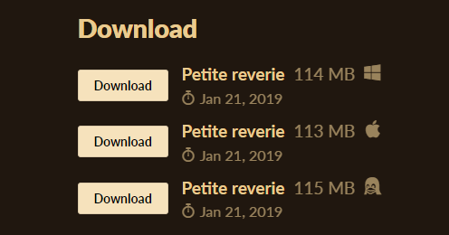
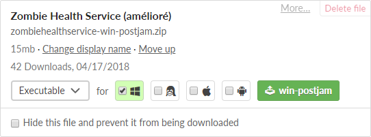
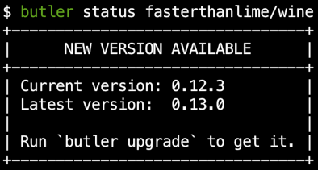

C'est l'unique commande que vous aurez besoin d'utiliser désormais ! Elle est structurée ainsi :

```
butler push dossier utilisateur/jeu:branche
```

`dossier` est le chemin du dossier que vous souhaitez envoyer. Cela peut aussi être un fichier zip mais ce n'est pas conseillé : cela ne ferait que ralentir le processus, car butler compresse lui-même le dossier.

`utilisateur/jeu` est le projet que vous mettez en ligne. Vous pouvez retrouver votre adresse d'utilisateur et de jeu dans l'URL. Par exemple : `gamedevalliance/starterpack` pour https://gamedevalliance.itch.io/starterpack

`branche` est l'emplacement du fichier que vous envoyez. Vous êtes perplexe ? Laissez-moi vous expliquer.

Imaginons que vous souhaitez proposer aux joueurs le choix de télécharger une version stable ou une version beta, et ce depuis la même page de jeu. Il vous faut utiliser deux branches, que vous pouvez appeler `stable` et `beta`. Vous pourriez aussi utiliser les branches pour donner le choix entre une démo gratuite et le jeu complet payant, ou encore pour proposer une version différente par système d'exploitation.


*Avec les branches, on peut proposer plusieurs téléchargements sur la même page.*

Le nom d'une branche a un sens. S'il contient `win` ou `windows`, le fichier sera automatiquement marqué comme fonctionnant sur Windows. De la même façon, on écrit `linux` pour Linux, `mac` ou `osx` pour Mac, et `android` pour une application Android. Une branche peut être marquée comme fonctionnant pour plusieurs plateformes, par exemple `win-mac-linux-beta`


*Le nom de la branche contient `win`, donc Windows est coché automatiquement.*

Vous pouvez aussi changer manuellement les plateformes supportées par une branche depuis la page **Edit game**. Marquer un jeu web doit toujours être fait depuis cette page.

Par défaut, itch.io génère un numéro de version qui augmente à chaque mise à jour et pour chaque branche. Pour utiliser un numéro de version personnalisé, ajoutez `--userversion` à la fin de la commande.

Pour récapituler, voici des exemples de commandes valides pour envoyer son jeu :

```
butler push C:\Jeux\starterpack gamedevalliance/starterpack:fr --userversion 1.2.0
butler push "C:\Jeux\Zombie HS" aureliendossantos/zombiehealthservice:win-postjam
```

Le premier push prendra un peu de temps, puisque toutes les données doivent être envoyées. Si vous faites un deuxième push ensuite, vous verrez qu'il sera presque instantané, car rien n'a changé !

La plupart du temps, seule une petite partie des données changera entre les pushes, ce qui vous permettra d'utiliser très peu de bande passante et de proposer des patchs légers aux joueurs.

### Mettre à jour butler

butler est automatiquement mis à jour au lancement de l'application itch. Mais si vous n'utilisez pas cette dernière, butler vous notifiera lui-même des mises à jour disponibles.



Pensez alors à utiliser la commande `butler update` et l'opération sera terminée en un instant !

### Conclusion

Je pense que vous savez tout ce qu'il faut pour débuter. Si c'était la première fois que vous utilisez un outil en ligne de commande, vous avez pu voir que cela n'est pas aussi compliqué que ça en a l'air ! De plus, ça permet d'utiliser le programme de plein de façons avec un peu d'imagination. Vous pourriez automatiser l'envoi dans un channel beta à chaque build de votre jeu, pour le montrer à vos amis. Si vous souhaitez y réfléchir, voici la [documentation](https://itch.io/docs/butler/integration.html) qui évoque des exemples d'intégration de butler avec Unity et d'autres programmes.

Sur ce, je vous souhaite une belle aventure dans la distribution de jeux !
