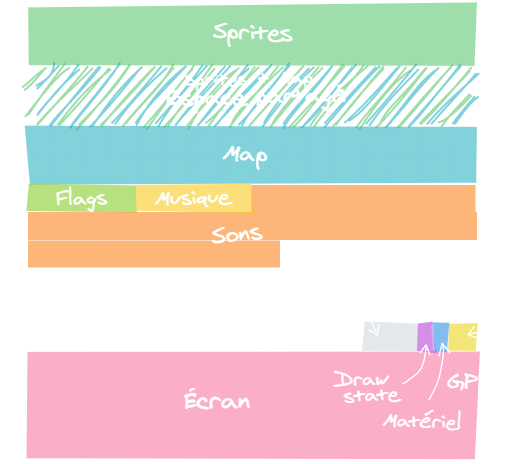

La mémoire vive (ou RAM) de PICO-8 contient les graphismes et les sons de votre jeu, mais aussi le contenu actuel de l'écran et quelques autres données. Il est possible de la manipuler directement avec les fonctions `peek()` et `poke()` que nous verrons plus bas, mais dans la plupart des cas, vous pouvez vous contenter d'utiliser les fonctions de base, qui se chargent de communiquer avec la mémoire pour vous.

Par exemple, appuyer sur une touche active un bit dans la mémoire, et `btn()` se charge de lire les adresses mémoire où se trouvent ces bits. Et lorsque vous utilisez une fonction de dessin comme `spr()`, elle écrit dans la région de la mémoire qui correspond à l'écran.

Mais tout n'est pas possible en utilisant ces fonctions ! Accéder à la mémoire directement peut vous permettre de réaliser toutes sortes de choses uniques : générer des sons avec des algorithmes, étirer l'écran, communiquer avec des circuits électroniques... ou encore activer le clavier et la souris !

La mémoire est composée d'octets, et chaque octet a une adresse que l'on écrit généralement en hexadécimal, par exemple 0x5f2c. Vous ne comprenez rien à ce que je viens de dire ? Pas de problème ! Prenons un instant pour comprendre ce que contient un octet, et quelles sont les différentes façons de compter en informatique.

### Compter avec des bits

Dans un ordinateur, le plus petit élément d'information que l'on peut manipuler est le bit. Il ne peut avoir que deux valeurs : le signal est soit éteint, soit allumé, ce que l'on désigne par les chiffres 0 et 1.

Dans le système décimal, nous avons 10 chiffres pour représenter tous les nombres qui existent, c'est pourquoi on parle aussi de base 10. Lorsqu'on arrive au bout des 10 chiffres à notre disposition, on ajoute une dizaine et on repart du premier chiffre.

Quand on compte en binaire, on n'a que 2 chiffres, c'est donc une base 2. On va atteindre les dizaines, les centaines et ainsi de suite beaucoup plus rapidement !

```
Décimal │ Binaire       Décimal │ Binaire 
───────────────      ───────────────
    0   │      0            9   │   1001
    1   │      1           10   │   1010
    2   │     10           11   │   1011
    3   │     11           12   │   1100
    4   │    100           13   │   1101
    5   │    101           14   │   1110
    6   │    110           15   │   1111
    7   │    111           16   │  10000
    8   │   1000           17   │  10001
```

En informatique, on rassemble généralement les bits en octets, qui sont des suites de 8 bits. Avec un octet, on peut stocker 256 valeurs différentes.

```
Décimal │  Octet
────────────────
    0   │ 00000000
    1   │ 00000001
    2   │ 00000010
    3   │ 00000011
    4   │ 00000100
────────────────
  251   │ 11111011
  252   │ 11111100
  253   │ 11111101
  254   │ 11111110
  255   │ 11111111
```

Si l'on veut stocker des nombres plus grands, il faudra utiliser plusieurs octets. Par exemple, les nombres dans les variables de PICO-8 sont codés sur 4 octets (32 bits), ce qui pourrait permettre d'aller de 0 à 2 147 483 647. Cela dit, pour que PICO-8 puisse stocker des nombres négatifs et à virgule, l'intervalle utilisable va en réalité de -32768 à 32767,9999. Lorsque vous essayez de dépasser cette limite, le nombre va boucler sur lui-même, et c'est d'ailleurs un problème épineux lorsque l'on souhaite créer des scores gigantesques par exemple.

Le système binaire n'est pas la seule façon originale de compter à laquelle vous serez confronté·e au cours de votre vie de programmeur ou programmeuse. Lorsque vous choisissez une couleur dans un logiciel de graphisme, vous avez probablement déjà eu affaire au système hexadécimal, qui est en base 16. Par exemple, ce code de violet [`#9e96d0`](https://www.google.com/search?q=%239e96d0) est une suite de trois nombres en hexadécimal :

```
            │  Rouge   │   Vert   │   Bleu
──────────────────────────────────────
Hexadécimal │       9e │       96 │       d0
Décimal     │      158 │      150 │      208
Octet       │ 10011110 │ 10010110 │ 11010000
```

Pour représenter la base 16, on utilise les lettres de l'alphabet : les 16 chiffres sont 0, 1, 2, 3, 4, 5, 6, 7, 8, 9, A, B, C, D, E et F. Par exemple, le nombre 31 s'écrit 1F, et le nombre 32 s'écrit... 20. Oui, c'est un peu l'embrouille.

Malgré tout, ce format est populaire en informatique car chaque chiffre correspond à 4 bits, étant donné que 4 bits permettent de compter de 0 à 15. Cela permet une écriture plus compacte : vous pouvez représenter le contenu d'un octet en seulement deux chiffres. C'est pourquoi les codes couleur, qui contiennent 3 octets pour les 3 couleurs, tiennent en 6 caractères.

Pour bien savoir dans quelle base le nombre est écrit, on utilise un préfixe qui dépend du langage de programmation. Dans PICO-8, `0x` désigne un nombre hexadécimal et `0b` désigne un nombre binaire.

Bien, nous avons les grandes bases. N'ayez crainte : vous n'avez pas besoin de tout retenir, mais il est utile d'avoir une petite idée de comment cela fonctionne. Nous pouvons maintenant accéder à la mémoire !

### Peek et poke

`peek(adresse)` permet de lire l'octet situé à cette adresse de la mémoire. Cela dit, il vaut mieux utiliser l'opérateur `@` car il économise un token et s'exécute plus rapidement.

```lua
peek(0x5f4c)
@0x5f4c
```

Prenons l'adresse `0x5f4c` pour l'exemple : c'est l'octet qui contient les boutons appuyés par le joueur 1. Si vous l'affichez en jeu avec `print()`, il apparaîtra en version décimale, mais en réalité, il représente bien les 8 bits qui valent 0 ou 1 en fonction des touches appuyées.

Pour écrire à une adresse, on utilise `poke(adresse, valeur)`. Par exemple, l'adresse 0x5f2c concerne le mode d'affichage, et si l'on y change des bits, on peut appliquer différents types de distorsions !

```lua
poke(0x5f2c, 0b10000010) -- inversement vertical de l'écran
poke(0x5f2c, 130)        -- le même nombre en décimal
```

Mais avant de voir plus de pokes utiles, je vous propose de prendre un peu de recul et d'examiner comment toutes ces adresses mémoire sont organisées.

### Anatomie de la mémoire

Il existe 3 types de mémoire dans PICO-8 : la ROM ou cartouche de jeu, la RAM que l'on peut modifier, et la RAM de Lua.

#### La ROM du jeu

Vous avez probablement déjà lu le terme ROM dans le domaine de l'émulation de jeux par exemple. Il signifie Read Only Memory, ou mémoire morte en français. On l'utilise souvent pour désigner les cartouches de jeu, et comme son nom l'indique, le contenu d'une ROM est fixé et ne peut pas être modifié par l'utilisateur, contrairement à la RAM.

Pour plus de rapidité, dans la plupart des consoles de jeu et des ordinateurs, les données stockées dans une ROM sont copiées dans la RAM avant d'être traitées, et c'est aussi le cas dans PICO-8. La ROM (votre cartouche) est chargée au lancement du jeu, mais vous pouvez aussi recharger une partie précise de la cartouche (et même d'une autre cartouche) en plein jeu avec la fonction `reload()`. Cela peut-être utile lorsque vous avez modifié les sprites ou la map dans la RAM et souhaitez réinitialiser leur état. Cependant, le code ne peut être rechargé de la même façon, car il est protégé et stocké dans un espace de RAM différent.

#### La RAM de base

C'est dans cet espace de 32 Kio que l'on pourra peek et poke pour modifier le comportement de PICO-8 pendant le jeu. La RAM est compartimentée en différentes sections, chaque adresse ayant une utilité précise :


*Un carré équivaut à 128 octets.*

Comme vous pouvez le voir, le début de la RAM, de "sprites" jusqu'à "sons", n'est autre que votre ROM chargée au lancement. On trouve ensuite :

- Un espace libre dans lequel vous pouvez stocker ce que vous souhaitez. Par exemple, vous pouvez y recopier une partie de l'écran pour sauvegarder une photo.
- Un fichier de sauvegarde pouvant contenir 64 chiffres et qui s'enregistre sur l'ordinateur du joueur ou de la joueuse.
- Le draw state et le hardware state, qui contiennent des adresses que l'on pourra poker pour obtenir des effets amusants.
- Les informations GPIO, qui permettent à votre jeu de communiquer avec des circuits électroniques ou une page web.
- Le contenu de l'écran, qui est modifié par les fonctions de dessin comme `spr()`.

Pour les plus curieuses et curieux d'entre vous, le fonctionnement de chacune de ces sections est détaillé sur [notre wiki](https://wiki.gamedevalliance.fr/fantasy-consoles/pico-8/memoire/) !

#### La RAM de Lua

Cet espace limité à 2 Mio contient le code de votre programme compilé ainsi que vos variables en cours de jeu. Elle est entièrement séparée de la RAM de base et vous ne pouvez pas y accéder avec peek, poke et compagnie. Cependant, comme je vous l'avais dit précédemment, vous pouvez connaître la quantité de mémoire actuellement occupée avec `stat(0)` qui vous donne le nombre d'octets utilisés.

Les 2 Mio disponibles peuvent sembler énormes en comparaison des 32 Kio de la RAM de base, et il est vrai que cela vous laisse une très grande marge de manœuvre ! Vous n'aurez sans doute pas à vous soucier du nombre de variables dans votre jeu.

### Pokes utiles

#### Désactiver le menu de pause

Les boutons `btn(x)` pour `x` allant de 0 à 5 sont les boutons documentés : les quatre flèches, X et O. En réalité, il existe aussi `btn(6)`, correspondant au bouton Pause et déclenché avec Entrée ou Echap, mais il est impossible de l'utiliser normalement étant donné qu'il retourne `true` pendant la frame juste avant que le menu de Pause ne s'ouvre.

C'était sans compter l'adresse 0x5f30, qui n'est pas documentée officiellement mais peut désactiver la prochaine ouverture du menu de pause avec la valeur 1. Il faut remettre cette valeur à 1 après chaque tentative bloquée ; je vous suggère donc l'écriture suivante :

```lua
if (btn(6)) poke(0x5f30, 1)
```

Vous disposez maintenant d'un bouton supplémentaire, qui pourrait vous servir à créer votre propre menu de pause.

#### Options graphiques

L'adresse 0x5f2c concerne le mode d'affichage. En changeant quelques bits, vous pouvez étirer l'écran, le retourner ou créer un effet miroir ! Voici un petit résumé des possibilités juste pour vous :

Valeur | Effet
--- | ---
0 | Normal
1 | Etirement horizontal
2 | Etirement vertical
3 | 1+2 : Etirement horizontal et vertical
5 | Miroir vertical : moitié gauche recopié à droite
6 | Miroir horizontal : moitié haute recopié en bas
7 | 5+6 : quart haut-gauche recopié trois fois
129 | Retournement horizontal
130 | Retournement vertical
131 | 129+130
133 | Rotation 90 degrés
134 | Rotation 180 degrés (même résultat que 131)
135 | Rotation -90 degrés

Tous ces effets sont amusants mais ne pourraient pas forcément servir dans un jeu conventionnel. Cela dit, je trouve la valeur 3 intéressante : c'est comme si on faisait un jeu en 64×64 pixels !

#### Utiliser le clavier et la souris

Les boutons de la manette sont chacun branchés à un emplacement précis de la mémoire et allument un bit. En fait, la fonction `btn()` lit la mémoire pour savoir si un bouton est appuyé ou non ! Mais ce n'est pas tout : une adresse de la mémoire peut aussi contenir l'état du clavier et de la souris. Par défaut, cette fonctionnalité est désactivée, mais on peut poker une adresse pour activer le mode devkit :

```lua
poke(0x5f2d, 1)
```

Il devient alors possible d'accéder à l'état du clavier et de la souris avec `stat()` !

##### Clavier

`stat(30)` est un booléen qui vaut vrai lorsqu'une touche du clavier parmi celles reconnues est appuyée, avec un fonctionnement proche de `btnp`. `stat(31)` renvoie un string contenant la lettre ou le caractère en question. Quelques touches spéciales sont aussi reconnues :

Touche | stat(31)
--- | ---
Retour arrière | "\b"
Tab | "\t"
Entrée | "\r"

N'oubliez pas que P et Entrée ouvrent le menu de pause, mais qu'on peut le désactiver avec `if (btn(6)) poke(0x5f30, 1)`.

La touche Shift ne peut être reconnue par elle-même mais permet de produire des symboles plutôt que des lettres, de la même façon que dans l'éditeur de code. Les autres touches, telles que Control et Alt, ne produisent pas de caractère et ne sont donc pas reconnues.

`stat(31)` ne peut contenir qu'un caractère à la fois, mais il est tout de même possible de reconnaître que plusieurs touches sont appuyées au même moment. Lorsque votre jeu constate que `stat(30)` est vrai puis lit le contenu de `stat(31)`, PICO-8 en rafraîchit immédiatement la valeur pour passer au caractère suivant à lire, ou bien passe `stat(30)` à faux s'il n'en reste plus.

```lua
keys = {}
while stat(30) do
    add(keys, stat(31))
end
```

##### Souris

Le support de la souris est lui aussi assez particulier.

Pour commencer, `stat(32)` et `stat(33)` vous donnent tout simplement les coordonnées X et Y de la souris, ce qui vous permet d'afficher un curseur que vous aurez dessiné vous-même dans un sprite.

Là où c'est plus original, c'est en ce qui concerne les boutons. `stat(34)` renvoie une suite de 3 bits pour les 3 boutons de la souris :

stat(34) | Boutons
--- | ---
0b001 | Clic gauche
0b010 | Clic droit
0b100 | Clic molette

Je vous invite à tester `print(stat(34))` et vous verrez que le résultat est affiché en décimal, ce qui produit un nombre allant de 0 à 7. Nous pourrions évaluer les 7 cas de figure possibles avec 7 conditions (par exemple, 6 veut dire qu'on appuie sur le clic droit et la molette), mais nous ne sommes pas des sauvages et je suis là pour vous apprendre des choses ! Je vous propose plutôt de réaliser une opération bit à bit, afin de regarder directement si le bit qu'on cherche est activé ou non !

Mettons que vous souhaitiez vérifier le bit du clic gauche, c'est à dire `0b001`. Nous allons vérifier si `stat(34)` a ce bit d'activé à l'aide de l'opération AND. Voici quelques exemples :

```
    101        000        001    <-- valeurs possibles de stat(34)
AND 001    AND 001    AND 001    <-- bit du clic gauche
  = 001      = 000      = 001
```

Pour résumer, `band(stat(34), 0b001)` renverra le résultat 0b001 si les deux nombres ont le bit en commun, et renverra 0b000 sinon. Voici comment vérifier les trois types de clic :


*Pour plus de concision, j'ai écrit 1, 2 et 4, qui sont les écritures décimales de 0b001, 0b010 et 0b1000. Les deux écritures sont toujours interchangeables !*

Si les opérations bit à bit vous intéressent, je vous laisse consulter la section [Bitwise Operations](https://www.lexaloffle.com/dl/docs/pico-8_manual.html#Bitwise_Operations) du manuel de PICO-8 ainsi que les exemples de [Wikipédia](https://fr.wikipedia.org/wiki/Opération_bit_à_bit).

Pour finir, `stat(36)` vous donne ce qu'a parcouru la molette depuis la dernière frame. Cela donnera -1 si vous l'avez faite défiler d'un cran vers le haut, 0 si elle n'a pas bougé et 1 pour un cran vers le bas.

Méfiez-vous cependant : zep, le développeur de PICO-8, indique que la souris ne fonctionne pas encore idéalement sur navigateur, mais cela semble tout de même satisfaisant pour la plupart des jeux.

Gardez également à l'esprit que toutes les machines exécutant PICO-8 ne disposent pas forcément d'une souris et d'un clavier complet ; il est donc recommandé de rendre le mode devkit optionnel lorsque vous publiez votre jeu sur le site officiel. La première fois qu'une de ces `stat()` est lue par le jeu dans un contexte où la présence d'un clavier et d'une souris n'est pas garantie, PICO-8 affiche un court avertissement en bas de l'écran.


