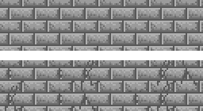
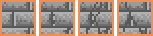

Interro surprise ! Lequel de ces deux murs est le plus intéressant visuellement ?

Vos yeux ont dû naturellement être intéressés par le second mur et pour cause : il est *intéressant*. Il n'est pas monotone comme le premier : ce n'est pas la même brique encore et encore... Pourtant, le second a été fait à partir du même tile, mais avec trois variations comportant des petites craquelures. Très peu d’efforts en somme, pour un résultat tout de suite plus agréable.

*Le tile de brique et ses trois variations.*

Si vous n'êtes toujours pas convaincu·e, imaginez être un joueur ou une joueuse, marchant à travers la map, suivant le mur d'un grand château... La zone faisant quelques dizaines de tiles, vous êtes parti pour observer ce mur pendant 30 bonnes secondes. Lequel des deux murs préféreriez-vous avoir à regarder ?

Les variations témoignent à la fois d'un château avec du vécu et du soin apporté à vos graphismes. Souvenez-vous qu'un joueur qui s'ennuie pendant les moments les moins intenses de votre jeu sera d'une humeur désintéressée quand il arrivera aux moments plus importants, alors gardez-le en éveil avec des décors intéressants ! Cela vous demandera quelques tiles en plus, mais votre jeu les mérite !
