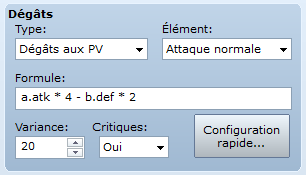

Les caractéristiques des personnages ont chacune une utilité par défaut que l'on va examiner, mais il est aussi possible de les utiliser différemment à l'aide des formules.

L'attaque, la défense, l'attaque magique et la défense magique n'ont aucun effet particulier et sont uniquement utilisées pour calculer les dégâts dans les formules des compétences ou des objets. Leur impact est donc facilement personnalisable.

### L'agilité

L'agilité influe sur la possibilité de réaliser une attaque surprise au début du combat. Lors d'une attaque surprise, l'adversaire ne peut pas agir durant le premier tour. Les attaques surprises ne peuvent pas survenir lors d'un combat déclenché par un évènement.

- Agilité moyenne de l'équipe >= agilité moyenne des ennemis :
  - Attaque surprise de l'équipe : 5%
  - Attaque surprise de l'ennemi : 3%

- Agilité moyenne de l'équipe < agilité moyenne des ennemis :
  - Attaque surprise de l'équipe : 3%
  - Attaque surprise de l'ennemi : 5%

L'agilité détermine également la probabilité de réussir une fuite :

- Chances de fuir (%) = 150 - 100 × **agilité moyenne de l'ennemi** ÷ **agilité moyenne de l'équipe**

Un bonus de 10% est ajouté après chaque tentative de fuite échouée. De plus, l'équipe peut s'échapper à coup sûr lors d'une attaque surprise.

### La chance

La chance influe lorsqu'on souhaite appliquer une altération d'état à une cible, ou pour calculer la probabilité pour que l'état se dissipe :

- Chance (%) = 100 + (**chance du lanceur** - **chance de la cible**) ÷ 10

### Formules de dégâts

Les dégâts infligés par une compétence sont personnalisables précisément à l'aide de formules.

*Formule de l'attaque de base.*

L'utilisateur de la compétence est représenté par `a` et la cible par `b`. On y associe un terme avec un point. Par exemple, `a.atk` signifie « l'attaque du joueur » et `b.def` signifie « la défense de la cible ».

Termes | Signification
-------|------------------
`atk`  | Attaque
`def`  | Défense
`mat`  | Magie
`mdf`  | Défense magique
`agi`  | Agilité
`luk`  | Chance
`mhp`  | PV maximum
`mmp`  | PM maximum
`hp`   |  PV actuels
`mp`   | PM actuels
`tp`   | PT actuels
`level`| Niveau
`v[x]` | Variable numéro x

On peut réaliser des opérations arithmétiques : la priorité des opérations est respectée et les parenthèses sont supportées.

Opérateur | Signification
----------|-----------------
`+`       | Addition
`-`       | Soustraction
`*`       | Multiplication
`/`       | Division
`**`      | Exponentielle
`%`       | Modulo

Notez que la résistance élémentaire et les autres effets sont calculés séparément. Cette formule concerne uniquement les dégâts de base de l'action !
